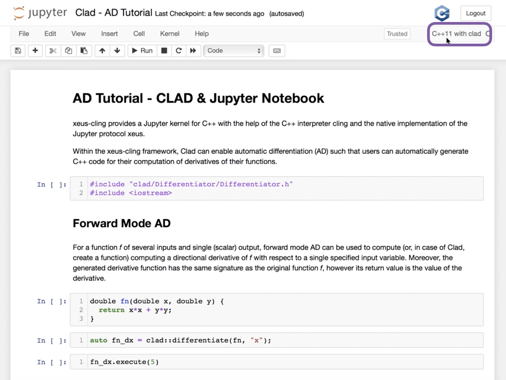

[](https://github.com/conda-forge/clad-feedstock)
[](https://anaconda.org/conda-forge/clad)
[](https://anaconda.org/conda-forge/clad)
[](https://anaconda.org/conda-forge/clad)

| Linux & OSX: | Coverity | Codecov |
|:---:|:---:|:---:|
[](https://github.com/vgvassilev/clad/actions?query=workflow%3AClad-CI) | <a href="https://scan.coverity.com/projects/vgvassilev-clad">  </a>| [](https://codecov.io/gh/vgvassilev/clad)

# Conda Installation

Clad is available using [conda](https://anaconda.org/conda-forge/clad):

```bash
conda install -c conda-forge clad
```

If you have already added `conda-forge` as a channel, the `-c conda-forge` is unnecessary. Adding the channel is recommended because it ensures that all of your packages use compatible versions:

```bash
conda config --add channels conda-forge
conda update --all
```

# Clad
Clad enables [automatic differentiation (AD)](https://en.wikipedia.org/wiki/Automatic_differentiation) for C++. It is based on LLVM compiler infrastructure and is a plugin for [Clang compiler](http://clang.llvm.org/). Clad is based on source code transformation. Given C++ source code of a mathematical function, it can automatically generate C++ code for computing derivatives of the function. It supports both forward-mode and reverse-mode AD.
## How to use Clad

### Wtih Jupyter Notebooks

[xeus-cling](https://github.com/jupyter-xeus/xeus-cling) provides a Jupyter kernel for C++ with the help of the C++ interpreter Cling and the native implementation of the Jupyter protocol xeus. Within the xeus-cling framework, Clad can enable automatic differentiation (AD) such that users can automatically generate C++ code for their computation of derivatives of their functions.

To set up your environment, use:

```
mamba create -n xeus-clad -c conda-forge clad xeus-cling jupyterlab

conda activate xeus-clad
```

Next, running ```jupyter notebook``` will now show 3 new kernels for `C++ 11/14/17` with Clad attached. The image below is a snapshot of a custom function and a call to Clad's forward mode (part of an AD Clad & Jupyter [tutorial](https://compiler-research.org/tutorials/clad_jupyter/)). 




### As a plugin for Clang
Since Clad is a Clang plugin, it must be properly attached when Clang compiler is invoked. First, the plugin must be built to get `libclad.so` (or `.dylib`). To compile `SourceFile.cpp` with Clad enabled use:
```
clang -cc1 -x c++ -std=c++11 -load /full/path/to/lib/clad.so -plugin clad SourceFile.cpp
```

To compile using clang-9, use: 
```
clang-9 -I /full/path/to/include/  -x c++ -std=c++11 -fplugin=/full/path/to/lib/clad.so SourceFile.cpp -o sourcefile -lstdc++ -lm
```

To save the Clad generated derivative code to `Deritives.cpp` add:
```
-Xclang -plugin-arg-clad -Xclang -fgenerate-source-file
```

To print the Clad generated derivative add:
```
-Xclang -plugin-arg-clad -Xclang -fdump-derived-fn
```

Clad provides four API functions:
- `clad::differentiate` to use forward-mode AD
- `clad::gradient` to use reverse-mode AD
- `clad::hessian` to compute Hessian matrix using a combination of forward-mode and reverse-mode AD
- `clad::jacobian` to compute Jacobian matrix using reverse-mode AD

API functions are used to label an existing function for differentiation.
Both functions return a functor object containing the generated derivative which can be called via `.execute` method, which forwards provided arguments to the generated derivative function. Example:
```cpp
#include "clad/Differentiator/Differentiator.h"
#include <iostream>

double f(double x, double y) { return x * y; }

int main() {
  auto f_dx = clad::differentiate(f, "x");
  std::cout << f_dx.execute(3, 4) << std::endl; // prints: 4
  f_dx.dump(); // prints:
  /* double f_darg0(double x, double y) {
       double _d_x = 1; double _d_y = 0;
       return _d_x * y + x * _d_y;
     } */
}
```
### Forward mode
For a function `f` of several inputs and single (scalar) output, forward mode AD can be used to compute (or, in case of Clad, create a function) computing a directional derivative of `f` with respect to a *single* specified input variable. Derivative function created by the forward-mode AD is guaranteed to have *at most* a constant factor (around 2-3) more arithmetical operations compared to the original function.

`clad::differentiate(f, ARGS)` takes 2 arguments:
1. `f` is a pointer to a function or a method to be differentiated
2. `ARGS` is either:
  * a single numerical literal indicating an index of independent variable (e.g. `0` for `x`, `1` for `y`)
  * a string literal with the name of independent variable (as stated in the *definition* of `f`, e.g. `"x"` or `"y"`), and if the variable is an array the index needs to be specified, e.g. `"arr[1]"`

Generated derivative function has the same signature as the original function `f`, however its return value is the value of the derivative.

### Reverse mode
When a function has many inputs and derivatives w.r.t. every input (i.e. gradient vector) are required, reverse-mode AD is a better alternative to the forward-mode. Reverse-mode AD allows to compute the gradient of `f` using *at most* a constant factor (around 4) more arithmetical operations compared to the original function. While its constant factor and memory overhead is higher than that of the forward-mode, it is independent of the number of inputs. E.g. for a function having N inputs and consisting of T arithmetical operations, computing its gradient takes a single execution of the reverse-mode AD and around 4\*T operations, while it would take N executions of the forward-mode, this requiring up to N\*3\*T operations.

`clad::gradient(f, /*optional*/ ARGS)` takes 1 or 2 arguments:
1. `f` is a pointer to a function or a method to be differentiated
2. `ARGS` is either:
  * not provided, then `f` is differentiated w.r.t. its every argument
  * a string literal with comma-separated names of independent variables (e.g. `"x"` or `"y"` or `"x, y"` or `"y, x"`)

Since a vector of derivatives must be returned from a function generated by the reverse mode, its signature is slightly different. The generated function has `void` return type and same input arguments. The function has additional, last input argument of the type `T*`, where `T` is the return type of `f`. This is the "result" argument which has to point to the beginning of the vector where the gradient will be stored. *The caller is responsible for allocating and zeroing-out the gradient storage*. Example:
```cpp
auto f_grad = clad::gradient(f);
double result1[2] = {};
f_grad.execute(x, y, result1);
std::cout << "dx: " << result1[0] << ' ' << "dy: " << result1[1] << std::endl;

auto f_dx_dy = clad::gradient(f, "x, y"); // same effect as before

auto f_dy_dx = clad::gradient(f, "y, x");
double result2[2] = {};
f_dy_dx.execute(x, y, result2);
// note that the derivatives are mapped to the "result" indices in the same order as they were specified in the argument:
std::cout << "dy: " << result2[0] << ' ' << "dx: " << result2[1] << std::endl;
```
Note: *we are working on improving the gradient interface*.
## What can be differentiated
Clad is based on compile-time analysis and transformation of C++ abstract syntax tree (Clang AST). This means that Clad must be able to see the body of a function to differentiate it (e.g. if a function is defined in an external library there is no way for Clad to get its AST).

We aim to support every piece of modern C++ syntax, however at the moment only the a subset of C++ is supported and there are some constraints on functions that can be differentiated with Clad:
* Only builtin C++ scalar numeric types (e.g. `double`, `float`, `int`) are fully supported
* Differentiated functions must return a single value of supported scalar numeric type
* Differentiated functions can have arbitrary number or inputs of supported scalar numeric types
* Clad can also differentiate `struct`/`class` methods, however at the moment there is no way to differentiate them w.r.t. member fields

Note: *we are currently working on vector inputs*

The following subset of C++ syntax is supported at the moment:
* Numerical literals, builtin arithmetic operators `+`, `-`, `*`, `/`
* Variable declarations of supported types (including local variables in `{}` blocks)
* Inside functions, builtin arrays (e.g. `double x[1][2][3];`) of supported types and subscript operator `x[i]`
* Direct assignments to variables via `=` and `+=`, `-=`, `*=`, `/=`, `++`, `--`
* Conditional operator `?:` and boolean expressions
* Comma operator `,`
* Control flow: `if` statements and `for` loops (*work on loops in the reverse-mode is in progress*)
* Calls to other functions, including recursion

Note: Clad currently differentiates types such as `int`/`char`/`boolean` as any real type (such as `float`, `double`, etc.) would be differentiated. Users should keep in mind that Clad *does not* warn against lossy casts, which on differentiation may result in incorrect derivatives.

Note: If for any reason clad is unable to algorithmically differentiate a function, it automatically switches to numerically differentiating the same. To disable this behavior, please compile your programs with the `-DCLAD_NO_NUM_DIFF` flag. The numerical differentiation functionality can also be used standalone over a wide range of function signatures with minimal user intervention. [This presentation](https://indico.cern.ch/event/1066812/contributions/4495279/attachments/2301763/3915404/Numerical%20Differentiaition%20.pdf) provides more information on what can be numerically differentiated. For a comprehensive demo on using custom user defined types with numerical differentiation, you can check out [this demo](https://github.com/vgvassilev/clad/blob/master/demos/CustomTypeNumDiff.cpp).

## Specifying custom derivatives
Sometimes Clad may be unable to differentiate your function (e.g. if its definition is in a library and source code is not available). Alternatively, an efficient/more numerically stable expression for derivatives may be know. In such cases, it is useful to be able to specify a custom derivatives for your function.

Clad supports that functionality by allowing to specify your own derivatives in `namespace custom_derivatives`. For a function named `FNAME` you can specify:
* a custom derivative w.r.t `I`-th argument by defining a function `FNAME_dargI` inside `namespace custom_derivatives`
* a custom gradient w.r.t every argument by defining a function `FNAME_grad` inside `namespace custom_derivatives`

When Clad will encounter a function `FNAME`, it will first do a lookup inside the `custom_derivatives` namespace to try to find a suitable custom function, and only if none is found will proceed to automatically derive it.

Example:
* Suppose that you have a function `my_pow(x, y)` which computes `x` to the power of `y`. However, Clad is not able to differentiate `my_pow`'s body (e.g. it calls an external library or uses some non-differentiable approximation):
```cpp
double my_pow(double x, double y) { // something non-differentiable here... }
```
However, you know analytical formulas of its derivatives, and you can easily specify custom derivatives:
```cpp
namespace custom_derivatives {
  double my_pow_darg0(double x, double y) { return y * my_pow(x, y - 1); }
  double my_pow_darg1(dobule x, double y) { return my_pow(x, y) * std::log(x); }
}
```
You can also specify a custom gradient:
```cpp
namespace custom_derivatives {
  void my_pow_grad(double x, double y, double* result) {
     double t = my_pow(x, y - 1);
     result[0] = y * t;
     result[1] = x * t * std::log(x);
   }
}
```
Whenever Clad will encounter `my_pow` inside differentiated function, it will find and use provided custom funtions instead of attempting to differentiate it.

Note: Clad provides custom derivatives for some mathematical functions from `<cmath>` inside `clad/Differentiator/BuiltinDerivatives.h`.

Note: *the concept of custom_derivatives will be reviewed soon, we intend to provide a different interface and avoid function name-based specifications and by-name lookups*.

## Using Clad's floating point error estimation framework

Clad is capable of annotating a given function with floating point error estimation code using the reverse mode of AD. An interface similar to `clad::gradient(f)` is provided as follows:

`clad::estimate_error(f)` takes 1 argument:
1. `f` is a pointer to the function or method to be annotated with floating point error estimation code.

The function signature of the generated code is the same as from `clad::gradient(f)` with the exception that it has an extra argument at the end of type `double&`, which returns the total floating point error in the function by reference. For a user function `double f(double, double)` example usage is described below:

```cpp
// Generate the floating point error estimation code for 'f'.
auto df = clad::estimate_error(f);
// Print the generated code to standard output.
df.dump();
// Declare the necessary variables.
double x, y, d_x, d_y, final_error = 0;
// Finally call execute on the generated code.
df.execute(x, y, &d_x, &d_y, final_error);
// After this, 'final_error' contains the floating point error in function 'f'.
```
The above example generates the the error code using an in-built taylor approximation model. However, clad is capable of using any user defined custom model, for information on how to use you own custom model, please visit [this demo](https://github.com/vgvassilev/clad/tree/master/demos/ErrorEstimation/CustomModel).

More details on this framework can be found [here](https://indico.cern.ch/event/1040761/contributions/4371613/attachments/2268248/3851583/floating_point_error_est.pdf).

## How Clad works
Clad is a plugin for the Clang compiler. It relies on the Clang to build the AST ([Clang AST](https://clang.llvm.org/docs/IntroductionToTheClangAST.html)) of user's source code. Then, [CladPlugin](https://github.com/vgvassilev/clad/blob/a264195f00792feeebe63ac7a8ab815c02d20eee/tools/ClangPlugin.h#L48), implemented as `clang::ASTConsumer` analyzes the AST to find differentiation requests for clad and process those requests by building Clang AST for derivative functions. The whole clad's operation sequence is the following:
* Clang parses user's source code and builds the AST.
* [`CladPlugin`](https://github.com/vgvassilev/clad/blob/a264195f00792feeebe63ac7a8ab815c02d20eee/tools/ClangPlugin.cpp#L63) analyzes the built AST and starts the traversal via [`HandleTopLevelDecl`](https://github.com/vgvassilev/clad/blob/a264195f00792feeebe63ac7a8ab815c02d20eee/tools/ClangPlugin.cpp#L67).
* [`DiffCollector`](https://github.com/vgvassilev/clad/blob/a264195f00792feeebe63ac7a8ab815c02d20eee/lib/Differentiator/DiffPlanner.cpp#L141) does the [traversal](https://github.com/vgvassilev/clad/blob/a264195f00792feeebe63ac7a8ab815c02d20eee/tools/ClangPlugin.cpp#L79) and looks at every call expression to find all the differentiation requests (through calls to `clad::differentiate(f, ...)` or `clad::gradient(f, ...)`).
* `CladPlugin` [processes](https://github.com/vgvassilev/clad/blob/a264195f00792feeebe63ac7a8ab815c02d20eee/tools/ClangPlugin.cpp#L82) every found request.
* Processing each request involves calling to [`DerivativeBuilder::Derive`](https://github.com/vgvassilev/clad/blob/a264195f00792feeebe63ac7a8ab815c02d20eee/tools/ClangPlugin.cpp#L113) which then [switches](https://github.com/vgvassilev/clad/blob/a264195f00792feeebe63ac7a8ab815c02d20eee/lib/Differentiator/DerivativeBuilder.cpp#L77) do either [`ForwardModeVisitor::Derive`](https://github.com/vgvassilev/clad/blob/a264195f00792feeebe63ac7a8ab815c02d20eee/lib/Differentiator/DerivativeBuilder.cpp#L407) or [`ReverseModeVisitor::Derive`](https://github.com/vgvassilev/clad/blob/a264195f00792feeebe63ac7a8ab815c02d20eee/lib/Differentiator/DerivativeBuilder.cpp#L1506), depending on which AD mode was requested.
* `ForwardModeVisitor` and `ReverseModeVisitor` are derived from `clang::StmtVisitor`. In the `Derive` method they analyze the AST of the declaration of the original function and create the AST for the declaration of derivative function. Then they proceed to recursively `Visit` every Stmt in original function's body and build the body for the derivative function. Forward/Reverse mode AD algorithm is implemented in `Visit...` methods, which are executed depending on the kind of AST node visited.
* The AST of the newly built derivative function's declaration is returned to `CladPlugin`, where the call to `clad::differentiate(f, ...)/clad::gradient(f, ...)` is [updated](https://github.com/vgvassilev/clad/blob/a264195f00792feeebe63ac7a8ab815c02d20eee/tools/ClangPlugin.cpp#L122) and `f` is replaced by a reference to the newly created derivative function `f_...`. This effectively results in the execution of `clad::differentiate(f_...)/clad::gradient(f_...)`, which constructs `CladFunction` with a pointer to the newly created derivative. Therefore, user's calls to `.execute` method will invoke the newly generated derivative.
* Finally, derivative's AST is [passed](https://github.com/vgvassilev/clad/blob/a264195f00792feeebe63ac7a8ab815c02d20eee/tools/ClangPlugin.cpp#L145) for further processing by Clang compiler (LLVM IR generation, optimizations, machine code generation, etc.).

## How to install
At the moment, LLVM/Clang 5.0.x - 12.0.1 are supported.

###  Building from source (example was tested on Ubuntu 18.04 LTS)
  ```
    #sudo apt install clang-9 libclang-9-dev llvm-9-tools llvm-9-dev
    sudo bash -c "$(wget -O - https://apt.llvm.org/llvm.sh)"
    sudo -H pip install lit
    git clone https://github.com/vgvassilev/clad.git clad
    mkdir build_dir inst; cd build_dir
    cmake ../clad -DClang_DIR=/usr/lib/llvm-9 -DLLVM_DIR=/usr/lib/llvm-9 -DCMAKE_INSTALL_PREFIX=../inst -DLLVM_EXTERNAL_LIT="`which lit`"
    make && make install
  ```
###  Building from source (example was tested on macOS Catalina 10.15.7)
  ```
    brew install llvm@12
    brew install python
    python -m pip install lit
    git clone https://github.com/vgvassilev/clad.git clad
    mkdir build_dir inst; cd build_dir
cmake ../clad -DLLVM_DIR=/usr/local/Cellar/llvm/12.0.0_1/lib/cmake/llvm -DClang_DIR=/usr/local/Cellar/llvm/12.0.0_1/lib/cmake/clang -DCMAKE_INSTALL_PREFIX=../inst -DLLVM_EXTERNAL_LIT="`which lit`"
    make && make install
    make check-clad
  ```
###  Building from source LLVM, Clang and clad (development environment)
  ```
    sudo -H pip install lit
    LAST_KNOWN_GOOD_LLVM=$(wget https://raw.githubusercontent.com/vgvassilev/clad/master/LastKnownGoodLLVMRevision.txt -O - -q --no-check-certificate)
    LAST_KNOWN_GOOD_CLANG=$(wget https://raw.githubusercontent.com/vgvassilev/clad/master/LastKnownGoodClangRevision.txt -O - -q --no-check-certificate)
    git clone https://github.com/llvm-mirror/llvm.git src
    cd src; git checkout $LAST_KNOWN_GOOD_LLVM
    cd tools
    git clone https://github.com/llvm-mirror/clang.git clang
    cd clang ; git checkout $LAST_KNOWN_GOOD_CLANG
    cd ../
    git clone https://github.com/vgvassilev/clad.git clad
    cd ../..
    mkdir obj inst
    cd obj
    cmake -DCMAKE_BUILD_TYPE=Debug -DLLVM_TARGETS_TO_BUILD=host -DCMAKE_INSTALL_PREFIX=../inst -DLLVM_EXTERNAL_LIT="`which lit`" ../src/
    make && make install
  ```
  ## Recent Contributors
  [](https://sourcerer.io/fame/vgvassilev/vgvassilev/clad/links/0)[](https://sourcerer.io/fame/vgvassilev/vgvassilev/clad/links/1)[](https://sourcerer.io/fame/vgvassilev/vgvassilev/clad/links/2)[](https://sourcerer.io/fame/vgvassilev/vgvassilev/clad/links/3)[](https://sourcerer.io/fame/vgvassilev/vgvassilev/clad/links/4)[](https://sourcerer.io/fame/vgvassilev/vgvassilev/clad/links/5)[](https://sourcerer.io/fame/vgvassilev/vgvassilev/clad/links/6)[](https://sourcerer.io/fame/vgvassilev/vgvassilev/clad/links/7)

  ## Citing Clad
```latex
% Peer-Reviewed Publication
%
% 16th International workshop on Advanced Computing and Analysis Techniques
% in physics research (ACAT), 1-5 September, 2014, Prague, The Czech Republic
%
@inproceedings{Vassilev_Clad,
  author = {Vassilev,V. and Vassilev,M. and Penev,A. and Moneta,L. and Ilieva,V.},
  title = {{Clad -- Automatic Differentiation Using Clang and LLVM}},
  journal = {Journal of Physics: Conference Series},
  year = 2015,
  month = {may},
  volume = {608},
  number = {1},
  pages = {012055},
  doi = {10.1088/1742-6596/608/1/012055},
  url = {https://iopscience.iop.org/article/10.1088/1742-6596/608/1/012055/pdf},
  publisher = {{IOP} Publishing}
}
```

## Additional references
[ACAT 2014 Slides](https://indico.cern.ch/event/258092/session/8/contribution/90/material/slides/0.pdf)  
[Martin's GSoC2014 Final Report](https://indico.cern.ch/event/337174/contribution/2/material/slides/0.pdf)  
[LLVM Poster](http://llvm.org/devmtg/2013-11/slides/Vassilev-Poster.pdf)  
[Violeta's GSoC2013 Final Report](http://prezi.com/g1iggppw76wl/autodiff/)  
[DIANA-HEP Meeting 2018](https://indico.cern.ch/event/760152/contributions/3153263/attachments/1730121/2795841/Clad-DIANA-HEP.pdf)  
[Demo at CERN](https://indico.cern.ch/event/808843/contributions/3368929/attachments/1817666/2971512/clad_demo.pdf)

##  Founders
Founder of the project is Vassil Vassilev as part of his research interests and vision. He holds the exclusive copyright and other related rights, described in Copyright.txt.

##  Contributors
We have quite a few contributors, whose contribution is described briefly in
Credits.txt. If you don't find your name among the list of contributors, please contact us!

##  License
clad is an open source project, licensed by GNU LESSER GENERAL PUBLIC
LICENSE (see License.txt). If there is module with different that LGPL license
it will be explicitly stated in the License.txt in the module's source code
folder.

Please see License.txt for further information.

##  How to Contribute
As stated in 2. clad is an open source project. Like most of the open
source projects we constantly lack of manpower and contributions of any sort are
very welcome. The best starting point is to download the source code and start
playing with it. There are a lot of tests showing implicitly the available
functionality.
