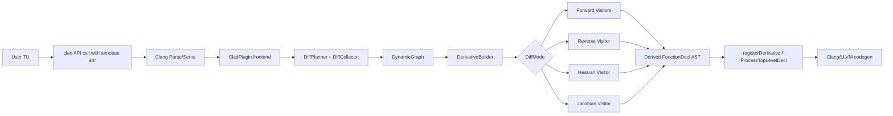
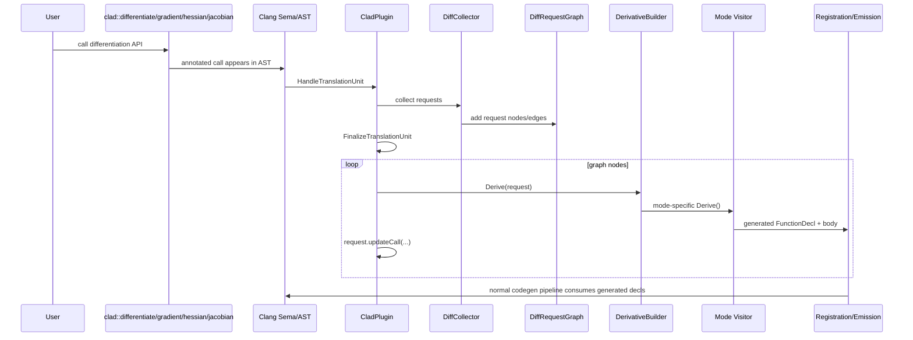
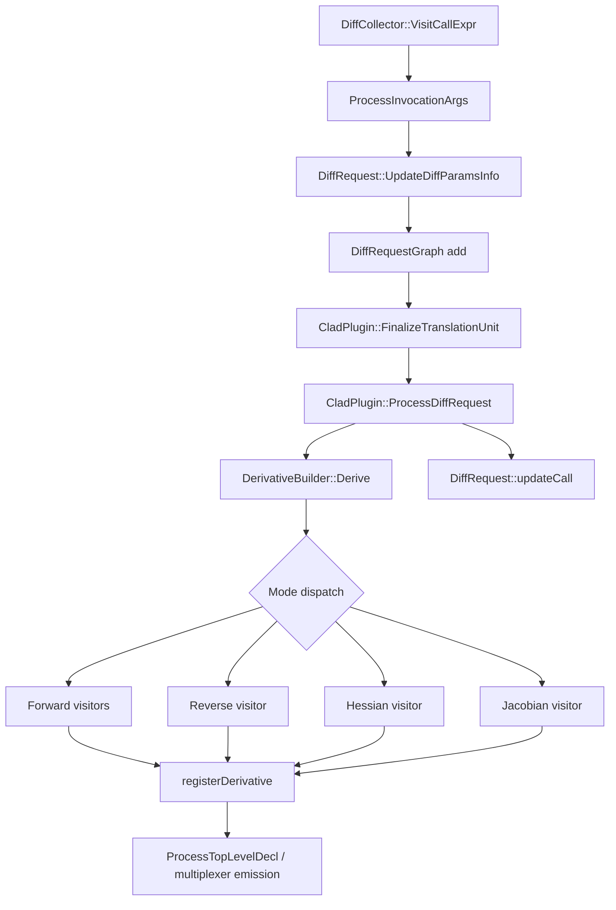
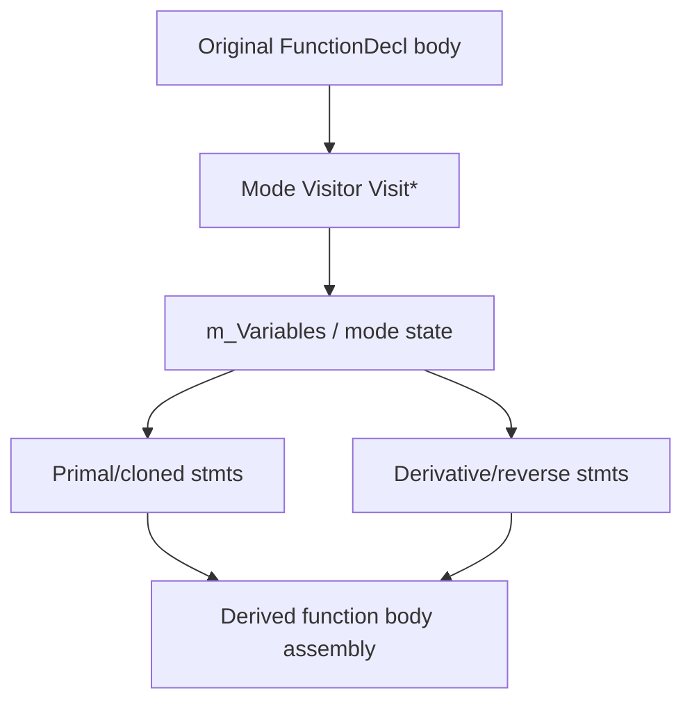
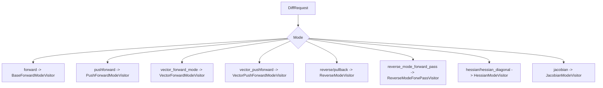
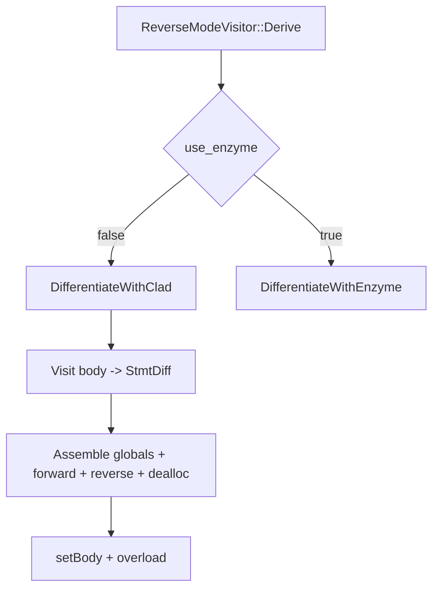
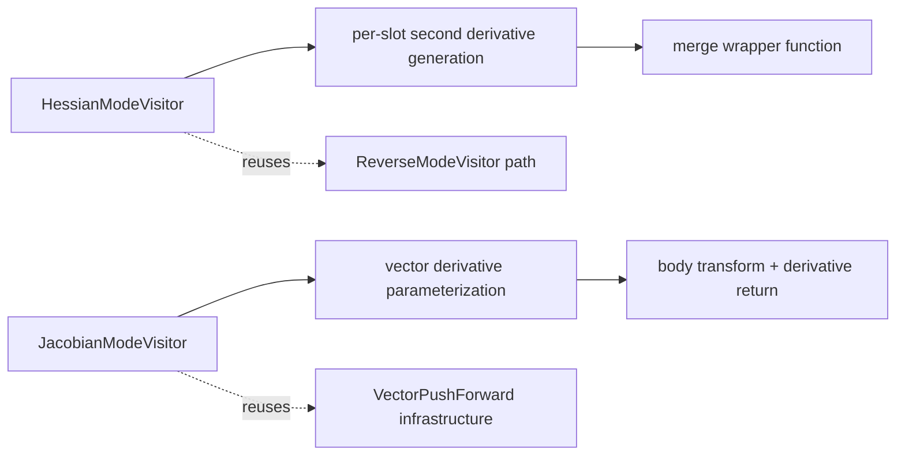

# CLAD Complete Architecture and Execution Book

Audience: advanced C++ / compiler developers  
Scope: end-to-end CLAD derivative generation system from API call detection to generated derivative function emission.  
Format goal: single long-form Markdown suitable for PDF export.

---

## Part I — System Architecture

## 1. System Overview

CLAD is a compile-time automatic differentiation system integrated with Clang.  
It transforms source-level C++ functions into derivative functions by constructing new Clang AST declarations.

Core architecture layers:

1. **User API layer** (`clad::differentiate`, `gradient`, `hessian`, `jacobian`)
2. **Planning layer** (`DiffCollector`, `DiffRequest`, request graph)
3. **Derivation layer** (`DerivativeBuilder` + mode visitors)
4. **Registration/emission layer** (Sema registration + multiplexer/codegen)
5. **Optional backend layer** (Enzyme pathway for reverse mode + backend plugin integration)

### 1.1 Top-Level Component Diagram



## 2. Repository and Module Map

### 2.1 Directory Structure

- `include/clad/Differentiator/`
  - API declarations and core engine interfaces
- `lib/Differentiator/`
  - implementations of planner, dispatcher, visitors, utilities
- `tools/`
  - frontend and backend plugin integration
- `docs/internalDocs/`
  - internal architecture and mode documents
- `test/`, `unittests/`
  - verification infrastructure

### 2.2 Core Files by Responsibility

| Responsibility | Key Files |
|---|---|
| User API + runtime wrapper | `include/clad/Differentiator/Differentiator.h` |
| Planning + requests | `include/clad/Differentiator/DiffPlanner.h`, `lib/Differentiator/DiffPlanner.cpp` |
| Dispatch and registration | `include/clad/Differentiator/DerivativeBuilder.h`, `lib/Differentiator/DerivativeBuilder.cpp` |
| Shared AST utilities | `include/clad/Differentiator/VisitorBase.h`, `lib/Differentiator/VisitorBase.cpp` |
| Forward family | `BaseForwardModeVisitor*`, `PushForwardModeVisitor*`, `VectorForwardModeVisitor*`, `VectorPushForwardModeVisitor*` |
| Reverse family | `ReverseModeVisitor*`, `Tape.h`, `ExternalRMVSource.h` |
| Higher-order modes | `HessianModeVisitor*`, `JacobianModeVisitor*` |
| Plugin lifecycle | `tools/ClangPlugin.cpp`, `tools/ClangBackendPlugin.cpp` |

## 3. End-to-End Execution Pipeline

### 3.1 Sequence Diagram



### 3.2 Core Call Graph



## 4. Component Responsibilities

## 4.1 DiffPlanner / DiffCollector / DiffRequest

- **Purpose**: discover, normalize, and schedule differentiation work.
- **Key classes**: `DiffCollector`, `DiffRequest`, `DynamicGraph<DiffRequest>`.
- **Key functions**:
  - `VisitCallExpr`
  - `ProcessInvocationArgs`
  - `UpdateDiffParamsInfo`
  - `ComputeDerivativeName`
  - `updateCall`
- **Control flow**:
  - parse callsite -> parse mode/options/args -> fill DVI -> schedule graph node.
- **Data flow**:
  - input: annotated `CallExpr`, template options, `Args`
  - output: normalized `DiffRequest` with mode/DVI/flags.

## 4.2 DerivativeBuilder

- **Purpose**: mode dispatcher + derivative declaration construction entry.
- **Key classes**: `DerivativeBuilder`, `DerivedFnCollector`.
- **Key functions**:
  - `Derive`
  - `cloneFunction`
  - `FindDerivedFunction`
  - nested/custom derivative helpers
- **Control flow**:
  - validate request -> custom path or mode path -> register derivatives.
- **Data flow**:
  - `DiffRequest` in, `{derivative, overload}` out + cache/registration side effects.

## 4.3 VisitorBase

- **Purpose**: shared AST cloning and statement/expression construction helpers.
- **Key functions**:
  - `Clone`, `CloneType`, declaration/reference builders, block/scope helpers.
- **Control flow**:
  - called from all mode visitors per-node.
- **Data flow**:
  - source AST nodes in, transformed AST nodes out.

## 4.4 Plugin Integration

- **Purpose**: lifecycle management and compiler integration.
- **Key classes/functions**:
  - `CladPlugin::HandleTranslationUnit`
  - `FinalizeTranslationUnit`
  - `ProcessDiffRequest`
- **Control flow**:
  - collect graph -> drain graph -> generate/rewrite/emit.
- **Data flow**:
  - AST declarations and `DiffRequest` graph processed into emitted derivative decls.

---

## Part II — AST Transformation Mechanics

## 5. Common Transformation Model

Visitors return `StmtDiff`, representing paired transformed artifacts:

- primal/cloned statement (`getStmt`)
- derivative/reverse sweep statement (`getStmt_dx`)

Forward family generally emits in forward evaluation order.  
Reverse family explicitly separates forward and reverse blocks.

### 5.1 AST Transformation Data Flow



## 6. Data Structure Lifecycle

### 6.1 `DiffRequest` Lifecycle

1. Create during call collection.
2. Fill mode/options.
3. Parse DVI (`Args` -> independent vars / ranges / fields).
4. Consume in builder/visitor.
5. Rewrite originating call (`updateCall`).

### 6.2 Generated `FunctionDecl` Lifecycle

1. Created via `cloneFunction`.
2. Parameters adjusted by mode visitor.
3. Body synthesized with transformed AST.
4. Registered via `registerDerivative`.
5. Emitted as top-level declaration.

### 6.3 Reverse-Specific Lifecycle Elements

- tape declarations in global/forward scope
- reverse sweep blocks (`m_Reverse`)
- deferred deallocation list (`m_DeallocExprs`)
- optional external source callbacks lifecycle.

---

## Part III — Forward Family Deep Dive

## 7. Forward Mode (`DiffMode::forward`)

### 7.1 Entry and Dispatch

- API annotation `"D"` maps to forward mode.
- Builder dispatches to `BaseForwardModeVisitor`.

### 7.2 `BaseForwardModeVisitor::Derive` Pipeline

1. Validate request and independent variable targeting.
2. Clone function declaration.
3. Setup derivative parameters.
4. Generate seed variables (`_d_*` map initialization).
5. Visit body and emit transformed statements.
6. Set function body and return derivative decl.

### 7.3 Critical `Visit*` Responsibilities

- `VisitDeclStmt` / `DifferentiateVarDecl`: derivative declarations and maps
- `VisitDeclRefExpr`: derivative lookup in `m_Variables`
- `VisitCallExpr`: nested request generation + custom/numeric fallback path
- `VisitBinaryOperator`/`VisitUnaryOperator`: rule-based derivative expression build
- loops and conditionals: preserve side effects and evaluation order.

## 8. Pushforward and Vector Forward Modes

- `PushForwardModeVisitor`: return value carries primal + derivative pair.
- `VectorForwardModeVisitor`: derivative values represented as vectors/matrices.
- `VectorPushForwardModeVisitor`: vector pushforward return conventions and independent-variable sizing.

---

## Part IV — Reverse Family Deep Dive

## 9. Reverse Mode (`DiffMode::reverse`, `pullback`, `reverse_mode_forward_pass`)

### 9.1 Architecture

Reverse mode uses:

- `ReverseModeVisitor`
- bidirectional statement assembly (forward pass + reverse sweep)
- tape-based storage for replay when needed
- optional Enzyme backend branch.

### 9.2 `ReverseModeVisitor::Derive`

1. Build derivative declaration and params.
2. Handle gradient-specific return semantics (`m_Pullback` seed for real returns).
3. Select backend:
   - `DifferentiateWithClad`
   - `DifferentiateWithEnzyme`
4. Assemble function body and optional overload.

### 9.3 `DifferentiateWithClad` Flow

1. Initialize non-independent parameter adjoints.
2. Handle constructor initialization differentiation.
3. Visit original body -> `StmtDiff`.
4. Emit:
   - globals
   - forward statements
   - reverse sweep statements
   - deferred dealloc expressions.

### 9.4 `DifferentiateWithEnzyme` Flow

1. Construct `__enzyme_autodiff_*` call signature.
2. Build args/params arrangement.
3. If real scalar parameters exist, extract gradient fields and assign to `_d_*`.
4. Otherwise emit call-only path.

## 10. Reverse Traversal and Tape Mechanics

### 10.1 Seed Propagation

- `Visit(stmt, dfdS)` pushes incoming derivative seed onto stack (`m_Stack`) with dedup behavior.

### 10.2 Statement Boundaries

- `DifferentiateSingleStmt` wraps and reverses reverse-side block.
- `DifferentiateSingleExpr` generates paired forward/reverse wrappers.

### 10.3 Tape Construction

- `MakeCladTapeFor` builds tape declaration + push/pop call expressions.
- `CladTapeResult::Last` accesses back element for reverse updates.

### 10.4 OpenMP Considerations

- reverse visitor tracks OMP context
- threadprivate/static tape choices in OMP regions
- dedicated OMP block queues for forward/reverse tape operations.

---

## Part V — Higher-Order Modes

## 11. Hessian Mode (`DiffMode::hessian`, `hessian_diagonal`)

### 11.1 Execution Strategy

Hessian mode is orchestration-heavy:

- full Hessian:
  - per independent slot: forward derivative then reverse derivative
- diagonal Hessian:
  - forward mode twice per slot

### 11.2 `HessianModeVisitor::Derive`

1. Expand requested independent args and index ranges.
2. Generate second derivative functions per slot.
3. Merge into one `*_hessian` (or `*_hessian_diagonal`) function.

### 11.3 `Merge` Function Role

- Clones final wrapper declaration.
- Creates output parameter (`hessianMatrix`/`diagonalHessianVector`).
- Emits calls to generated second-derivative functions and writes results into output slices.

## 12. Jacobian Mode (`DiffMode::jacobian`)

### 12.1 Execution Strategy

- `JacobianModeVisitor` extends vector pushforward infrastructure.
- Builds per-parameter derivative vectors/matrices.
- Uses independent-variable offset accounting for one-hot/identity initialization.

### 12.2 `JacobianModeVisitor::Derive`

1. Clone jacobian function declaration (`*_jac` naming).
2. Build derivative parameter inventory.
3. Compute `indepVarCount`.
4. Initialize differentiable parameter derivatives:
   - independent params -> one-hot/identity
   - non-independent params -> zero vectors
5. Visit body and set function body.
6. Create overload and return.

### 12.3 Return Semantics

- Override `VisitReturnStmt` returns derivative expression only (`Expr_dx`), unlike vector pushforward default pair return.

---

## Part VI — Integration, Extension, and Operations

## 13. Plugin Lifecycle Integration

### 13.1 Frontend

1. Registration
2. Translation unit collection
3. Request graph finalization
4. Derivative generation and emission dispatch

### 13.2 Backend

- Backend plugin registers LLVM pass hooks.
- Reverse Enzyme mode can leverage backend path for generated/autodiff integration.

## 14. Extension Points and Customization Hooks

### 14.1 Custom Derivative Overloads

- resolved in builder with Sema overload matching
- signature mismatch diagnostics include candidate notes

### 14.2 Numerical Differentiation Fallback

- used when derivation and custom overload resolution fail and numerical viability exists
- controlled by macro/compile settings.

### 14.3 Reverse External Hooks

- `ExternalRMVSource` hook interfaces for error estimation and reverse custom behavior.

### 14.4 Option Bitmask Controls

- TBR/VA/UA analyses
- immediate mode
- vector mode
- diagonal-only (hessian)
- enzyme backend selection.

---

## Part VII — Performance and Debugging

## 15. Performance-Critical Components

1. `VisitorBase` cloning/build helpers (high call frequency)
2. `BaseForwardModeVisitor::VisitCallExpr` (nested request + overload complexity)
3. `ReverseModeVisitor` sweep and tape generation paths
4. `DerivativeBuilder::Derive` in large TU/multi-request workloads

### 15.1 Performance Diagram

```mermaid
flowchart LR
  RQ[Request volume] --> DS[Dispatch cost]
  DS --> VT[Visitor traversal cost]
  VT --> CL[Clone/build AST cost]
  VT --> NR[Nested request cost]
  VT --> TP[Tape handling cost (reverse)]
```

## 16. Debugging and Tracing Workflow

### 16.1 Recommended Trace Steps

1. Confirm request discovery in `VisitCallExpr`.
2. Inspect `DiffRequest` contents (mode, DVI, flags).
3. Validate graph ordering.
4. Confirm mode dispatch in builder.
5. Inspect generated `FunctionDecl` signature/body.
6. Verify `updateCall` mutation.
7. Verify registration/emission path.

### 16.2 Common Failure Patterns

- undefined target function definitions
- non-differentiable attributes on functions/classes
- invalid args specification for array/pointer independent vars
- custom derivative signature mismatch
- unsupported reverse pointer/array adjoint initialization paths
- unexpected numerical fallback.

---

## Part VIII — Reference Diagrams

## 17. Unified Mode Dispatch Diagram



## 18. Reverse Internal Control Diagram



## 19. Hessian/Jacobian Relationship Diagram



---

## 20. Contributor Quick Navigation

1. `DiffPlanner.cpp` for request genesis.
2. `DerivativeBuilder.cpp` for dispatch and registration.
3. `VisitorBase.*` for AST construction primitives.
4. Mode file of interest:
   - forward: `BaseForwardModeVisitor.cpp`
   - reverse: `ReverseModeVisitor.cpp`
   - hessian: `HessianModeVisitor.cpp`
   - jacobian: `JacobianModeVisitor.cpp`
5. `tools/ClangPlugin.cpp` for lifecycle integration.

---

## 21. Suggested PDF Export Path

This file is intentionally single-document and diagram-rich for export.
For best PDF results:

1. render with a markdown engine supporting Mermaid
2. use print-to-PDF or markdown-to-pdf tooling with Mermaid enabled
3. keep monospace font for symbol-heavy sections.

---

End of book.

