# CLAD Complete Architecture and Execution Book (PDF Edition)

**Audience:** Advanced C++ / compiler developers  
**Purpose:** Print-friendly, chapter-structured reference for CLAD internals  
**Scope:** Full derivative generation pipeline from `clad::differentiate`-family call sites to emitted derivative declarations

---

## Table of Contents

1. [How to Use This Document](#1-how-to-use-this-document)  
2. [System Architecture Foundations](#2-system-architecture-foundations)  
3. [Repository and Module Topology](#3-repository-and-module-topology)  
4. [Frontend Plugin Lifecycle and Request Genesis](#4-frontend-plugin-lifecycle-and-request-genesis)  
5. [Derivative Request Model and Graph Scheduling](#5-derivative-request-model-and-graph-scheduling)  
6. [DerivativeBuilder Dispatch and Declaration Construction](#6-derivativebuilder-dispatch-and-declaration-construction)  
7. [Shared AST Transformation Infrastructure](#7-shared-ast-transformation-infrastructure)  
8. [Forward Pipeline (Detailed)](#8-forward-pipeline-detailed)  
9. [Reverse Pipeline (Detailed)](#9-reverse-pipeline-detailed)  
10. [Hessian Pipeline (Detailed)](#10-hessian-pipeline-detailed)  
11. [Jacobian Pipeline (Detailed)](#11-jacobian-pipeline-detailed)  
12. [AST-to-Emission Data and Control Flow](#12-ast-to-emission-data-and-control-flow)  
13. [Extension Points and Customization Hooks](#13-extension-points-and-customization-hooks)  
14. [Performance-Critical Areas](#14-performance-critical-areas)  
15. [Debugging and Tracing Workflow](#15-debugging-and-tracing-workflow)  
16. [Operational Checklists](#16-operational-checklists)  
17. [Appendix A — Core Call Graphs](#17-appendix-a--core-call-graphs)  
18. [Appendix B — File Index by Responsibility](#18-appendix-b--file-index-by-responsibility)  
19. [Appendix C — Diagram Index](#19-appendix-c--diagram-index)

---

\newpage

## 1. How to Use This Document

This edition is structured for long-form review and PDF export:

- Chapters progress from architecture to execution to operations.
- Every major subsystem includes:
  - purpose
  - key classes
  - key functions
  - control flow
  - data flow
- Diagram-heavy sections are placed near related prose for quick visual mapping.

Recommended reading sequence:

1. Chapters 2–6 (system and dispatcher foundations)
2. Chapters 8–11 (mode pipelines)
3. Chapters 12–15 (cross-cutting execution, performance, debugging)

---

\newpage

## 2. System Architecture Foundations

CLAD is a compile-time AD engine integrated into Clang. Its key property is **AST-native derivative synthesis**, not post-hoc textual rewriting.

### 2.1 Layered Architecture

1. **API Layer**
   - user-facing calls in `Differentiator.h`
2. **Planning Layer**
   - request detection, mode selection, argument parsing, graph scheduling
3. **Derivation Layer**
   - mode-specific visitors generate derivative AST bodies
4. **Registration/Emission Layer**
   - generated decls registered in Sema and emitted through normal compiler paths
5. **Backend Integration Layer**
   - optional Enzyme route for reverse-mode backend pathing

### 2.2 Component Architecture Diagram

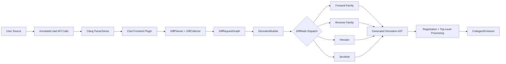

### 2.3 Architectural Invariants

- `DiffRequest` is the canonical execution contract across planning and generation.
- All generated derivatives are concrete `clang::FunctionDecl` nodes.
- Mode differences are isolated behind visitor polymorphism.
- Nested derivative requests are graph-scheduled, not ad hoc recursive string generation.

---

\newpage

## 3. Repository and Module Topology

### 3.1 Top-Level Module Layout

- `include/clad/Differentiator/`
  - interfaces, mode enums, key declarations
- `lib/Differentiator/`
  - implementations of planner, builder, visitor pipelines
- `tools/`
  - frontend/backend plugin integration
- `docs/internalDocs/`
  - deep technical docs
- `test/` and `unittests/`
  - behavioral and unit verification

### 3.2 Core Module Map

| Module | Primary Responsibility | Core Files |
|---|---|---|
| API Wrapper | User entrypoints + runtime wrapper | `include/clad/Differentiator/Differentiator.h` |
| Request Planning | Build normalized derivation requests | `DiffPlanner.h/.cpp` |
| Dispatch Engine | Mode dispatch + registration | `DerivativeBuilder.h/.cpp` |
| AST Base Utilities | Shared cloning/build helpers | `VisitorBase.h/.cpp` |
| Forward Modes | First-order and pushforward/vector modes | `BaseForwardModeVisitor*`, `PushForward*`, `Vector*` |
| Reverse Modes | Gradient/pullback with sweep/tape | `ReverseModeVisitor*`, `Tape.h` |
| Higher Order | Hessian/Jacobian orchestration | `HessianModeVisitor*`, `JacobianModeVisitor*` |
| Plugin Integration | Clang/LLVM lifecycle integration | `tools/ClangPlugin.cpp`, `tools/ClangBackendPlugin.cpp` |

### 3.3 Dependency Orientation

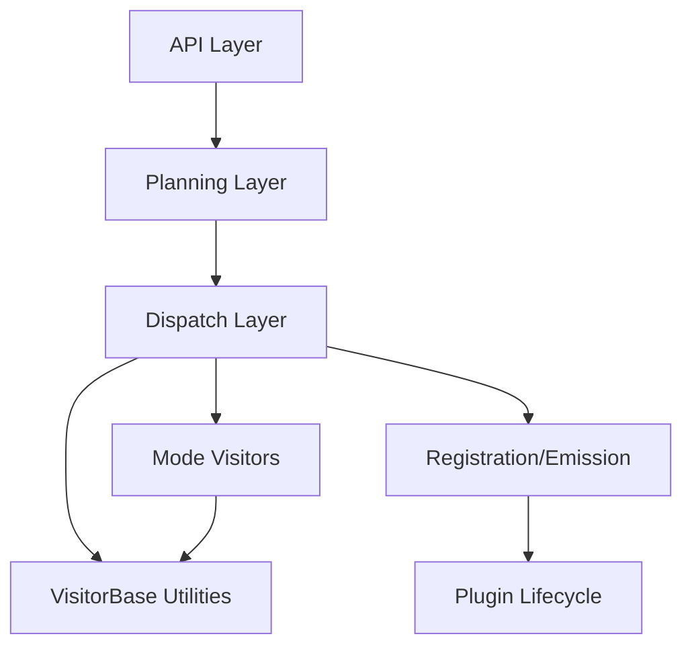

---

\newpage

## 4. Frontend Plugin Lifecycle and Request Genesis

### 4.1 Purpose

The frontend plugin is the runtime coordinator of compile-time differentiation:

- discovers annotated calls
- creates and schedules requests
- triggers derivation
- rewrites call sites
- emits generated declarations

### 4.2 Key Classes and Functions

- `clad::plugin::CladPlugin`
  - `HandleTranslationUnit`
  - `FinalizeTranslationUnit`
  - `ProcessDiffRequest`
- `DiffCollector::VisitCallExpr`

### 4.3 Control Flow

1. Clang invokes plugin TU handler.
2. Collector traverses declarations and identifies derivative requests.
3. Request graph is finalized.
4. Requests are processed in dependency-safe order.

### 4.4 Data Flow

- **Input:** AST calls with `AnnotateAttr`, plugin options
- **Output:** generated derivative decls + rewritten call arguments

### 4.5 Lifecycle Sequence Diagram

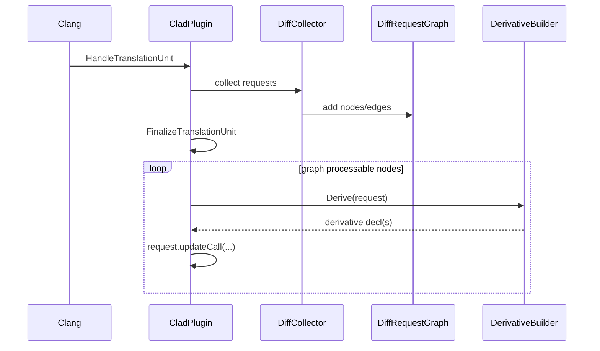

---

\newpage

## 5. Derivative Request Model and Graph Scheduling

### 5.1 Purpose

`DiffRequest` encapsulates all state required to generate a derivative consistently across modes.

### 5.2 Key Data Contracts

- target function (`Function`)
- base naming (`BaseFunctionName`)
- order controls (`CurrentDerivativeOrder`, `RequestedDerivativeOrder`)
- mode (`DiffMode`)
- independent variable info (`DVI`)
- analysis and backend flags (`EnableTBRAnalysis`, `EnableVariedAnalysis`, `EnableUsefulAnalysis`, `use_enzyme`, etc.)

### 5.3 Core Functions

- `ProcessInvocationArgs(...)`
- `DiffRequest::UpdateDiffParamsInfo(...)`
- `DiffRequest::ComputeDerivativeName()`
- `DiffRequest::updateCall(...)`

### 5.4 Scheduling Model

Graph scheduling uses `DynamicGraph<DiffRequest>`:

- nodes represent derivation tasks
- edges represent nested/higher-order dependencies
- finalization loop processes only ready nodes

### 5.5 Planning Call Graph

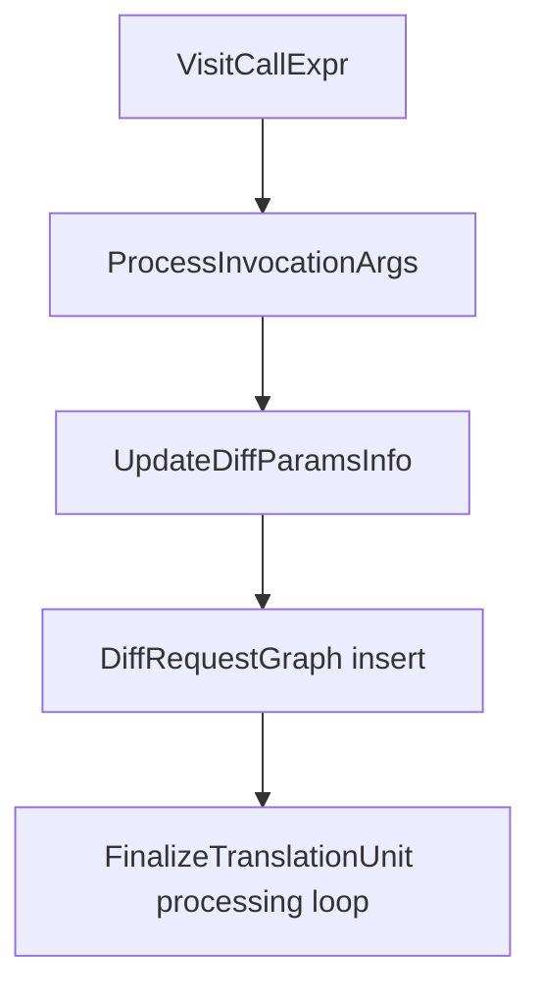

---

\newpage

## 6. DerivativeBuilder Dispatch and Declaration Construction

### 6.1 Purpose

`DerivativeBuilder` is the mode-agnostic dispatcher and declaration constructor.

### 6.2 Key Classes / Functions

- `DerivativeBuilder::Derive`
- `cloneFunction`
- `FindDerivedFunction`
- nested/custom derivative helpers

### 6.3 Control Flow

1. Validate request and custom derivative conditions.
2. Dispatch by mode to visitor `Derive()`.
3. Register derivative and overload declarations.

### 6.4 Data Flow

- **Input:** `DiffRequest`
- **Output:** `DerivativeAndOverload`
- **Side effects:** cache updates and Sema registration state

### 6.5 Mode Dispatch Graph

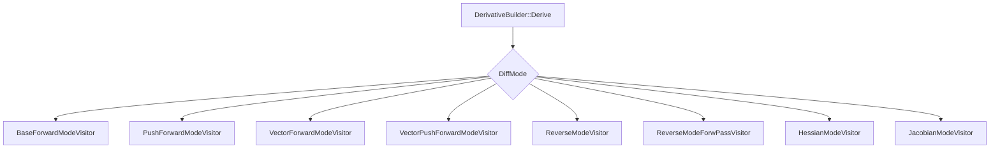

---

\newpage

## 7. Shared AST Transformation Infrastructure

### 7.1 Purpose

`VisitorBase` centralizes AST cloning and construction logic reused by all modes.

### 7.2 Key Functions

- cloning:
  - `Clone`, `CloneType`
- block/scope:
  - `beginBlock`, `endBlock`, `addToCurrentBlock`
- expression/declaration construction:
  - `BuildVarDecl`, `BuildDeclRef`, `BuildOp`, call builders

### 7.3 Control and Data Flow

- visitors delegate node reconstruction and type adaptation to shared helpers
- helper outputs are directly inserted into mode-specific output blocks

---

\newpage

## 8. Forward Pipeline (Detailed)

### 8.1 Purpose

Generate first-order forward derivatives and forward-like vector/pushforward variants.

### 8.2 Core Classes

- `BaseForwardModeVisitor`
- `PushForwardModeVisitor`
- `VectorForwardModeVisitor`
- `VectorPushForwardModeVisitor`

### 8.3 Forward Control Flow

1. clone derivative declaration
2. setup derivative parameters
3. generate seeds (`_d_` variables)
4. visit body (`Visit*`)
5. emit final derivative body

### 8.4 Forward Data Flow

- `m_Variables` maps primal symbols to derivative symbols/expressions
- DVI selects independent variable targets
- pushforward/vector modes shape return and storage types

### 8.5 Forward Sequence

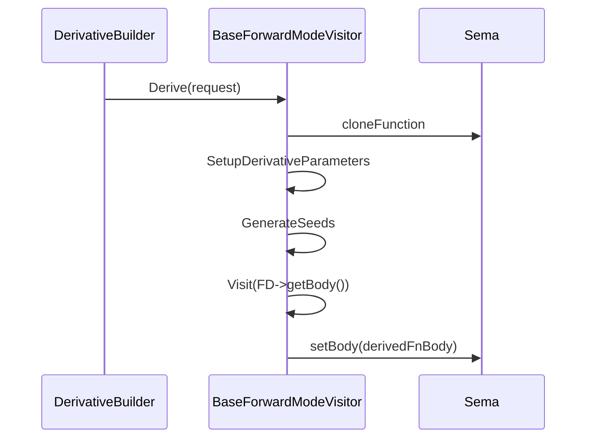

---

\newpage

## 9. Reverse Pipeline (Detailed)

### 9.1 Purpose

Generate reverse-mode gradient/pullback derivatives using forward accumulation plus reverse sweep semantics.

### 9.2 Core Classes

- `ReverseModeVisitor`
- `ExternalRMVSource` family
- tape support (`Tape.h`, tape expression builders)

### 9.3 Reverse Control Flow

1. clone derivative declaration
2. build params
3. backend branch:
   - `DifferentiateWithClad`
   - `DifferentiateWithEnzyme`
4. visit body and build forward/reverse blocks
5. finalize body and optional overload

### 9.4 Reverse Data Flow

- `m_Stack`: incoming adjoint seed propagation
- `m_Globals`: promoted declarations/tapes
- `m_Reverse`: reverse-sweep statements
- `m_DeallocExprs`: deferred cleanup statements

### 9.5 Reverse Internal Graph

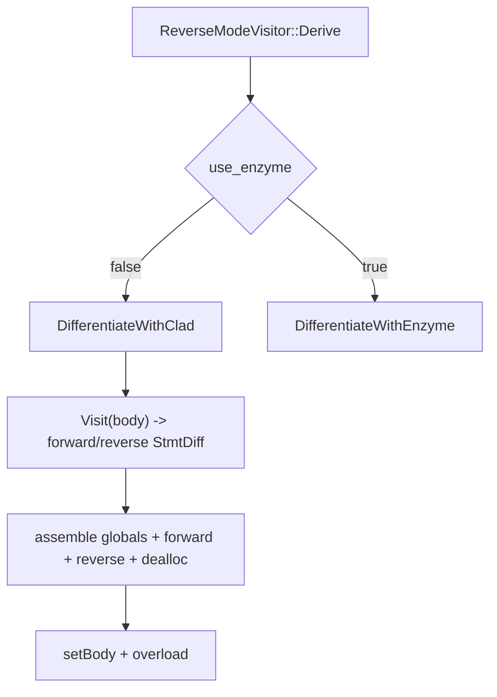

---

\newpage

## 10. Hessian Pipeline (Detailed)

### 10.1 Purpose

Produce Hessian second-order outputs by orchestrating multiple derivative generations.

### 10.2 Core Class

- `HessianModeVisitor`

### 10.3 Control Flow

1. expand requested independent argument slots/ranges
2. generate second-derivative functions per slot:
   - full Hessian: forward + reverse
   - diagonal Hessian: forward twice
3. merge per-slot functions into one output wrapper

### 10.4 Data Flow

- `IndependentArgsSize` and total size drive output indexing/layout
- merge function writes to output matrix/vector parameter slices

### 10.5 Hessian Composition Diagram

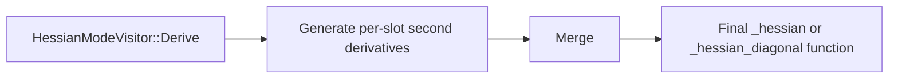

---

\newpage

## 11. Jacobian Pipeline (Detailed)

### 11.1 Purpose

Produce Jacobian derivatives via vectorized pushforward infrastructure.

### 11.2 Core Class

- `JacobianModeVisitor : VectorPushForwardModeVisitor`

### 11.3 Control Flow

1. clone jacobian function (`*_jac`)
2. build derivative parameter vectors/matrices
3. compute independent variable count
4. initialize one-hot/identity/zero vectors by DVI
5. transform body
6. return derivative expression (`Expr_dx`) in overridden return visitor

### 11.4 Data Flow

- `m_IndVarCountExpr`: global dimension for vector derivatives
- `m_Variables`: parameter -> derivative vector expression mapping

---

\newpage

## 12. AST-to-Emission Data and Control Flow

### 12.1 Unified Data Flow

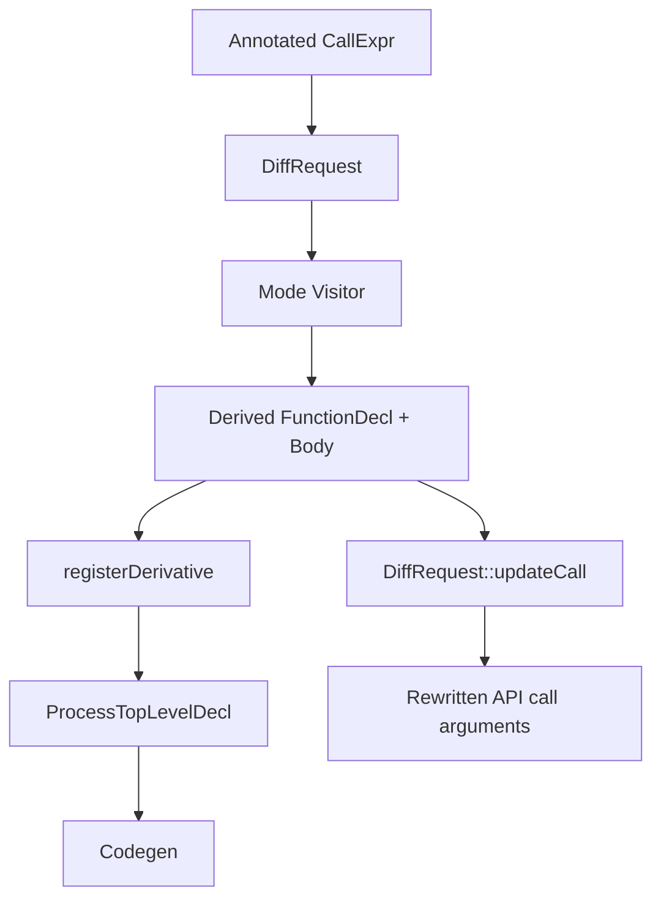

### 12.2 Control Flow Summary

1. detect
2. normalize
3. schedule
4. dispatch
5. transform
6. register
7. rewrite
8. emit

---

\newpage

## 13. Extension Points and Customization Hooks

### 13.1 Custom Derivatives

- custom overload lookup and Sema-based signature matching
- reverse/jacobian modes may require overload generation wrappers

### 13.2 Numerical Fallback

- used when symbolic derivation and custom overloads are unavailable and viable
- diagnostics explain fallback behavior and controls

### 13.3 Reverse External Hooks

- callback-driven hooks via external reverse source interfaces
- used for error estimation and augmentation behaviors

### 13.4 Backend Customization

- Enzyme route toggled by request options for reverse mode
- backend plugin hooks can alter/augment LLVM pass pipeline behavior

---

\newpage

## 14. Performance-Critical Areas

### 14.1 High-Cost Zones

- AST clone/build helper hot paths (`VisitorBase` and utility builders)
- call differentiation logic in forward visitor (`VisitCallExpr`)
- reverse sweep and tape orchestration (`ReverseModeVisitor`)
- repeated nested generation in hessian/jacobian workloads

### 14.2 Complexity Factors

- number of requests in TU
- independent variable dimensionality
- nested/high-order derivative depth
- control-flow and expression complexity of differentiated functions

### 14.3 Optimization Opportunities

1. cache repeated nested derivation resolutions
2. reduce redundant type reconstruction in hot visitors
3. optimize hessian/jacobian repeated-slot generation paths

---

\newpage

## 15. Debugging and Tracing Workflow

### 15.1 Step-by-Step Trace

1. request detection:
   - confirm call reaches `VisitCallExpr`
2. request normalization:
   - inspect mode, DVI, options
3. graph scheduling:
   - verify dependencies and processing order
4. dispatch:
   - confirm selected visitor
5. transformation:
   - inspect generated function signature and body
6. rewrite:
   - verify `updateCall` updated call arguments
7. registration/emission:
   - verify declaration reaches top-level processing

### 15.2 Frequent Failure Classes

- undefined function body for target
- non-differentiable attributes
- invalid/insufficient args specification (notably array/pointer indexing in higher-order modes)
- custom derivative signature mismatch
- unsupported mode-specific AST patterns

### 15.3 Reverse-Specific Debug Focus

- backend branch selection (CLAD vs Enzyme)
- tape declaration and push/pop generation
- reverse statement ordering and block serialization

---

\newpage

## 16. Operational Checklists

### 16.1 Implementation Checklist (New Mode Feature)

- [ ] add/extend `DiffMode` mapping and planner option gates
- [ ] implement visitor `Derive` and key `Visit*` overrides
- [ ] ensure `DerivativeBuilder` mode dispatch path
- [ ] verify overload generation behavior
- [ ] add lit regression tests
- [ ] add unit tests for utility logic and edge cases

### 16.2 Incident Checklist (Broken Derivative Output)

- [ ] verify mode and DVI parse
- [ ] inspect request graph order
- [ ] inspect generated decl name/signature
- [ ] inspect transformed body for missing derivative state mappings
- [ ] verify callsite rewrite
- [ ] verify top-level emission path

---

\newpage

## 17. Appendix A — Core Call Graphs

### 17.1 Pipeline Spine

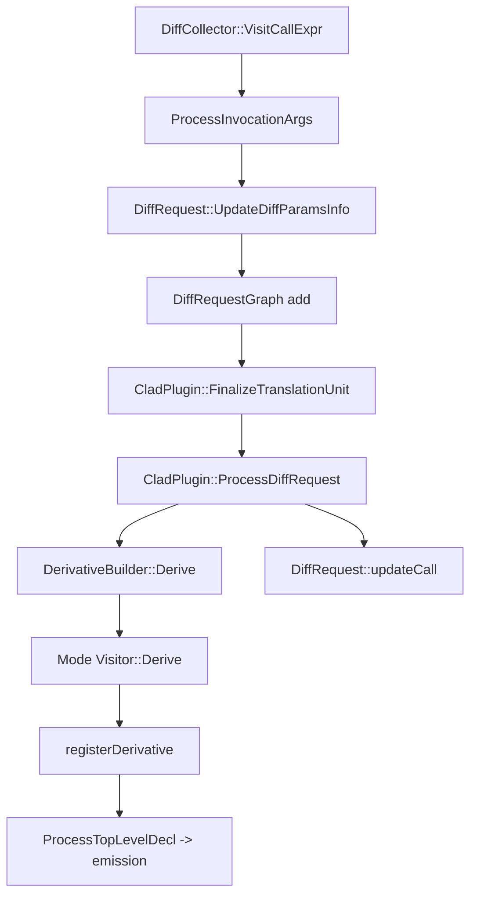

### 17.2 Forward Inner Call Graph

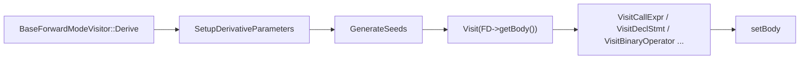

### 17.3 Reverse Inner Call Graph

---

\newpage

## 18. Appendix B — File Index by Responsibility

### 18.1 Planning and Request Management

- `include/clad/Differentiator/DiffPlanner.h`
- `lib/Differentiator/DiffPlanner.cpp`

### 18.2 Dispatch and Registration

- `include/clad/Differentiator/DerivativeBuilder.h`
- `lib/Differentiator/DerivativeBuilder.cpp`

### 18.3 Shared Visitor Infrastructure

- `include/clad/Differentiator/VisitorBase.h`
- `lib/Differentiator/VisitorBase.cpp`
- `lib/Differentiator/CladUtils.cpp`

### 18.4 Mode Pipelines

- `lib/Differentiator/BaseForwardModeVisitor.cpp`
- `lib/Differentiator/PushForwardModeVisitor.cpp`
- `lib/Differentiator/VectorForwardModeVisitor.cpp`
- `lib/Differentiator/VectorPushForwardModeVisitor.cpp`
- `lib/Differentiator/ReverseModeVisitor.cpp`
- `lib/Differentiator/HessianModeVisitor.cpp`
- `lib/Differentiator/JacobianModeVisitor.cpp`

### 18.5 Plugin Lifecycle

- `tools/ClangPlugin.cpp`
- `tools/ClangBackendPlugin.cpp`

---

\newpage

## 19. Appendix C — Diagram Index

1. System component architecture
2. Module dependency orientation
3. Frontend lifecycle sequence
4. Request planning call graph
5. Mode dispatch graph
6. Forward sequence
7. Reverse internal graph
8. Hessian composition graph
9. Unified AST-to-emission flow
10. Pipeline spine call graph
11. Forward inner call graph
12. Reverse inner call graph

---

End of PDF Edition.

