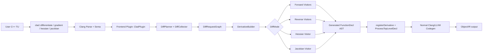
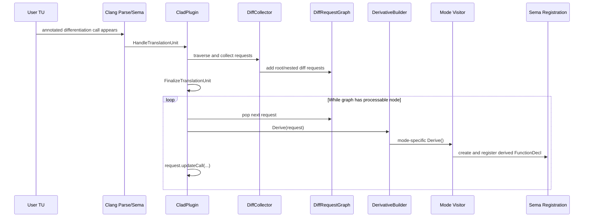
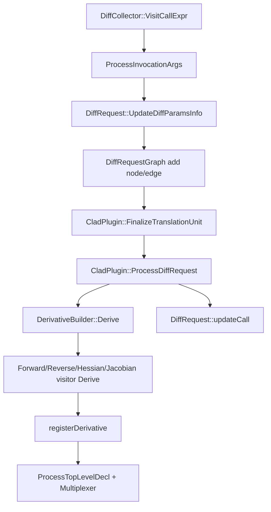
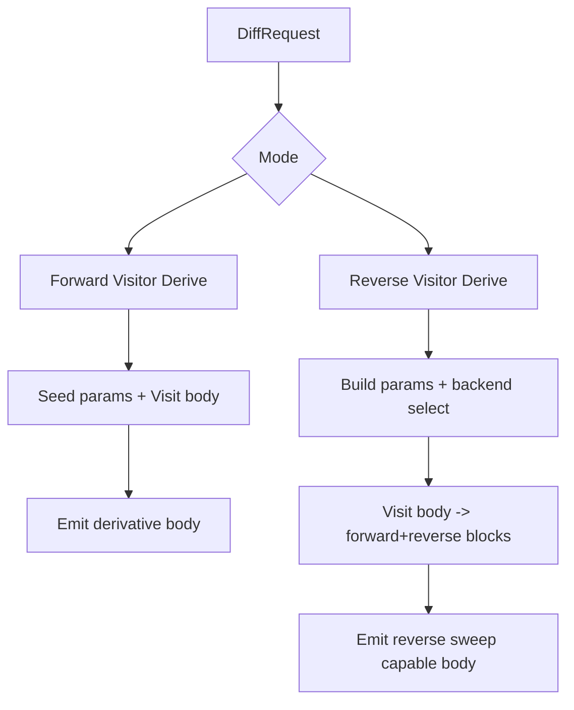
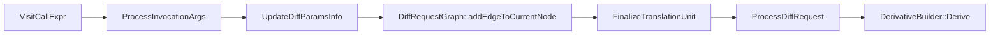
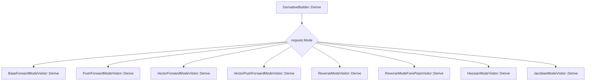
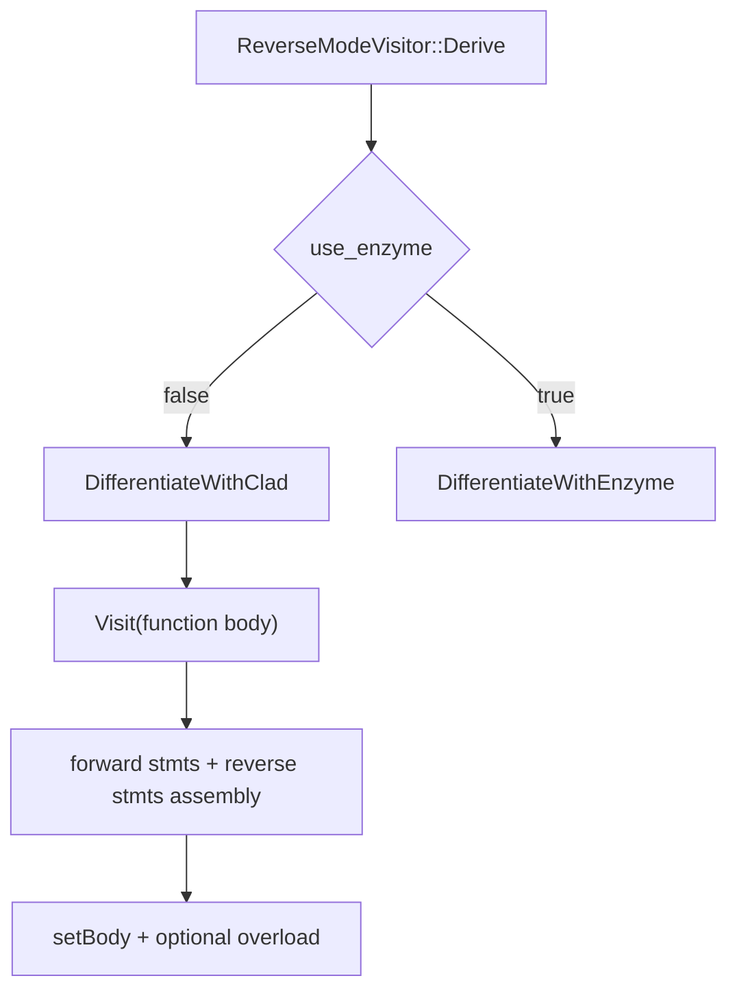
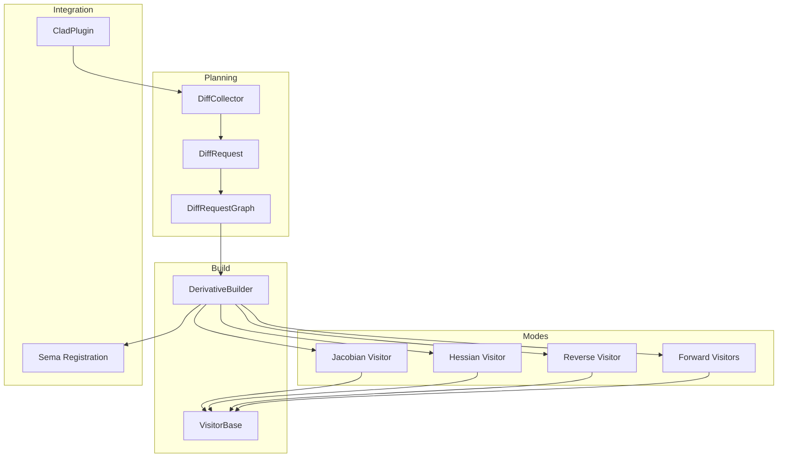
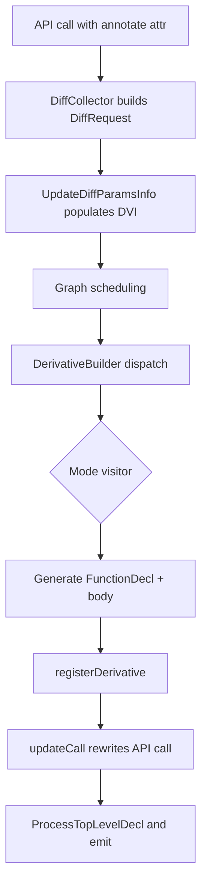

# CLAD Complete Technical Architecture and Execution Document

Audience: advanced C++ and compiler developers  
Scope: full derivative generation pipeline from `clad::differentiate(...)`/family calls to generated derivative declaration emission in the translation unit.

---

## 1. System Context and Architectural Boundaries

CLAD is a source-transformation automatic differentiation system embedded into Clang compilation.
Its core execution model is:

1. User writes differentiation API call (`differentiate`, `gradient`, `hessian`, `jacobian` family).
2. API is annotated with `__attribute__((annotate("...")))`.
3. Clang frontend plugin discovers annotation-bearing calls and builds differentiation requests.
4. Requests are dependency-scheduled in a graph.
5. A mode-specific AST visitor synthesizes a derivative `FunctionDecl`.
6. Generated decls are registered and emitted through normal Clang codegen.

The architecture has two cooperating integration layers:

- **Frontend integration**: AST/Sema transformations and request scheduling.
- **Backend integration**: LLVM pass pipeline extension and optional Enzyme backend path for reverse mode.

The system is intentionally compile-time-first: runtime execution is just indirect function invocation through `CladFunction`.

### 1.1 End-to-End Component Diagram

### 1.2 Cross-Cutting Design Themes

- **Request-centric orchestration**: `DiffRequest` is the currency from planning to emission.
- **Mode polymorphism**: derivation logic is delegated to mode-specific visitors.
- **AST-native synthesis**: derivative code is produced as real Clang AST nodes, not textual code.
- **Dependency-driven scheduling**: nested/high-order requests are represented explicitly in a graph.
- **Interposition-friendly**: custom derivatives and numerical fallback can override normal derivation.

---

## 2. Full Module and Directory Map

This section maps major directories to responsibilities, ownership, and execution roles.

### 2.1 Repository-Level Layout

- `include/clad/Differentiator/`
  - Public and internal AD interfaces.
  - Core structs/classes: `DiffRequest`, `DerivativeBuilder`, visitor APIs, mode enums, runtime wrappers.
- `lib/Differentiator/`
  - Implementations of planning, builder, visitors, utilities.
  - Main algorithmic body of AD transformation.
- `tools/`
  - Plugin entrypoints:
    - Clang frontend plugin (`ClangPlugin.cpp`)
    - LLVM backend plugin (`ClangBackendPlugin.cpp`)
- `docs/internalDocs/`
  - Internal design and execution documents.
- `test/`
  - Regression tests (lit).
- `unittests/`
  - C++ unit tests (GoogleTest).

### 2.2 Differentiator Include Layer (Key Files)

- `Differentiator.h`
  - User API templates and `CladFunction`.
  - Annotation-bearing entry points.
- `DiffPlanner.h`
  - `DiffRequest` definition and planning interfaces.
- `DerivativeBuilder.h`
  - Core dispatcher and declaration cloning interfaces.
- `VisitorBase.h`
  - Common AST cloning/building utilities.
- Mode visitors:
  - `BaseForwardModeVisitor.h`
  - `PushForwardModeVisitor.h`
  - `VectorForwardModeVisitor.h`
  - `VectorPushForwardModeVisitor.h`
  - `ReverseModeVisitor.h`
  - `HessianModeVisitor.h`
  - `JacobianModeVisitor.h` (in `lib/Differentiator/` in this repo layout)
- Support/data:
  - `DiffMode.h`
  - `ParseDiffArgsTypes.h`
  - `Tape.h`
  - `ExternalRMVSource.h`

### 2.3 Differentiator Implementation Layer (Key Files)

- Planning:
  - `DiffPlanner.cpp`
- Dispatcher:
  - `DerivativeBuilder.cpp`
- Shared AST helpers:
  - `VisitorBase.cpp`
  - `CladUtils.cpp`
  - `StmtClone.cpp`
- Mode implementations:
  - `BaseForwardModeVisitor.cpp`
  - `PushForwardModeVisitor.cpp`
  - `VectorForwardModeVisitor.cpp`
  - `VectorPushForwardModeVisitor.cpp`
  - `ReverseModeVisitor.cpp`
  - `HessianModeVisitor.cpp`
  - `JacobianModeVisitor.cpp`

### 2.4 Tooling Integration Layer

- `tools/ClangPlugin.cpp`
  - Frontend pipeline lifecycle hooks.
  - Graph draining and derivative request execution.
- `tools/ClangBackendPlugin.cpp`
  - Backend plugin registration and pass injection points.

---

## 3. Entry Points and Request Genesis

### 3.1 User-Side Entry

**Primary purpose**: allow users to request differentiation in C++ syntax while preserving compile-time discoverability.

**Key classes/functions**

- `clad::differentiate(...)` overloads
- `clad::gradient(...)`, `clad::hessian(...)`, `clad::jacobian(...)` family
- `CladFunction` wrapper

**Control flow**

1. Template API call appears in source.
2. Annotated function call enters AST (`AnnotateAttr`).
3. Plugin later discovers call and builds request.

**Data flow**

- API args include:
  - target function
  - differentiation arg spec (`Args`)
  - optional template bitmask options
- Result object:
  - `CladFunction` with function pointer and code string slot.

### 3.2 Frontend Plugin Entry

**Purpose**: detect requests, schedule derivation, trigger AST mutation/emission.

**Key classes/functions**

- `clad::plugin::CladPlugin::HandleTopLevelDecl`
- `clad::plugin::CladPlugin::HandleTranslationUnit`
- `FinalizeTranslationUnit`
- `ProcessDiffRequest`
- `SendToMultiplexer`

**Control flow**

1. Clang calls plugin TU handlers.
2. Collector builds request graph.
3. Finalize drains graph in dependency order.
4. Each request dispatched to builder.
5. Decls registered and emitted.

**Data flow**

- Input: AST declaration groups, plugin options.
- Output: generated `FunctionDecl`s + rewritten callsites.

---

## 4. Differentiation Pipeline Execution (Global)

### 4.1 Full Sequence (Compile-Time)

### 4.2 Core Call Graph (Pipeline Spine)

---

## 5. Major Components: Responsibilities, Control, and Data Flow

For each major component: purpose, key classes/functions, control flow, data flow.

## 5.1 Runtime Wrapper Component (`CladFunction`)

**Purpose**

- Hold generated derivative function pointer and derivative source string.
- Provide runtime invocation entrypoint once compile-time generation is complete.

**Key classes**

- `CladFunction`

**Key functions**

- `CladFunction` constructors
- `execute(...)`
- helper execution forwarding

**Control flow**

1. Constructed at API call expression.
2. During compilation, callsite gets rewritten with concrete derived function.
3. At runtime, `execute` invokes stored pointer.

**Data flow**

- `m_Function` receives generated function symbol.
- `m_Code` can carry generated code string unless immediate mode suppresses update.

## 5.2 Planning Component (`DiffPlanner`, `DiffCollector`, `DiffRequest`)

**Purpose**

- Convert call expressions into normalized derivation requests.
- Parse independent variable specifications.
- Build dependency graph for nested/high-order derivations.

**Key classes**

- `DiffRequest`
- `DiffCollector`
- `DynamicGraph<DiffRequest>`

**Key functions**

- `DiffCollector::VisitCallExpr`
- `ProcessInvocationArgs`
- `DiffRequest::UpdateDiffParamsInfo`
- `DiffRequest::ComputeDerivativeName`
- `DiffRequest::updateCall`

**Control flow**

1. Collector visits call expr.
2. Validates annotation/mode and options.
3. Parses args into DVI.
4. Pushes request into graph.
5. Later, callsite rewritten after derivation.

**Data flow**

- Inputs:
  - annotation string (`D/G/H/J/E`)
  - template bitmask options
  - args expr
- Outputs:
  - fully configured `DiffRequest`:
    - mode
    - DVI
    - analysis flags
    - backend flags (`use_enzyme`)
    - derivative order metadata.

## 5.3 Dispatcher Component (`DerivativeBuilder`)

**Purpose**

- Central derivation orchestrator and mode dispatcher.
- Handles custom derivative matching and fallback behavior.
- Owns registration ordering and nested request handling.

**Key classes**

- `DerivativeBuilder`
- `DerivedFnCollector`

**Key functions**

- `DerivativeBuilder::Derive`
- `cloneFunction`
- `FindDerivedFunction`
- `HandleNestedDiffRequest`
- `BuildCallToCustomDerivativeOrNumericalDiff`
- `registerDerivative` (helper)

**Control flow**

1. Inspect request for custom derivative route.
2. Validate function availability and differentiability.
3. Dispatch by `DiffMode`.
4. Register derivative and optional overload.

**Data flow**

- Input: `DiffRequest`
- Output: `DerivativeAndOverload { derivative, overload }`
- Side effects:
  - derived decl cache updates
  - Sema registration state updates.

## 5.4 Shared AST Utility Component (`VisitorBase`)

**Purpose**

- Provide reusable AST cloning/building helpers to all mode visitors.

**Key classes**

- `VisitorBase`

**Key functions**

- `Clone(...)`, `CloneType(...)`
- block/scope helpers (`beginBlock`, `endBlock`, `addToCurrentBlock`)
- declaration/reference builders (`BuildVarDecl`, `BuildDeclRef`, `BuildOp`)

**Control flow**

- Called per AST node transformation by mode visitors.

**Data flow**

- Consumes source AST nodes and Sema context.
- Produces cloned/transformed AST nodes inserted into derivative function body.

## 5.5 Forward Pipeline Component

**Purpose**

- Generate first-order forward derivatives and pushforward/vector forms.

**Key classes**

- `BaseForwardModeVisitor`
- `PushForwardModeVisitor`
- `VectorForwardModeVisitor`
- `VectorPushForwardModeVisitor`

**Key functions**

- `BaseForwardModeVisitor::Derive`
- `GenerateSeeds`, `SetupDerivativeParameters`
- `VisitCallExpr`, `VisitBinaryOperator`, `VisitDeclStmt`, `VisitReturnStmt`
- vector-specific `CreateVectorModeOverload`

**Control flow**

1. Clone derivative function declaration.
2. Build derivative parameters and seed values.
3. Traverse original body with `Visit*` transforms.
4. Set derivative body and emit overloads if required.

**Data flow**

- `m_Variables` map stores primal->derivative expression mapping.
- DVI decides independent variable seed positions.
- Pushforward modes return paired value+derivative structures.

## 5.6 Reverse Pipeline Component

**Purpose**

- Generate reverse-mode gradient/pullback functions with reverse sweep semantics.

**Key classes**

- `ReverseModeVisitor`
- `ExternalRMVSource` family
- reverse-specific helper structures (`StmtDiff`, tape wrappers)

**Key functions**

- `ReverseModeVisitor::Derive`
- `DifferentiateWithClad`
- `DifferentiateWithEnzyme`
- `DifferentiateSingleStmt`
- `DifferentiateSingleExpr`
- `MakeCladTapeFor`

**Control flow**

1. Build derivative declaration and params.
2. Choose backend path (CLAD or Enzyme).
3. Produce forward pass + reverse sweep statements.
4. Serialize and append deallocation/cleanup.

**Data flow**

- `m_Stack` carries incoming adjoint seeds.
- `m_Globals` stores promoted/tape declarations.
- `m_Reverse` stores reverse-pass statements.
- `m_DeallocExprs` stores deferred free/delete operations.

## 5.7 Hessian Component

**Purpose**

- Compose second-order derivatives into Hessian output API.

**Key classes**

- `HessianModeVisitor`

**Key functions**

- `HessianModeVisitor::Derive`
- `DeriveUsingForwardAndReverseMode` (helper)
- `DeriveUsingForwardModeTwice` (diagonal helper)
- `Merge`

**Control flow**

1. Expand requested independent argument slots.
2. For each slot:
   - full Hessian: forward then reverse.
   - diagonal Hessian: forward twice.
3. Merge generated second-derivative functions into one output function.

**Data flow**

- `IndependentArgsSize` and `TotalIndependentArgsSize` define matrix slicing layout.
- Output pointer param receives row-major column slices via generated calls.

## 5.8 Jacobian Component

**Purpose**

- Build Jacobian-producing vectorized derivative functions.

**Key classes**

- `JacobianModeVisitor` (subclass of `VectorPushForwardModeVisitor`)

**Key functions**

- `JacobianModeVisitor::Derive`
- `JacobianModeVisitor::VisitReturnStmt`

**Control flow**

1. Clone jacobian function decl (`*_jac` naming).
2. Build per-parameter derivative vectors/matrices.
3. Initialize one-hot/identity/zero vectors by requested DVI.
4. Transform body with vector mode semantics.
5. Return derivative value only in return visitor override.

**Data flow**

- `m_IndVarCountExpr` tracks total independent dimension.
- `m_Variables` stores parameter derivative vector expressions.

## 5.9 Plugin Lifecycle Component

**Purpose**

- Integrate CLAD logic into Clang frontend and optional LLVM backend lifecycle.

**Key classes**

- `CladPlugin` (frontend)
- backend plugin action in `ClangBackendPlugin.cpp`

**Key functions**

- `HandleTranslationUnit`
- `FinalizeTranslationUnit`
- `ProcessDiffRequest`
- `ProcessTopLevelDecl`
- backend pass registration callback

**Control flow**

1. Frontend plugin initializes once per TU.
2. Collect/plan requests.
3. Drain graph and generate/emit derivatives.
4. Backend plugin extends LLVM pipeline as configured.

**Data flow**

- Frontend: AST and Sema objects.
- Backend: LLVM pass builder and module pipeline state.

---

## 6. AST Transformation Workflow (Detailed)

## 6.1 Node-Level Transformation Model

All visitors return `StmtDiff`:

- primal or cloned AST fragment (`Stmt`)
- derivative/reverse-sweep fragment (`Stmt_dx`)

Forward mode usually emits derivatives in forward evaluation context.
Reverse mode splits statements into two phases and reverses reverse-phase ordering.

## 6.2 Scope and Block Management

Mode visitors use shared scope/block primitives:

- function declaration scope
- function body scope
- nested declaration/control scopes
- forward/reverse directional blocks (reverse mode)

This ensures transformed declarations are visible where reverse sweep needs them.

## 6.3 Expression and Statement Categories

Transform categories include:

- declarations (`VisitDeclStmt`, var differentiation)
- references (`VisitDeclRefExpr`)
- calls (`VisitCallExpr` with nested request logic)
- arithmetic/logical operators (rule-specific derivative formulas)
- control flow:
  - `if`, `for`, `while`, range-for
  - condition variable handling
- return semantics:
  - forward derivative return
  - pushforward paired return
  - jacobian derivative-only return
  - reverse pullback/gradient output conventions.

## 6.4 Reverse-Specific Tape and Replay Semantics

Reverse mode records values needed later in reverse sweep:

- creates tape variables for intermediates
- emits `clad::push` during forward pass
- emits `clad::pop`/back access during reverse sweep

OpenMP paths may require static/threadprivate tape declarations.

---

## 7. Data Structure Lifecycle and Object Ownership

## 7.1 `DiffRequest` Lifecycle

1. Constructed during collection.
2. Mode/options configured.
3. DVI computed.
4. Potentially cloned/mutated for nested derivation requests.
5. Consumed by builder and visitors.
6. Used to rewrite callsite via `updateCall`.

## 7.2 `FunctionDecl` Lifecycle (Generated Derivatives)

1. Created by `cloneFunction`.
2. Parameters replaced/extended by visitor mode logic.
3. Body assigned with transformed AST.
4. Registered by `registerDerivative`.
5. Processed as top-level declarations for emission.

## 7.3 Visitor State Lifecycle

Representative long-lived state:

- variable derivative maps (`m_Variables`)
- current block stacks
- reverse stacks (`m_Stack`, `m_Reverse`, `m_Globals`)
- external source pointers (reverse error estimation)

Lifecycle is generally bounded by one visitor instance per request.

## 7.4 Runtime Wrapper Lifecycle (`CladFunction`)

1. Constructed at API site.
2. Populated through compile-time call rewrite.
3. Runtime `execute` invokes generated symbol.

---

## 8. Plugin Lifecycle Integration

## 8.1 Frontend Lifecycle Phases

1. **Registration phase**: plugin action and pragma handlers registered.
2. **Translation unit traversal phase**:
   - collect declarations
   - build request graph.
3. **Finalization phase**:
   - drain requests
   - generate derivatives
   - rewrite calls
   - emit declarations.

## 8.2 Backend Lifecycle Phases

- Backend plugin hooks into pass pipeline construction.
- Used for backend-level differentiation support and Enzyme integration pathways.

## 8.3 Multiplexer and Emission Bridge

After generation:

- plugin sends decls to Clang multiplexer path.
- normal codegen emits object/IR for generated derivative functions.

---

## 9. Forward vs Reverse Mode Pipeline Comparison

## 9.1 Architectural Comparison

| Aspect | Forward family | Reverse family |
|---|---|---|
| Core visitor | `BaseForwardModeVisitor` and vector variants | `ReverseModeVisitor` |
| Seed model | direct parameter derivative seeds | incoming adjoint seed stack (`dfdS`) |
| Statement organization | mostly single forward ordering | explicit forward pass + reverse sweep |
| Tape usage | generally none | core mechanism for intermediate replay |
| Return shape | derivative or value+pushforward | gradient/pullback updates |
| Backend branch | CLAD AST transform | CLAD AST transform or Enzyme call path |

## 9.2 Control-Flow Comparison Diagram

---

## 10. Extension Points and Customization Hooks

## 10.1 Custom Derivatives

Builder resolves user-provided derivatives from custom derivative namespace and validates call compatibility via Sema overload resolution.

### Hook surface

- custom overload symbol lookup
- signature matching against expected derivative type
- overload generation for reverse/jacobian modes

## 10.2 Numerical Differentiation Fallback

If derivation/custom derivative is unavailable and viable:

- builder can inject numerical differentiation path
- diagnostic messages explain fallback and disable flags (`CLAD_NO_NUM_DIFF`)

## 10.3 Reverse External Source Hooks

Reverse mode can attach external callback sources (notably error estimation):

- start/end derive hooks
- parameter creation hooks
- statement-level boundary hooks
- call/return finalization hooks

## 10.4 Backend Selection Hook

`request.use_enzyme` toggles reverse backend implementation path:

- CLAD-native reverse transformation
- Enzyme autodiff call generation

## 10.5 Pragmas and Analysis Control

Pragma handlers and bitmask options influence:

- active differentiation region
- checkpointing behavior
- TBR/varied/useful analyses

---

## 11. Performance-Critical Components

## 11.1 Hot Paths by Responsibility

- AST cloning and expression rebuilding (`VisitorBase`, `StmtClone`, `CladUtils`)
- reverse-mode transformation (`ReverseModeVisitor`) due to tape/sweep complexity
- call differentiation resolution (`VisitCallExpr`) due to nested requests and overload logic
- builder dispatch/registration in large TU workloads

## 11.2 Complexity Drivers

- Number of differentiated call sites.
- Nesting level of derivative requests.
- Function body size and control-flow complexity.
- Reverse mode tape density and loop recording requirements.
- Number of independent variables (vector, jacobian, hessian dimensions).

## 11.3 Practical Optimization Opportunities

1. Reuse cloned AST fragments where semantically safe.
2. Reduce repeated lookup and type reconstruction costs in hot visitor paths.
3. Cache nested request resolutions aggressively in `DerivedFnCollector`.
4. Improve Hessian/Jacobian repeated-derivative sharing for overlapping requests.

---

## 12. Debugging and Tracing Workflow

## 12.1 Request-Level Tracing Strategy

Recommended trace checkpoints:

1. **Collection**:
   - confirm `VisitCallExpr` sees annotated differentiation calls.
   - inspect produced `DiffRequest` fields (mode, DVI, flags).
2. **Planning**:
   - inspect graph nodes/edges for dependency ordering.
3. **Dispatch**:
   - confirm `DerivativeBuilder::Derive` selects expected visitor.
4. **Transformation**:
   - inspect generated function decl and body.
5. **Call rewrite**:
   - verify `DiffRequest::updateCall` replaced derived function argument.
6. **Emission**:
   - confirm derived decl reaches `ProcessTopLevelDecl`.

## 12.2 Reverse-Mode Debug Focus

Critical debugging points:

- `ReverseModeVisitor::Derive` backend branch selection.
- `DifferentiateWithClad` assembly order of globals, forward statements, reverse statements.
- Tape declarations and push/pop generation.
- Missing adjoint cases for unsupported pointer/array configurations.

## 12.3 Common Failure Classes

1. Missing function definition for target call.
2. Non-differentiable attribute on function/class.
3. Unsupported differentiation argument specification.
4. Custom derivative signature mismatch.
5. Unexpected fallback to numerical differentiation.
6. Reverse pointer/array parameter restrictions without explicit shape/index info.

## 12.4 Diagnostics and Crash Support

- Reverse visitor installs pretty stack trace derivative context.
- Diagnostic engine messages report mode-specific unsupported patterns.
- Signature mismatch diagnostics include candidate notes.

---

## 13. Component-Level Execution Details (Purpose/Classes/Functions/Control/Data)

This section enumerates high-impact components in compact structured form for quick system navigation.

### 13.1 `DiffCollector` Component

- **Purpose**: discover differentiation API calls and construct requests.
- **Key classes**: `DiffCollector`, `DiffRequest`.
- **Key functions**: `VisitCallExpr`, `ProcessInvocationArgs`.
- **Control flow**: AST traversal -> request build -> graph insertion.
- **Data flow**: call expr + annotations -> `DiffRequest` (`Mode`, `DVI`, options).

### 13.2 `DiffRequest` Component

- **Purpose**: canonical request envelope across planning/building.
- **Key classes**: `DiffRequest`.
- **Key functions**: `UpdateDiffParamsInfo`, `ComputeDerivativeName`, `updateCall`.
- **Control flow**: initialize -> normalize -> consume -> rewrite.
- **Data flow**: args expression parsed to `DVI`; generated decls fed back to call rewrite.

### 13.3 `DerivativeBuilder` Component

- **Purpose**: mode dispatch, custom derivative handling, registration.
- **Key classes**: `DerivativeBuilder`, `DerivedFnCollector`.
- **Key functions**: `Derive`, `cloneFunction`, `FindDerivedFunction`.
- **Control flow**: validate -> dispatch -> register.
- **Data flow**: request in, derivative/overload out + cache updates.

### 13.4 `BaseForwardModeVisitor` Component

- **Purpose**: scalar forward derivative generation.
- **Key classes**: `BaseForwardModeVisitor`.
- **Key functions**: `Derive`, `GenerateSeeds`, `VisitCallExpr`, `VisitBinaryOperator`.
- **Control flow**: clone+seeds -> AST visit -> body emit.
- **Data flow**: `m_Variables` mapping drives derivative expression lookup.

### 13.5 `ReverseModeVisitor` Component

- **Purpose**: reverse-mode gradient/pullback generation.
- **Key classes**: `ReverseModeVisitor`, external source interfaces.
- **Key functions**: `Derive`, `DifferentiateWithClad`, `DifferentiateWithEnzyme`, `DifferentiateSingleStmt`.
- **Control flow**: derive setup -> backend path -> forward/reverse assembly.
- **Data flow**: adjoint stack, tape refs, reverse blocks, global promoted decls.

### 13.6 `HessianModeVisitor` Component

- **Purpose**: second-order derivatives via composition.
- **Key classes**: `HessianModeVisitor`.
- **Key functions**: `Derive`, `Merge`.
- **Control flow**: per-slot second derivative generation -> merge wrapper emission.
- **Data flow**: `IndependentArgsSize` shapes output matrix layout.

### 13.7 `JacobianModeVisitor` Component

- **Purpose**: jacobian through vectorized derivatives.
- **Key classes**: `JacobianModeVisitor`.
- **Key functions**: `Derive`, `VisitReturnStmt`.
- **Control flow**: vector parameter setup -> body transform -> derivative return.
- **Data flow**: one-hot/identity/zero vectors map independent-variable axes.

### 13.8 `CladPlugin` Component

- **Purpose**: lifecycle controller for TU differentiation process.
- **Key classes**: `CladPlugin`.
- **Key functions**: `HandleTranslationUnit`, `FinalizeTranslationUnit`, `ProcessDiffRequest`.
- **Control flow**: collect -> schedule -> derive -> emit.
- **Data flow**: graph nodes consumed; decls and callsites mutated.

---

## 14. Detailed Call Graphs for Core Execution Paths

## 14.1 Frontend Request to Derivation

## 14.2 Builder Mode Dispatch

## 14.3 Reverse Internal Path

---

## 15. Component Interaction Diagram (Responsibility View)

---

## 16. Reverse vs Forward vs Higher-Order (Execution Semantics Matrix)

| Dimension | Forward | Reverse | Hessian | Jacobian |
|---|---|---|---|---|
| Primary output | first derivative | gradient/pullback | second derivatives | jacobian matrix |
| Engine basis | direct forward propagation | reverse sweep with adjoints | composition (forward+reverse or forward^2) | vectorized forward/pushforward |
| Intermediate recording | minimal | tape-heavy | delegated to nested modes | vector storage |
| Return model | derivative value (or pushforward pair) | gradient outputs/pullback style | output matrix/vector param writes | derivative-only vectorized return |
| Typical complexity growth | linear-ish in expression tree | depends on sweep + tape points | high due to repeated nested derivations | high with many independent vars |

---

## 17. Practical Navigation Guide for New Contributors

1. Start with `DiffPlanner.cpp`:
   - understand request construction and mode/option parsing.
2. Continue to `DerivativeBuilder.cpp`:
   - understand dispatch and registration contracts.
3. Read `VisitorBase.h/.cpp`:
   - learn AST helper abstractions used everywhere.
4. Read one mode deeply:
   - `BaseForwardModeVisitor.cpp` for algebraic derivative logic.
   - `ReverseModeVisitor.cpp` for tape/sweep architecture.
5. Follow plugin lifecycle in `tools/ClangPlugin.cpp`.
6. Validate understanding with `test/` regression cases.

---

## 18. Verification and Debugging Checklist (Pipeline-Oriented)

When diagnosing a derivation bug:

1. Confirm annotation and mode selection.
2. Inspect `DiffRequest` contents:
   - `Mode`, `DVI`, flags, derivative order.
3. Verify request graph ordering for nested requests.
4. Confirm builder dispatch path.
5. Inspect generated derivative declaration name/type.
6. Inspect transformed body:
   - forward seeds/mappings for forward/jacobian
   - tape and reverse blocks for reverse/hessian nested reverse
7. Confirm `updateCall` rewrite completed.
8. Confirm generated decl registered and emitted.

---

## 19. Appendix A: Major File Index by Execution Phase

### A.1 Request Detection and Planning

- `lib/Differentiator/DiffPlanner.cpp`
- `include/clad/Differentiator/DiffPlanner.h`

### A.2 Derivation Dispatch and Registration

- `lib/Differentiator/DerivativeBuilder.cpp`
- `include/clad/Differentiator/DerivativeBuilder.h`

### A.3 Shared AST Transform Utilities

- `lib/Differentiator/VisitorBase.cpp`
- `include/clad/Differentiator/VisitorBase.h`
- `lib/Differentiator/CladUtils.cpp`

### A.4 Mode Implementations

- Forward: `BaseForwardModeVisitor.cpp`, `PushForwardModeVisitor.cpp`
- Vector: `VectorForwardModeVisitor.cpp`, `VectorPushForwardModeVisitor.cpp`
- Reverse: `ReverseModeVisitor.cpp`
- Hessian: `HessianModeVisitor.cpp`
- Jacobian: `JacobianModeVisitor.cpp`

### A.5 Plugin Integration

- `tools/ClangPlugin.cpp`
- `tools/ClangBackendPlugin.cpp`

---

## 20. Appendix B: Full Pipeline Diagram (Condensed)

---

This document is intended to be read alongside the focused mode deep-dives already present in `docs/internalDocs/` for forward, reverse, hessian, and jacobian mechanics.

