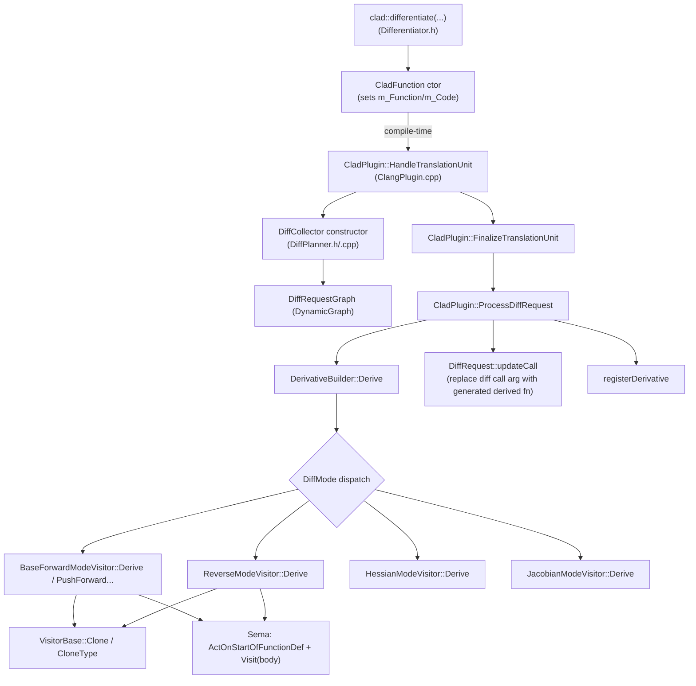

# CLAD Codebase Internal Workflow Documentation

Focus: the complete internal workflow when a user requests a derivative using `clad::differentiate()`.

## System Overview

CLAD is a **C++ source-to-source/AST transformer** implemented as a **Clang frontend plugin** plus an **LLVM backend plugin**. When user code calls `clad::differentiate(...)`, CLAD relies on **Clang attribute annotations** (e.g. `__attribute__((annotate("D")))`) to let the plugin detect those call sites during compilation, then it generates a new **derived function** by:

- building a **static dependency graph** of differentiation requests,
- selecting a **mode-specific visitor** (forward vs reverse),
- cloning and transforming the original AST into a derivative AST,
- registering the produced `clang::FunctionDecl`s so Clang emits code for them.

### High-level architecture diagram

```mermaid
flowchart LR
  U[User code: clad::differentiate(fn,args)] --> C[Clang parsing/Sema]
  C --> P[Clang frontend plugin: CladPlugin]
  P --> G[Diff planning: DiffCollector + DiffRequestGraph]
  G --> B[Derivative building: DerivativeBuilder]
  B --> V{DiffMode dispatch}
  V --> F[Forward visitors (BaseForwardModeVisitor/PushForward...)]
  V --> R[Reverse visitors (ReverseModeVisitor...)]
  V --> H[Hessian/Jacobian modes]
  F --> AST1[AST transform + derivative function decl]
  R --> AST2[AST transform + tape/pullback code]
  AST1 --> MX[Multiplexer/Clang codegen trigger]
  AST2 --> MX
  MX --> LLVM[LLVM backend/codegen (and optional Enzyme pass)]
```

## Directory and Module Map

Key directories in the repo:

- `include/clad/Differentiator/`
  - Public-ish differentiation engine headers: `Differentiator.h` (user API + `CladFunction`), mode visitors, planning/requests, builder, and core AST/utility types.
- `lib/Differentiator/`
  - Implementations of visitors, builder logic, planning logic, and supporting utilities.
- `tools/`
  - Clang plugin integration: `ClangPlugin.cpp`, backend plugin pass registration.
- `test/`
  - `lit`-based compiler/exec regression tests.
- `unittests/`
  - GoogleTest-based unit tests.

## Entry Points

### User API entry points (runtime wrapper + compile-time trigger)

The user calls one of the `clad::differentiate(...)` overloads in:

- `include/clad/Differentiator/Differentiator.h`
  - These overloads **return a `CladFunction` object**.
  - The overload is annotated with `__attribute__((annotate("D")))` for forward-mode differentiation (and other annotations for gradient/hessian/jacobian).

### Compile-time entry points (Clang plugin)

Clang loads the plugin via:

- `tools/ClangPlugin.cpp`
  - `FrontendPluginRegistry::Add<Action<CladPlugin>> X("clad", ...)`
  - Also registers a pragma handler: `PragmaHandlerRegistry::Add<CladPragmaHandler>`

At compile time, Clang calls:

- `clad::plugin::CladPlugin::HandleTopLevelDecl(...)`
- `clad::plugin::CladPlugin::HandleTranslationUnit(...)`

Then the plugin drives:

- `FinalizeTranslationUnit()`
- request-graph processing and derivative emission scheduling.

## Derivative Request Execution Flow

### End-to-end flow (user request to generated derivative)

Sequence diagram (compile-time generation + runtime execution wrapper):

```mermaid
sequenceDiagram
  participant U as User
  participant API as clad::differentiate (C++ template)
  participant Clang as Clang (Parse/Sema)
  participant Plug as CladPlugin (frontend plugin)
  participant Plan as DiffPlanner/DiffCollector
  participant Graph as DiffRequestGraph
  participant Build as DerivativeBuilder
  participant Vis as Visitor (Forward/Reverse)
  participant Sema as Clang Sema (AST mutation)
  participant Codegen as Multiplexer/Backend

  U->>API: clad::differentiate(fn, args)
  API->>Clang: create CladFunction + annotate("D") call
  Clang->>Plug: HandleTopLevelDecl / HandleTranslationUnit
  Plug->>Plan: DiffCollector (build static diff request graph)
  Plan->>Graph: add nodes/edges
  Plug->>Plug: FinalizeTranslationUnit()
  Plug->>Graph: getNextToProcessNode()
  Plug->>Plug: ProcessDiffRequest(request)
  Plug->>Build: DerivativeBuilder::Derive(request)
  Build->>Vis: mode dispatch (forward vs reverse)
  Vis->>Sema: cloneFunction + ActOnStartOfFunctionDef + build body stmts
  Sema->>Codegen: plugin registers derived decls; multiplexer triggers emission
  Codegen-->>Clang: derived function exists in TU
  U->>API: call CladFunction::execute at runtime
  API-->>U: execute derived function pointer (m_Function)
```

### Static call graph (core pipeline)



### Derivative execution-flow functions (function-by-function)

This documents the explicit, central call chain functions that connect a `clad::differentiate()` request to a generated derivative function declaration.

| Function name | Class name | File path | Purpose | Inputs and outputs | Next function called |
|---|---|---|---|---|---|
| `clad::differentiate(F fn, ArgSpec args, DerivedFnType derivedFn, const char* code)` | (free function template) | `include/clad/Differentiator/Differentiator.h` | User-facing forward-mode API; returns a `CladFunction` and tags the call with `annotate("D")`. | Inputs: `fn`, `args` spec; Output: `CladFunction` wrapper for runtime execution. | compile-time handled by `CladPlugin` during AST visitation |
| `CladFunction<...>::CladFunction(...)` | `CladFunction` | `include/clad/Differentiator/Differentiator.h` | Runtime wrapper initialization: stores function pointer and derivative code string. | Inputs: derived function pointer, code; Output: internal state `m_Function`, `m_Code`, optional functor object. | runtime `CladFunction::execute(...)` |
| `CladFunction<...>::execute(Args&&... args) const` | `CladFunction` | `include/clad/Differentiator/Differentiator.h` | Runtime entry point: calls derived function pointer (if valid) or returns default. | Inputs: runtime `Args...`; Output: derived result. | calls internal `execute_helper(...)` |
| `CladPlugin::HandleTranslationUnit(ASTContext& C)` | `clad::plugin::CladPlugin` | `tools/ClangPlugin.cpp` | Builds static diff request graph once and triggers TU finalization and emission scheduling. | Inputs: AST context; Output: derivative decls created and scheduled. | `FinalizeTranslationUnit()`, then `SendToMultiplexer()` |
| `CladPlugin::FinalizeTranslationUnit()` | `clad::plugin::CladPlugin` | `tools/ClangPlugin.cpp` | Drains the diff request graph queue and runs `ProcessDiffRequest` for each node. | Inputs: graph nodes; Output: produced derivative decls and call updates. | `ProcessDiffRequest(request)` |
| `CladPlugin::ProcessDiffRequest(DiffRequest& request)` | `clad::plugin::CladPlugin` | `tools/ClangPlugin.cpp` | Main driver: ensures definitions, calls `DerivativeBuilder::Derive`, registers derivatives, and updates the original differentiation call site. | Inputs: a `DiffRequest`; Outputs: `FunctionDecl*` derivative decl (or `nullptr`) and AST call mutation. | `DerivativeBuilder::Derive(request)`, may call `DiffRequest::updateCall(...)` |
| `DiffCollector::DiffCollector(...)` | `clad::DiffCollector` | `include/clad/Differentiator/DiffPlanner.h` (ctor signature) + `lib/Differentiator/DiffPlanner.cpp` | Traverses collected decls to build a static dependency graph of differentiation requests. | Inputs: decl group + activation interval; Outputs: populated `DiffRequestGraph` nodes/edges. | internal AST traversal `TraverseDecl(...)` and `VisitCallExpr(...)` |
| `DiffCollector::VisitCallExpr(CallExpr* E)` | `clad::DiffCollector` | `lib/Differentiator/DiffPlanner.cpp` | Detects `clad::differentiate/gradient/hessian/jacobian` via `AnnotateAttr`, creates root request, selects mode, parses options and args, and sets `CallUpdateRequired`. | Inputs: call expr; Outputs: mutated request + edges in graph. | `ProcessInvocationArgs(...)`, then `request.UpdateDiffParamsInfo(...)` |
| `ProcessInvocationArgs(...)` | (helper) | `lib/Differentiator/DiffPlanner.cpp` | Maps annotation (`"D"`, `"G"`, `"H"`, `"J"`) to `DiffMode`, sets options (TBR/Varied/Useful/Enzyme), and performs sanity checks. | Inputs: Sema + begin location + request targets; Outputs: `request.Mode` and option flags; returns true on error. | `request.UpdateDiffParamsInfo(m_Sema)` |
| `DiffRequest::UpdateDiffParamsInfo(Sema& semaRef)` | `clad::DiffRequest` | `lib/Differentiator/DiffPlanner.cpp` | Parses the user-provided `args` expression (string literal specs like `"x,y"` or `"arr[2:5]"`, numeric index, or default) into `DiffInputVarsInfo` metadata stored in `request.DVI`. | Inputs: Sema + `Args` + `Function`; Outputs: `request.DVI` and parameter index/range/field info. | used by visitor/build step |
| `DerivativeBuilder::Derive(const DiffRequest& request)` | `clad::DerivativeBuilder` | `lib/Differentiator/DerivativeBuilder.cpp` | Core mode dispatcher and derivative function creation entry point. Handles custom derivatives too. | Inputs: request; Output: `{ derivative=FunctionDecl*, overload=FunctionDecl* }` plus registration side-effects. | calls mode visitor `.Derive()` |
| `DerivativeBuilder::cloneFunction(...)` | `clad::DerivativeBuilder` | `lib/Differentiator/DerivativeBuilder.cpp` | Creates the derived `FunctionDecl` skeleton by cloning signature/context and copying signature attributes and relevant metadata. | Inputs: original `FunctionDecl`, visitor helper, target decl context, new name and type; Outputs: new `FunctionDecl*`. | called by mode visitors |
| `registerDerivative(Decl* D, Sema& S, const DiffRequest& R)` | (helper) | `lib/Differentiator/DerivativeBuilder.cpp` | Registers the produced derived decl into Clang’s semantic context so it participates in later compilation and codegen. | Inputs: derived decl; Output: Sema scope/IdResolver state updated. | back to `DerivativeBuilder::Derive()` |
| `BaseForwardModeVisitor::Derive()` | `clad::BaseForwardModeVisitor` | `lib/Differentiator/BaseForwardModeVisitor.cpp` | Forward-mode pipeline: validates request, sets independent variable selection, computes derivative function name, clones function signature, sets up scopes/params, generates seeds, then transforms statements via `Visit(FD->getBody())`. | Inputs: `m_DiffReq`; Outputs: derivative `FunctionDecl*` with body AST. | internal `cloneFunction`, `SetupDerivativeParameters`, `GenerateSeeds`, then `Visit(body)` |
| `PushForwardModeVisitor::VisitReturnStmt(const ReturnStmt* RS)` | `clad::PushForwardModeVisitor` | `lib/Differentiator/PushForwardModeVisitor.cpp` | Forward-mode return specialization: constructs paired primal + derivative return values in pushforward mode. | Inputs: return statement; Outputs: derivative return statement AST. | called by forward visitor traversal |
| `ReverseModeVisitor::Derive()` | `clad::ReverseModeVisitor` | `lib/Differentiator/ReverseModeVisitor.cpp` | Reverse-mode pipeline: clones gradient/pullback declaration, builds parameters, then differentiates with CLAD backend or Enzyme backend. | Inputs: `m_DiffReq`; Outputs: gradient/pullback `FunctionDecl*` and optional overload. | calls `DifferentiateWithClad()` or `DifferentiateWithEnzyme()` |
| `ReverseModeVisitor::DifferentiateWithClad()` | `clad::ReverseModeVisitor` | `lib/Differentiator/ReverseModeVisitor.cpp` | Reverse-mode body construction: initializes adjoints for non-independent parameters, handles constructor differentiation, runs `Visit(body)` to compute forward + reverse sweep statements, and emits reverse-pass control into derivative body. | Inputs: `m_DiffReq` and visitor state; Outputs: derivative body statement blocks. | internal `Visit(m_DiffReq->getBody())` |
| `HessianModeVisitor::Derive()` | `clad::HessianModeVisitor` | `lib/Differentiator/HessianModeVisitor.cpp` | Hessian pipeline: computes second derivatives via forward+reverse (or forward twice for diagonal mode) and merges into one Hessian function. | Inputs: request; Outputs: Hessian function `FunctionDecl*`. | uses forward/reverse derivations + `Merge(...)` |
| `JacobianModeVisitor::Derive()` | `clad::JacobianModeVisitor` | `lib/Differentiator/JacobianModeVisitor.cpp` | Jacobian pipeline: builds vector-mode derivative function and initializes derivative parameters for multiple outputs. | Inputs: request; Outputs: vectorized Jacobian function `FunctionDecl*`. | inherits from vector pushforward modes and generates body |
| `DiffRequest::updateCall(FunctionDecl* FD, FunctionDecl* OverloadedFD, Sema& SemaRef)` | `clad::DiffRequest` | `lib/Differentiator/DiffPlanner.cpp` | Rewrites the original differentiation call AST so `derivedFn` argument points to the newly created derivative and updates the `code` string literal (unless immediate mode). | Inputs: produced derivative decls + Sema; Outputs: mutated `CallExpr`. | returns to `CladPlugin::ProcessDiffRequest()` |

## Core Differentiation Engine

### What the engine does (high level)

1. Detect differentiation requests in the AST (`DiffCollector::VisitCallExpr` checks `AnnotateAttr`).
2. Plan request parameters by parsing the `args` expression (`DiffRequest::UpdateDiffParamsInfo`).
3. Build a static dependency graph to schedule higher-order derivatives (`DiffRequestGraph`).
4. Generate derivative declarations (`DerivativeBuilder::Derive` + mode visitors).
5. Rewrite the original call so the runtime wrapper gets a valid derived function pointer (`DiffRequest::updateCall`).
6. Trigger code emission by sending new decls into Clang’s multiplexer path.

### Data flow between components

- `DiffCollector` constructs `DiffRequest` objects:
  - `DiffRequest.Function`, `BaseFunctionName`, `CurrentDerivativeOrder`, `RequestedDerivativeOrder`
  - `DiffRequest.Mode` (forward/reverse/hessian/jacobian)
  - `DiffRequest.DVI` (computed from `args`)
  - flags: `EnableTBRAnalysis`, `EnableVariedAnalysis`, `EnableUsefulAnalysis`, `EnableErrorEstimation`, `use_enzyme`, `ImmediateMode`
- `DiffRequestGraph` schedules request evaluation order:
  - edges model dependencies between derivatives.
- `DerivativeBuilder` consumes each `DiffRequest`:
  - creates `clang::FunctionDecl`s and delegates AST transformations to mode visitors.
- `DiffRequest::updateCall` mutates the original AST call:
  - sets `derivedFn` argument and (for non-immediate mode) updates `code` argument with stringified generated declaration.

## AST Visitors and Traversal

### AST traversal model

Visitors build derivative functions by transforming the original function’s body.

Forward visitors (`BaseForwardModeVisitor`)

- `clang::ConstStmtVisitor` traversal.
- `BaseForwardModeVisitor::Derive()` seeds derivative variables (independent var seeds), then executes:
  - `Stmt* BodyDiff = Visit(FD->getBody()).getStmt();`
  - inserts transformed statements into derivative function body blocks.

Reverse visitors (`ReverseModeVisitor`)

- `ReverseModeVisitor::Derive()` produces a derived function signature and uses `StmtDiff` to represent:
  - primal/forward-pass statements (`StmtDiff.getStmt()`)
  - reverse sweep statements that update adjoints (`StmtDiff.getStmt_dx()`)
- `DifferentiateWithClad()` creates forward+reverse blocks:
  - initializes global adjoint storage
  - optionally handles constructor `this` reverse sweep requirements
  - runs `Visit(m_DiffReq->getBody())` to create forward+reverse sweep statements
  - emits forward pass stmts, then reverse pass stmts

### AST traversal and transformation process (walkthrough)

**Forward mode (`BaseForwardModeVisitor::Derive`)**

1. Clone derivative function declaration skeleton (`DerivativeBuilder::cloneFunction`).
2. Prepare derivative parameters (`SetupDerivativeParameters`), seed independent var derivative values (`GenerateSeeds` when mode is forward).
3. Start scopes and blocks in the derivative function body.
4. Transform statements:
   - `Visit(FD->getBody())`
   - insert transformed statements into derivative function body blocks.
5. Finalize:
   - `m_Derivative->setBody(fnBody)`.

**Reverse mode (`ReverseModeVisitor::Derive` + `DifferentiateWithClad`)**

1. Clone gradient function declaration skeleton (`DerivativeBuilder::cloneFunction`).
2. Build parameters (`BuildParams`).
3. Start derived function body and choose backend:
   - `DifferentiateWithClad()`
   - or `DifferentiateWithEnzyme()` if `m_DiffReq.use_enzyme` is enabled.
4. `DifferentiateWithClad()`:
   - initializes non-independent parameter adjoints (via `m_NonIndepParams` / `m_Globals`).
   - handles constructor inits if needed.
   - visits original function body:
     - `StmtDiff BodyDiff = Visit(m_DiffReq->getBody())`
   - emits forward pass and reverse pass statement blocks.

## Code Generation

### How derivative code becomes emitted

Derivative generation happens by constructing Clang AST nodes (`FunctionDecl`s and statements) and registering them with Clang’s semantic system so they participate in standard Clang backend codegen.

CLAD’s generation pattern:

1. Build derived `clang::FunctionDecl` skeletons.
2. Use Clang Sema APIs:
   - `m_Sema.ActOnStartOfFunctionDef(...)` to create a function definition context.
   - visitor insertion helpers to build derivative bodies.
3. Register produced declarations:
   - via `registerDerivative(...)` and `DerivedFnCollector`.
4. Trigger emission:
   - `CladPlugin::ProcessDiffRequest` calls `ProcessTopLevelDecl(...)` for new decls.
   - `CladPlugin::SendToMultiplexer` sends work to Clang multiplexer.

## Plugin Integration

### Frontend plugin (AST-level differentiation)

- `tools/ClangPlugin.cpp` registers the frontend plugin.
- It detects differentiation request calls via AST traversal and builds the diff request graph once during translation unit processing.

### Backend plugin (LLVM codegen extensions)

- `tools/ClangBackendPlugin.cpp` registers LLVM pass pipeline callbacks.
- `ReverseModeVisitor` may select CLAD reverse generation or Enzyme backend generation based on request options (`use_enzyme`).

## Data Structures

Core data structures:

- `clad::CladFunction` (`include/.../Differentiator.h`)
  - runtime wrapper; stores `m_Function` pointer + `m_Code` string + optional functor object.
- `clad::DiffRequest` (`include/.../DiffPlanner.h`)
  - planning payload:
    - target function, mode, derivative orders
    - `CallContext` and `Args` expressions
    - `DiffInputVarsInfo DVI`
    - flags: `EnableTBRAnalysis`, `EnableVariedAnalysis`, `EnableUsefulAnalysis`, `EnableErrorEstimation`, `use_enzyme`, `ImmediateMode`
  - supports rewriting call site via `updateCall(...)`.
- `clad::DynamicGraph<DiffRequest>` (`include/.../DynamicGraph.h`)
  - request scheduling with nodes/edges.
- `clad::DerivedFnCollector` / `DerivedFnInfo`
  - caches/closes reuse of already generated derivative decls.
- Reverse-mode statement packaging:
  - `clad::StmtDiff` contains both primal and derivative/sweep statement pointers.

## Extension Points

1. Custom derivative overloads:
   - Custom derivatives are resolved via a `custom_derivatives` namespace lookup mechanism in `DerivativeBuilder`.
2. Numerical differentiation fallback:
   - If no custom derivative matches and numerical differentiation is enabled, CLAD emits diagnostics and may generate numerical derivative calls.
3. Error estimation:
   - In reverse mode with `annotate("E")`, CLAD attaches `ErrorEstimationHandler` as an `ExternalRMVSource` to modify reverse-mode behavior.
4. Enzyme backend:
   - With option bitmask `clad::opts::use_enzyme`, reverse-mode differentiation routes into `DifferentiateWithEnzyme()` (and LLVM backend pass pipeline may enable Enzyme).

## Testing Infrastructure

- Regression tests use LLVM’s `lit` infrastructure:
  - `test/lit.cfg` configures `lit` runner.
  - `cmake --build . --target check-clad` runs the test suites.
- Unit tests use GoogleTest:
  - `unittests/CMakeLists.txt` defines a `CladUnitTests` target.

## Performance-Critical Components

Main likely hotspots:

- `lib/Differentiator/VisitorBase.cpp`:
  - statement cloning and type cloning (`VisitorBase::Clone`, `CloneType`).
- `lib/Differentiator/ReverseModeVisitor.cpp`:
  - reverse-mode transform generates many statements and tape-related operations.
- `lib/Differentiator/DerivativeBuilder.cpp`:
  - signature building, Sema registration, and visitor dispatch.

## Threading or Concurrency Behavior

- Derivative generation inside the compiler plugin is effectively single-threaded with respect to CLAD’s control flow.
- Generated code’s concurrency primitives (e.g., OpenMP regions) are inherited from the original user code and handled via visitor/AST traversal of OMP clauses.

