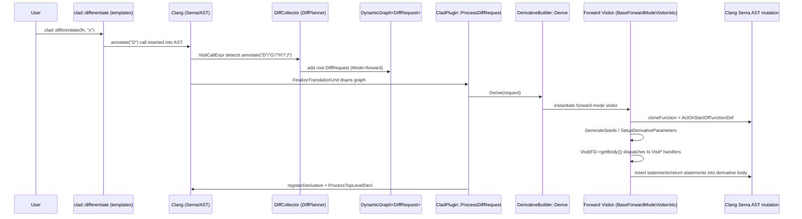

# CLAD Forward-Mode Differentiation Workflow (Detailed)

This document explains the complete internal workflow for derivative requests when the differentiation call resolves to **forward mode** and related modes:

- `DiffMode::forward`
- `DiffMode::pushforward`
- `DiffMode::vector_forward_mode`
- `DiffMode::vector_pushforward`

It focuses on the **end-to-end internal pipeline** from `clad::differentiate()` call detection to AST transformation, with detailed coverage of:

- `BaseForwardModeVisitor` seeds and transformation strategy
- explicit `Visit*` methods (statement + expression handlers)
- `VectorForwardModeVisitor` and `VectorPushForwardModeVisitor` parameterization and return handling

## 1. Forward-Mode Entry and Dispatch Overview

### User API
User-facing entry is the compile-time annotated call:

- `clad::differentiate(fn, args)` is declared in `include/clad/Differentiator/Differentiator.h`
- the overload is tagged with `__attribute__((annotate("D")))`
- the call site is therefore visible to the Clang frontend plugin during parsing/Sema

### Clang frontend plugin: detection -> planning -> request graph
At compile time, `clad::plugin::CladPlugin` is executed by Clang.

1. The plugin runs `CladPlugin::HandleTranslationUnit` to initialize the static request graph.
2. A `DiffCollector` traverses AST nodes and detects differentiation calls.
3. Each differentiation request is represented by `DiffRequest` and scheduled through a `DynamicGraph<DiffRequest>`.
4. `CladPlugin::FinalizeTranslationUnit` drains the graph and invokes `CladPlugin::ProcessDiffRequest(request)`.

### Derivative builder: selecting forward-mode visitors
Inside `DerivativeBuilder::Derive(request)` the request `Mode` determines which visitor is instantiated:

- `DiffMode::forward`      -> `BaseForwardModeVisitor`
- `DiffMode::pushforward`  -> `PushForwardModeVisitor` (subclass of `BaseForwardModeVisitor`)
- `DiffMode::vector_forward_mode` -> `VectorForwardModeVisitor`
- `DiffMode::vector_pushforward`  -> `VectorPushForwardModeVisitor`

In all these modes, the core mechanics are:

1. clone/build a derived function declaration
2. create parameter derivative storage/seeds
3. traverse original function body using `Visit(...)`
4. insert generated statements/expressions into the new function body

## 2. High-level Architecture (Forward Mode)

```mermaid
flowchart LR
  U[User calls clad::differentiate] --> C[Clang Sema + AST]
  C --> P[CladPlugin (tools/ClangPlugin.cpp)]
  P --> D[DiffCollector / DiffRequestGraph (DiffPlanner.cpp)]
  D --> R[CladPlugin::ProcessDiffRequest]
  R --> B[DerivativeBuilder::Derive]
  B --> F{request.Mode}
  F -->|forward| BF[BaseForwardModeVisitor]
  F -->|pushforward| PF[PushForwardModeVisitor -> BaseForwardModeVisitor]
  F -->|vector_forward_mode| VF[VectorForwardModeVisitor]
  F -->|vector_pushforward| VPF[VectorPushForwardModeVisitor -> VectorForwardModeVisitor]
  BF --> T1[Visit(FD->getBody()) + seeds]
  VF --> T2[BuildVectorModeParams + one-hot vectors]
  T1 --> G1[AST transformed derivative function decl]
  T2 --> G2[AST transformed vector derivative function decl]
  G1 --> MX[Clang multiplexer emission]
  G2 --> MX
```

## 3. Forward-Mode Execution Flow (End-to-End)

### Sequence diagram (forward mode generation)



## 4. Core Forward-Mode Engine

### 4.1 `BaseForwardModeVisitor::Derive()` (main forward transformation loop)
File: `lib/Differentiator/BaseForwardModeVisitor.cpp`

Entry: `DerivativeBuilder::Derive()` dispatches to `BaseForwardModeVisitor V(*this, request); result = V.Derive();`

Key responsibilities:

1. Validate `m_DiffReq` and forward-mode constraints.
2. Compute the independent-variable target (`m_IndependentVar` + `m_IndependentVarIndex`).
3. Compute the derived function name (`m_DiffReq.ComputeDerivativeName()`).
4. Clone the function signature (`m_Builder.cloneFunction`).
5. Create the derivative function parameter list (`SetupDerivativeParameters`).
6. Create/seed derivative variables (`GenerateSeeds`) for `DiffMode::forward`.
7. Transform the function body using the AST visitor (`Visit(FD->getBody())`).
8. Build and set the derivative function body (`m_Derivative->setBody(fnBody)`).

Important forward-mode constraints enforced in `BaseForwardModeVisitor::Derive()`:

- If `DVI` is empty, return `{}` (no derivative).
- Forward mode differentiating multiple parameters at once is rejected:
  - error: "forward mode differentiation ... w.r.t several parameters at once is not supported"
- If the independent variable is not a differentiable numeric:
  - array/pointer: requires real pointee/element type
  - scalar/member: requires real type
- It asserts that recursive diff isn't in-flight:
  - `assert(!m_DerivativeInFlight && "Doesn't support recursive diff. Use DiffPlan.")`

### 4.2 Seed generation and derivative variable mapping
Seeds are created by:

- `BaseForwardModeVisitor::GenerateSeeds(const clang::FunctionDecl* dFD)`
  File: `lib/Differentiator/BaseForwardModeVisitor.cpp`

What `GenerateSeeds()` does:

1. For each parameter in the derived function:
   - if differentiable and of supported type:
     - create `_d_<param>` derivative variable
     - initialize to:
       - `1` if this parameter is the independent variable
       - otherwise `0`
2. If the function is a method instance (non-lambda):
   - create `_d_this_obj` and `_d_this`
   - set `m_ThisExprDerivative` so subsequent visits can find derivative of `this`
3. If differentiating a call operator (`m_DiffReq.Functor`):
   - create derivative member variables for each field:
     - constant array fields initialized with an initializer list of 0s, with a 1 at the independent index
     - pointer fields initialized with `nullptr`
     - scalar fields initialized with 0/1 depending on whether the field equals the independent target
4. After each seed variable is created:
   - update the map `m_Variables[param] = dParam`

This mapping is the central lookup used by expression visitors, especially:

- `VisitDeclRefExpr` (derivative of variables)

## 5. AST Traversal and Transformation Process (Forward Mode)

The forward-mode visitor returns `StmtDiff`:

- In general forward mode:
  - `StmtDiff.getStmt()` is the original/cloned statement/expression (or a transformed original statement)
  - `StmtDiff.getStmt_dx()` is the derivative statement/expression generated for that node (or null)

### 5.1 Dispatch model
`BaseForwardModeVisitor` inherits:

- `clang::ConstStmtVisitor<BaseForwardModeVisitor, StmtDiff>`

The dispatch is therefore:

```c++
StmtDiff SD = Visit(SomeStmtOrExpr);
```

Clang calls the corresponding `Visit*` method based on node dynamic type, and each `Visit*` method builds:

- cloned nodes using `Clone(...)` / `Build*` helpers
- derivative expressions using the derivative mapping `m_Variables` and seed initialization
- derivative statement ordering based on control-flow structure

## 6. Explicit `Visit*` Method Structure (Detailed)

Below are the most important forward-mode `Visit*` implementations and the derivative semantics they encode.

### 6.1 `VisitCompoundStmt`
File: `lib/Differentiator/BaseForwardModeVisitor.cpp`

Behavior:

- Creates a new declaration scope (`beginScope(Scope::DeclScope)`) and a new output block (`beginBlock()`).
- For each statement `S` in the original compound:
  - `StmtDiff SDiff = Visit(S)`
  - inserts derivative statement/expression first:
    - `addToCurrentBlock(SDiff.getStmt_dx())`
  - then inserts the original/cloned statement/expression:
    - `addToCurrentBlock(SDiff.getStmt())`
- Returns `StmtDiff(Result)` where:
  - `StmtDiff.getStmt()` is the final compound statement
  - `StmtDiff.getStmt_dx()` is null

Reasoning:

This ordering rule makes forward-mode derivatives appear “before” the re-evaluated statement, while still preserving original evaluation order when side effects exist.

### 6.2 `VisitIfStmt`
File: `lib/Differentiator/BaseForwardModeVisitor.cpp`

Key steps:

1. Begin a combined scope for declaration + control:
   - `beginScope(Scope::DeclScope | Scope::ControlScope)`
2. Create a block wrapper around the if-statement (`beginBlock()`).
3. Handle `init`:
   - if init exists:
     - `StmtDiff initResult = Visit(init)`
     - add derivative of init before the if:
       - `addToCurrentBlock(initResult.getStmt_dx())`
4. Differentiate the condition variable (if `If->getConditionVariable()`):
   - `DifferentiateVarDecl(condVarDecl)`
   - insert derivative declaration `condVarDiff.getDecl_dx()` if present
   - clone the condition expression itself without deriving it:
     - `Expr* cond = Clone(If->getCond())`
5. Visit branches:
   - `VisitBranch(then)` and `VisitBranch(else)`
   - if branch is non-compound: it introduces a new block and scope so that both cloned and dx statements can be inserted.
6. Rebuild the if statement using `clad_compat::IfStmt_Create(...)`.
7. Return either:
   - `StmtDiff(ifDiff)` if wrapper block contains only that statement
   - or `StmtDiff(Block)` otherwise.

Important design choice:

- the if-condition expression itself is cloned (not derived)
- differentiation of condition variable is handled by `DifferentiateVarDecl`, not by differentiating `If->getCond()` directly

### 6.3 `VisitReturnStmt`
File: `lib/Differentiator/BaseForwardModeVisitor.cpp`

Behavior:

- If there is no return value, returns `nullptr` (no derivative).
- Otherwise:
  - `StmtDiff retValDiff = Visit(RS->getRetValue())`
  - creates a new return statement whose returned expression is the derivative:
    - `ActOnReturnStmt(... retValDiff.getExpr_dx() ...)`

Result:

- forward-mode derivative function returns only the derivative value.

### 6.4 `VisitDeclStmt` and `DifferentiateVarDecl`
Files:

- `BaseForwardModeVisitor::VisitDeclStmt` in `lib/Differentiator/BaseForwardModeVisitor.cpp`
- `BaseForwardModeVisitor::DifferentiateVarDecl` in `lib/Differentiator/BaseForwardModeVisitor.cpp`

`VisitDeclStmt` responsibilities:

1. Optionally short-circuit for non-differentiable or lambda types:
   - for certain non-differentiable types and lambda declarations, it clones the statement and returns `StmtDiff(DSClone, nullptr)`.
2. For each `VarDecl` in the statement:
   - call `DifferentiateVarDecl(VD)`
   - produce:
     - cloned original declaration list (`decls`)
     - and derivative declaration list (`declsDiff`) if `VD` requires forward adjoints.
3. Handle rare name collisions:
   - if generated derived decl name collides with original decl name:
     - update `m_DeclReplacements` so `VisitDeclRefExpr` uses the correct identifier.

`DifferentiateVarDecl(VD, ignoreInit)`:

1. If init exists:
   - when not ignoring init:
     - `initDiff = Visit(init)`
   - when ignoring init:
     - `initDiff = StmtDiff(Clone(init))`
2. Clone original variable declaration (`VDClone`) with the cloned init expr.
3. Create derivative variable `VDDerived` if `m_DiffReq.shouldHaveAdjointForw(VD)`:
   - name `_d_<VD name>`
   - initializer is `initDx`:
     - if original is pointer type and init derivative missing, initialize derived with `nullptr`
4. Update `m_Variables`:
   - `m_Variables[VDClone]` is stored so that later `VisitDeclRefExpr` can retrieve the correct derivative expression.

### 6.5 `VisitDeclRefExpr` (variable derivative lookup)
File: `lib/Differentiator/BaseForwardModeVisitor.cpp`

Behavior:

1. Clone the referenced DeclRefExpr, applying `m_DeclReplacements` if needed.
2. If referencing a `VarDecl`:
   - look up in `m_Variables`:
     - if present, return `StmtDiff(clonedDRE, dExpr)`
     - the derivative expression `dExpr` may be rebuilt if contexts differ (e.g., lambda capture rebuild)
3. If no mapping exists (unrelated to independent variable):
   - derivative is 0 (or null pointer for pointer expressions)
4. Also respects `m_DiffReq.shouldHaveAdjointForw(decl)`:
   - if adjoint-forw is disabled for that decl, derivative is null/zero.

### 6.6 `VisitArraySubscriptExpr`
File: `lib/Differentiator/BaseForwardModeVisitor.cpp`

Algorithm:

1. Use `SplitArraySubscript(ASE)` to decompose base + indices.
2. Visit base and clone indices.
3. Build a cloned subscript:
   - `cloned = BuildArraySubscript(clonedBase, clonedIndices)`
4. Determine which “variable” this subscript represents:
   - in call operator functor mode: can treat constant array member variables specially
   - otherwise:
     - if base is a `DeclRefExpr` to a `VarDecl`, treat that as `VD`
5. Compute derivative:
   - If `VD == m_IndependentVar`:
     - if the last index constant-evaluates to the independent index, derivative is 1
     - else derivative is 0 (or an equality expression when index isn't evaluatable)
   - Else, check `m_Variables` mapping for the `VD`:
     - if mapped and is array/pointer:
       - derivative is `_d_arr[idx]` implemented as another subscript expression
     - else derivative is 0.

### 6.7 `VisitCallExpr` (forward-mode call + nested derivative scheduling)
File: `lib/Differentiator/BaseForwardModeVisitor.cpp`

This is one of the most important forward-mode visitors.

High-level workflow:

1. Resolve the direct callee:
   - if indirect call: emit diagnostics and just clone (no derivative).
2. Handle lambda/operator and implicit `this` derivatives:
   - for instance methods/lambdas:
     - derive the implicit base object derivative
     - add it to `diffArgs` as required by pushforward derivative signature conventions
3. Handle non-differentiable calls:
   - if call has non-differentiable attribute:
     - clone the call
     - derivative is literal 0
4. Differentiate each argument:
   - `StmtDiff argDiff = Visit(arg)`
   - append cloned args to `CallArgs`
   - append arg derivatives to `diffArgs` when differentiable
   - if argument derivative is missing, it’s treated as zero initialization
5. Choose or build derivative of the callee:
   - attempt to use existing derivatives:
     - `callDiff` is null until resolved/created
   - if overload derivative is not found:
     - create a nested `DiffRequest pushforwardFnRequest`
       - `pushforwardFnRequest.Function = FD`
       - `pushforwardFnRequest.Mode = GetPushForwardMode()` (forward mode uses pushforward derivatives)
       - `pushforwardFnRequest.BaseFunctionName = utils::ComputeEffectiveFnName(FD)`
       - propagate analysis flags
     - if not in base derivative order or call context:
       - request custom derivative call generation via
         `m_Builder.BuildCallToCustomDerivativeOrNumericalDiff(...)`
       - or derive via `m_Builder.HandleNestedDiffRequest(...)`
     - else:
       - locate existing pushforward derivative via `FindDerivedFunction(...)`
6. If derivative resolution fails:
   - attempt numerical differentiation for eligible cases
   - if no viable numerical diff, return `(call, 0)`
7. If derivative resolution succeeded:
   - create a call expression to the generated derived function
   - if return type is not void:
     - store the derivative call result via `StoreAndRef(callDiff, "_t", ...)`
     - then extract:
       - `valueAndPushforward.value` for primal return
       - `valueAndPushforward.pushforward` for derivative return
     - return `StmtDiff(returnValue, pushforward)`

### 6.8 `VisitUnaryOperator` and `VisitBinaryOperator`
Files: `lib/Differentiator/BaseForwardModeVisitor.cpp`

Unary:
1. Visit sub-expression: `StmtDiff diff = Visit(UnOp->getSubExpr())`
2. Clone original expression:
   - `op = BuildOp(opKind, diff.getExpr())`
3. Derivative rule selection:
   - unary plus/minus:
     - derivative is op-applied to `diff.getExpr_dx()`
   - inc/dec:
     - derivative is derived op applied to `diff.getExpr_dx()` (with pointer special casing)
   - deref/addr-of:
     - derivative is `d(op(expr))` with `diff.getExpr_dx()` if available
   - logical not:
     - derivative is 0 and can preserve derivative evaluation with comma operator if needed
   - default:
     - unsupported unary operator -> warn and derivative is 0

Binary:
1. Compute both sides:
   - `Ldiff = Visit(LHS)`
   - `Rdiff = Visit(RHS)`
2. Depending on opcode:
   - multiplication:
     - product rule:
       - `(L'*R) + (L*R')`
   - division:
     - quotient rule:
       - `(L'*R - L*R') / (R*R)`
   - add/sub:
     - derivative is `L' (+/-) R'` (preserving parentheses)
   - assignment ops:
     - derivative is assignment to derived LHS using combined derivative L/R operands
   - comma operator:
     - derivative is `d(E1), E1, d(E2)` when needed to preserve evaluation effects
   - logical/bitwise/comparison/remainder:
     - uses comma expressions to ensure both derivative and primal evaluation ordering is preserved:
       - `((dL, L) op (dR, R))` with derivative in `Stmt_dx` set to 0 where appropriate
   - shifts:
     - derivative follows scaling by 2^RHS (implemented by opcode-specific derivative rule)
   - default:
     - warn + derivative 0
3. Optionally fold constants using `ConstantFolder`.

### 6.9 Loop statements (For/While/CXXForRange/Do)
Loop visitation patterns in forward mode:

- `VisitForStmt`:
  - differentiates init part (`initDiff = Visit(init)`)
  - clones condition and differentiates condition variable (if present)
  - visits the increment expression and builds derivative increment expression
  - visits body using `Visit(body)` and inserts `getBothStmts()` to preserve both primal and derivative ordering
  - then rebuilds `ForStmt(...)` with init/cond/inc/body and returns `StmtDiff(forStmtDiff)` (no derivative stmt outside)

- `VisitWhileStmt`:
  - builds condition:
    - clone condition expression
    - if condition variable exists, runs `DifferentiateVarDecl(condVar, ignoreInit=true)` and assigns condition clone accordingly
    - if the condition expression is an assignment/logical expression, it calls `Visit(cond)` so that derivative side effects are included using comma expressions
  - builds body:
    - if body is compound: `Visit(body).getStmt()`
    - else: creates a new compound block and appends `Result.getBothStmts()`
  - rebuilds while via `Sema::ActOnWhileStmt(...)`

- `VisitCXXForRangeStmt`:
  - visits range decl, begin decl, end decl
  - differentiates loop variable declaration and prepends it to body as additional decls for both primal and derivative
  - constructs `ForStmt` equivalent for range loop with differentiated body.

## 7. Forward-Mode Return in Pushforward and Vector Pushforward

### 7.1 `PushForwardModeVisitor::VisitReturnStmt`
File: `lib/Differentiator/PushForwardModeVisitor.cpp`

This affects `DiffMode::pushforward` and modifies how return values are assembled.

Behavior:

1. If return value is missing, return `nullptr` (no derivative).
2. Visit return value to get `retValDiff.getExpr()` and `retValDiff.getExpr_dx()`.
3. If returned types mismatch, insert explicit casts to expected derivative return type.
4. Create an init-list containing:
   - primal return value (`retValDiff.getExpr()`)
   - derivative/pushforward (`retValDiff.getExpr_dx()`)
5. Emit a new `ReturnStmt` returning that init list.

Therefore pushforward derivatives return a struct-like value with both:

- `value` (primal)
- `pushforward` (derivative)

This matches how `BaseForwardModeVisitor::VisitCallExpr` later extracts `.value` and `.pushforward`.

### 7.2 Vector pushforward override: `VectorPushForwardModeVisitor::ExecuteInsidePushforwardFunctionBlock`
File: `lib/Differentiator/VectorPushForwardModeVisitor.cpp`

It prepares the independent variables vector sizing information:

1. Extract the last parameter of the vector pushforward derivative function:
   - this last parameter is either:
     - an array-like container size for arrays
     - or a matrix-like container where `rows` or equivalent gives the size
2. Build `indepVarCountExpr` based on that container shape.
3. Create:
   - `size_t indepVarCount = indepVarCountExpr;`
4. Call:
   - `SetIndependentVarsExpr(BuildDeclRef(totalIndVars))`
   - then delegate to `BaseForwardModeVisitor::ExecuteInsidePushforwardFunctionBlock()` to continue forward-mode generation mechanics.

## 8. Vector Forward Mode (vector_forward_mode + vector_pushforward)

Vector forward mode is handled by two specialized visitors:

- `VectorForwardModeVisitor` generates the main vector derivative function (`DiffMode::vector_forward_mode`)
- `VectorPushForwardModeVisitor` wraps it and generates pushforward variants (`DiffMode::vector_pushforward`)

### 8.1 `VectorForwardModeVisitor::Derive()`
File: `lib/Differentiator/VectorForwardModeVisitor.cpp`

Responsibilities:

1. Generate the derived vector derivative function declaration:
   - cloneFunction(...)
2. Construct derivative parameter list:
   - it converts scalar/vector/array parameters into derivative containers:
     - identity matrix for arrays (size is inferred or passed later)
     - one-hot vectors for scalars
3. Create `indepVarCount`:
   - using `m_IndVarCountExpr` (set by `SetIndependentVarsExpr`)
4. Initialize `_d_vector_<param>` variables:
   - for each differentiable parameter, set its derivative vector content based on which parameters are independent
   - updates `m_Variables[param] = dVectorParam`
5. Transform the body:
   - `Visit(FD->getBody())` and insert resulting statements.
6. Create vector-mode overload:
   - `CreateVectorModeOverload()` returns a wrapper `FunctionDecl*` that ultimately calls the vector mode function.

### 8.2 Vector forward mode expression overrides
Key overrides visible in the vector visitor:

- `VisitArraySubscriptExpr` (vector semantics for array indexing)
- `VisitReturnStmt` (vector mode return assembly)
- `DifferentiateVarDecl` (vector derivative variable declarations)
- `VisitFloatingLiteral`/`VisitIntegerLiteral` (vector literal derivative = 0 vectors)

These are analogous to scalar forward mode but operate on vector containers rather than scalar derivative expressions.

## 9. Error Handling and Configuration Points (Forward Mode)

Forward-mode error handling is primarily in:

- `BaseForwardModeVisitor::Derive()`
  - detects unsupported DVI cardinality
  - checks the differentiability of the independent variable type
- `DiffPlanner` (before `Derive`)
  - parses `clad::differentiate<N>(...)` bitmask template options
  - sets `Mode` and flags in `DiffRequest`

Forward mode configuration knobs:

- `clad::differentiate<N>`:
  - influences `RequestedDerivativeOrder` (higher order forward derivatives are planned via recursive request scheduling)
- `clad::differentiate<immediate_mode>`:
  - sets `request.ImmediateMode` which changes whether `DiffRequest::updateCall` updates generated code args
- error estimation:
  - forward mode can still be triggered for some error estimation scenarios depending on planner logic, but the internal mechanics are still forward visitor based.

## 10. Concurrency / Threading Behavior

Forward-mode derivative *generation* is performed within the compiler frontend plugin and therefore is effectively single-threaded as part of the Clang compilation pipeline.

Any concurrency in the generated derivative function (e.g., OpenMP constructs) is inherited by transforming/visiting the original user code’s constructs.

## 11. Suggested next step (for maintainers)

If you want to extend forward-mode support, start by:

1. adding or improving `Visit*` methods for additional expression/statement kinds in `BaseForwardModeVisitor.cpp`
2. updating pushforward return conventions in `PushForwardModeVisitor`
3. mirroring necessary container logic in `VectorForwardModeVisitor` overrides

