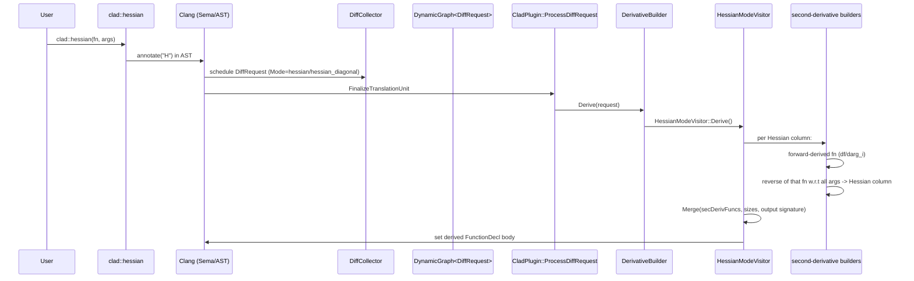

# CLAD Hessian-Mode Differentiation Workflow (Detailed)

This document explains the complete internal workflow for derivative requests when the differentiation call resolves to **Hessian mode**:

- `DiffMode::hessian` (full Hessian matrix)
- `DiffMode::hessian_diagonal` (diagonal-only vector)

Hessian mode is implemented as a *higher-order orchestration*:

1. Generate many **second-derivative functions** (one per Hessian column, or one per diagonal entry).
2. **Merge** them into a single Hessian-producing function.

## 1. Hessian Entry and Dispatch Overview

### 1.1 User API (compile-time trigger)

Reverse- and forward-mode requests are selected by `__attribute__((annotate("<letter>")))` on the differentiate APIs.
For Hessian:

- `clad::hessian(...)` / hessian-family call sites are detected as:
  - `AnnotateAttr == "H"` -> `DiffRequest.Mode = DiffMode::hessian`

Planner options can also switch Hessian into diagonal-only:

- `opts::diagonal_only`:
  - `DiffMode::hessian` -> `DiffMode::hessian_diagonal`
  - invalid if used with other modes

### 1.2 DiffPlanner: annotation + option processing

File: `lib/Differentiator/DiffPlanner.cpp`

Key logic:

- `ProcessInvocationArgs(...)` sets the initial mode:
  - `"H"` -> `DiffMode::hessian`
- option bitmask overrides:
  - diagonal-only option rewrites mode to `hessian_diagonal`

### 1.3 DerivativeBuilder: choosing HessianModeVisitor

File: `lib/Differentiator/DerivativeBuilder.cpp`

Inside `DerivativeBuilder::Derive(...)`, Hessian mode dispatches as:

- `request.Mode == DiffMode::hessian` or `DiffMode::hessian_diagonal`
  - instantiate `HessianModeVisitor H(*this, request)`
  - call `H.Derive()`

## 2. High-level Architecture (Hessian Mode)

```mermaid
flowchart LR
  U[User calls clad::hessian] --> C[Clang Sema + AST]
  C --> P[CladPlugin (tools/ClangPlugin.cpp)]
  P --> D[DiffCollector / request graph (DiffPlanner.cpp)]
  D --> X[CladPlugin::ProcessDiffRequest]
  X --> B[DerivativeBuilder::Derive]
  B --> H[HessianModeVisitor::Derive]
  H --> Cols{Mode}
  Cols -->|hessian| ColGen[Generate per-column second derivatives: forward then reverse]
  Cols -->|hessian_diagonal| DiagGen[Generate per-argument second derivatives: forward twice]
  ColGen --> M[HessianModeVisitor::Merge]
  DiagGen --> M
  M --> Out[Final function: f_hessian (matrix) or f_hessian_diagonal]
```

## 3. Sequence Diagram (Hessian Derivative Generation)



## 4. Core Hessian Engine

### 4.1 `HessianModeVisitor::Derive()` (main orchestration)
File: `lib/Differentiator/HessianModeVisitor.cpp`

Purpose:

- Compute all required second-derivative functions (one per Hessian column entry grouping).
- Return a single Hessian `FunctionDecl` by calling `Merge(...)`.

Inputs:

- `m_DiffReq.Function` (`const FunctionDecl* FD`) = base function being differentiated
- `m_DiffReq.Args` (optional expression describing independent args/indices)
- `m_DiffReq.Mode` = `hessian` or `hessian_diagonal`
- `m_DiffReq.DVI` (diff input vars info, populated from `args`)

Outputs:

- `DerivativeAndOverload` whose `derivative` is the generated Hessian `FunctionDecl*`.

Core steps:

1. Collect derivative target argument set (`DiffParams args`) and index intervals:
   - if `m_DiffReq.Args` is present, loop through `m_DiffReq.DVI`:
     - push each requested `dParam.param` into `args`
     - push each `dParam.paramIndexInterval` into `indexIntervalTable`
   - else, default to all FD parameters
2. Name Hessian function:
   - `hessianFuncName = m_DiffReq.BaseFunctionName + "_hessian"`
   - if diagonal: append `"_diagonal"`
   - if not differentiating all parameters at once: append suffixes `_<paramIndex>`
3. Decide independent-arg expansion:
   - iterate `FD->parameters()`; for each parameter that is present in `args`:
     - scalar: contribute 1 independent slot
     - array/pointer:
       - requires `indexIntervalTable` to include a non-empty interval for that arg
       - emits a diagnostic error if missing and returns early
4. For each independent slot, generate a second derivative function:
   - diagonal mode (`hessian_diagonal`):
     - call `DeriveUsingForwardModeTwice(...)`
   - full mode (`hessian`):
     - call `DeriveUsingForwardAndReverseMode(...)`
5. Merge:
   - call `Merge(secondDerivativeFuncs, IndependentArgsSize, TotalIndependentArgsSize, hessianFuncName, DC, hessianFunctionType)`

#### Hessian column generation semantics

- In `DiffMode::hessian`, each generated “second derivative function” corresponds to one column of the Hessian:
  - forward-mode derivative: compute `d f / d arg_i`
  - reverse-mode derivative: compute gradient of that function w.r.t all requested args

### 4.2 `DeriveUsingForwardAndReverseMode(...)` (column generation for full Hessian)
File: `lib/Differentiator/HessianModeVisitor.cpp`

This is a helper function local to the file.

Purpose:

- Produce the Hessian column for one chosen independent slot `ForwardModeArgs`,
  by differentiating forward once and reverse once.

Inputs:

- `Builder` = `DerivativeBuilder&` (used to find/build derived functions)
- `IndependentArgRequest` = copied request describing the forward differentiation target
- `ForwardModeArgs` = string literal expr for `PVD` or `PVD[idx]`
- `ReverseModeArgs` = expression describing the full independent-args set (the user provided `args`)
- `DFC` exists in signature but is unused in current code

Outputs:

- `FunctionDecl* secondDerivative` = reverse-mode derived function for the forward derivative.

Exact algorithm:

1. Build the first derivative using forward mode:
   - `IndependentArgRequest.Args = ForwardModeArgs`
   - `IndependentArgRequest.Mode = DiffMode::forward`
   - `IndependentArgRequest.CallUpdateRequired = false`
   - `IndependentArgRequest.UpdateDiffParamsInfo(SemaRef)`
   - `firstDerivative = Builder.FindDerivedFunction(IndependentArgRequest)`
2. Build the second derivative (gradient of first derivative) using reverse mode:
   - create `DiffRequest ReverseModeRequest{}`
   - set:
     - `ReverseModeRequest.Mode = DiffMode::reverse`
     - `ReverseModeRequest.Function = firstDerivative`
     - `ReverseModeRequest.Args = ReverseModeArgs`
     - `ReverseModeRequest.BaseFunctionName = firstDerivative->getNameAsString()`
   - `secondDerivative = Builder.HandleNestedDiffRequest(ReverseModeRequest)`

Important note:

- `use_enzyme` and other planner flags are *not* propagated into `ReverseModeRequest{}` here.
  That means Hessian’s reverse step uses the reverse-mode visitor’s default CLAD backend behavior.

### 4.3 `DeriveUsingForwardModeTwice(...)` (diagonal generation)
File: `lib/Differentiator/HessianModeVisitor.cpp`

Purpose:

- Generate the diagonal second derivative entries by differentiating forward twice
  with respect to a single argument slot.

Inputs:

- `IndependentArgRequest` = request object for the target argument slot
- `ForwardModeArgs` = string literal expr for `PVD` or `PVD[idx]`

Outputs:

- `FunctionDecl* secondDerivative`

Algorithm:

1. Set `IndependentArgRequest.RequestedDerivativeOrder = 2`
2. Set:
   - `IndependentArgRequest.Args = ForwardModeArgs`
   - `IndependentArgRequest.Mode = DiffMode::forward`
   - `CallUpdateRequired = false`
3. `IndependentArgRequest.UpdateDiffParamsInfo(SemaRef)`
4. `secondDerivative = Builder.FindDerivedFunction(IndependentArgRequest)`

## 5. Merge: assembling the Hessian output function

### 5.1 `HessianModeVisitor::Merge(...)`
File: `lib/Differentiator/HessianModeVisitor.cpp`

Purpose:

- Combine the set of generated second-derivative functions into one Hessian function body.

Inputs:

- `secDerivFuncs`: `std::vector<FunctionDecl*>` (per-column or per-diagonal-entry derivative functions)
- `IndependentArgsSize`: sizes per requested independent argument (array index intervals expand into multiple slots)
- `TotalIndependentArgsSize`: sum across independent arg slots
- `hessianFuncName`: output function name to create
- `FD` (decl context) and `hessianFuncType`: signature/type info for the Hessian output

Outputs:

- `DerivativeAndOverload`:
  - `derivative` = `hessianFD` created by `m_Builder.cloneFunction(...)`
  - overload is null

Core algorithm:

1. Clone the target function signature into a new `hessianFD`:
   - `hessianFD = cloneFunction(m_DiffReq.Function, ..., DC, hessianFuncName, hessianFunctionType)`
2. Create output parameter:
   - full mode: output param name `"hessianMatrix"`
   - diagonal mode: output param name `"diagonalHessianVector"`
3. Generate Hessian body:
   - for each generated `secDerivFuncs[i]`:
     - diagonal:
       - compute `HessianMatrixStartIndex = i`
       - `call = secDerivFuncs[i](original_params..., UseRefQualifiedThisObj=true)`
       - store: `* (Result + offset)` = `call`
     - full Hessian:
       - `HessianMatrixStartIndex = i * TotalIndependentArgsSize`
       - build slice expressions for each requested independent-arg slot:
         - `SliceExpr = Result + (HessianMatrixStartIndex + columnIndex)`
       - `call = secDerivFuncs[i](..., DeclRefToParams=[slices], UseRefQualifiedThisObj=true)`
       - the reverse-mode derivative call is responsible for writing into the referenced output slices
4. Wrap statements in a compound body and `hessianFD->setBody(CS)`

## 6. Hessian “reverse” integration details (what is reused)

Even though Hessian mode is implemented in `HessianModeVisitor`, the *reverse-mode part* is produced by:

- `ReverseModeVisitor` (indirectly), via `Builder.HandleNestedDiffRequest(ReverseModeRequest)` inside `DeriveUsingForwardAndReverseMode`.

Therefore:

- Hessian mode itself does not emit tape push/pop code.
- tape push/pop and reverse sweeps are contained within each generated reverse-mode derivative function used by `Merge(...)`.

## 7. Hessian-specific error handling and constraints

### 7.1 Array/pointer indices must be explicit in `args`

File: `lib/Differentiator/HessianModeVisitor.cpp`

When differentiating w.r.t. an array/pointer parameter in Hessian mode:

- if `indexIntervalTable` is empty (or the interval size is zero) for that param, Hessian mode emits:
  - `DiagnosticsEngine::Error` with message:
    - “hessian mode differentiation w.r.t. array or pointer parameters needs explicit declaration of the indices of the array using the args parameter; did you mean ...”
- then returns `{}` without generating a Hessian.

### 7.2 Diagonal-only rewriting

File: `lib/Differentiator/DiffPlanner.cpp`

- `opts::diagonal_only` is valid only for `DiffMode::hessian`
- it rewrites the request to `DiffMode::hessian_diagonal`

## 8. External RMV sources and error estimation

Hessian mode’s internal helper `DeriveUsingForwardAndReverseMode(...)` constructs a fresh `DiffRequest ReverseModeRequest{}`.

As a result, Hessian mode does not currently:

- attach an `ErrorEstimationHandler`
- propagate `EnableErrorEstimation` or external RMV sources into nested reverse-mode requests

If you rely on Hessian + error estimation hooks, you should verify whether those settings are expected to apply to the nested derivatives or only to the primary derivative request.

## 9. Memory and object lifecycle (Hessian mode)

Hessian mode’s runtime behavior is compile-time AST construction:

- it creates many derived `FunctionDecl*` objects via the `DerivativeBuilder`
- it then creates one output `FunctionDecl` and sets its body to call those derived functions

Key lifecycle aspects:

- the Hessian mode orchestrator owns no tapes directly; reverse-mode tapes are owned inside generated reverse derivative functions
- `Merge(...)` builds AST nodes for slicing and storage expressions; no explicit manual memory management is visible here

## 10. Threading / concurrency behavior

Hessian derivative generation happens inside the Clang compilation pipeline, therefore:

- Hessian orchestration itself is effectively single-threaded
- any concurrency semantics in the generated code come only from the structure of the original function (e.g., OpenMP clauses), not from Hessian orchestration logic

## 11. Practical extension points

Hessian mode is a natural place to add more backend propagation or to optimize repeated derivative generation:

1. Propagate planner flags into `ReverseModeRequest{}` created in `DeriveUsingForwardAndReverseMode(...)`.
2. Cache/reuse derived functions across columns when indices overlap.
3. Improve support for additional tensor-like shapes by extending how `IndependentArgsSize` is built for arrays/pointers.

