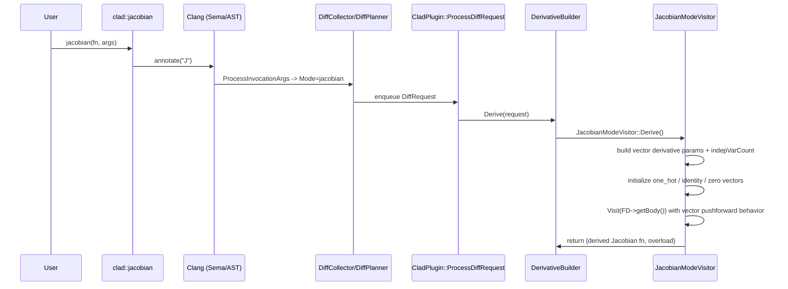
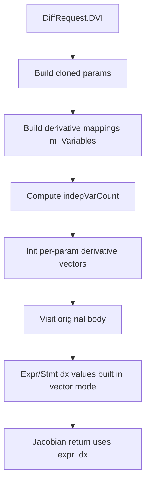

# CLAD Jacobian-Mode Differentiation Workflow (Detailed)

This document explains the internal workflow for derivative requests resolved to **Jacobian mode**:

- `DiffMode::jacobian`

Jacobian mode in CLAD is implemented as a vectorized forward/pushforward-style transformation through:

- `JacobianModeVisitor` (derived from `VectorPushForwardModeVisitor`)

## 1. Jacobian Entry and Dispatch Overview

### 1.1 User API (compile-time trigger)

At call sites, Jacobian requests are recognized by annotation:

- `AnnotateAttr == "J"` -> `DiffRequest.Mode = DiffMode::jacobian`

This mapping happens during planning in `DiffPlanner`.

### 1.2 DiffPlanner mode selection

File: `lib/Differentiator/DiffPlanner.cpp`

In `ProcessInvocationArgs(...)`:

- `"J"` sets `request.Mode = DiffMode::jacobian`
- mode/options are then validated and attached to `DiffRequest`

### 1.3 DerivativeBuilder Jacobian dispatch

File: `lib/Differentiator/DerivativeBuilder.cpp`

In `DerivativeBuilder::Derive(...)`:

- `request.Mode == DiffMode::jacobian`
  - instantiate `JacobianModeVisitor J(*this, request)`
  - return `J.Derive()`

For custom derivatives, Jacobian still requires an overload:

- if `request.CustomDerivative` and mode is reverse/jacobian, builder creates overload via `ReverseModeVisitor::CreateDerivativeOverload(...)`.

## 2. High-level Architecture (Jacobian Mode)

```mermaid
flowchart LR
  U[User calls clad::jacobian] --> C[Clang Sema + AST]
  C --> P[CladPlugin / DiffPlanner]
  P --> R[DiffRequest Mode=jacobian]
  R --> B[DerivativeBuilder::Derive]
  B --> J[JacobianModeVisitor::Derive]
  J --> V[Vectorized derivative parameter setup]
  V --> S[Visit original body (vector pushforward semantics)]
  S --> O[Create overload + register derived function]
```

## 3. Sequence Diagram (Jacobian Generation)



## 4. Core Jacobian Engine

### 4.1 Class shape
File: `lib/Differentiator/JacobianModeVisitor.h`

`JacobianModeVisitor` is declared as:

- `class JacobianModeVisitor : public VectorPushForwardModeVisitor`

It overrides:

- `DerivativeAndOverload Derive()`
- `StmtDiff VisitReturnStmt(const ReturnStmt* RS)`

Implication:

- Jacobian mode reuses vector forward/pushforward infrastructure and customizes setup/return handling.

### 4.2 `JacobianModeVisitor::Derive()`
File: `lib/Differentiator/JacobianModeVisitor.cpp`

Purpose:

- Build a Jacobian-specific vector derivative function (`*_jac`).
- Configure derivative vector parameters for each differentiable argument.
- Traverse the original function body and emit vectorized derivative code.

Inputs:

- `m_DiffReq.Function` (`FD`)
- `m_DiffReq.DVI` (independent variables chosen by args parsing)
- `m_DiffReq.Mode` (must equal `DiffMode::jacobian`)

Outputs:

- `DerivativeAndOverload{vectorDiffFD, overloadFD}`

Detailed algorithm:

1. Validate mode:
   - `assert(m_DiffReq.Mode == DiffMode::jacobian)`
2. Build target argument list:
   - `args` from `m_DiffReq.DVI`
3. Generate derived function name:
   - base name: `BaseFunctionName + "_jac"`
   - if subset of params requested: append `_<paramIndex>` suffixes
4. Clone function declaration:
   - `vectorDiffFunctionType = GetDerivativeType()`
   - `cloneFunction(..., derivedFnName, vectorDiffFunctionType)`
   - assign `m_Derivative = vectorDiffFD`
5. Enter function decl/body scopes and begin output block.
6. Build derivative parameter inventory:
   - clone each original param into `params`
   - for differentiable params, create Jacobian derivative storage mapped in `m_Variables`:
     - array/pointer param:
       - create derivative parameter of Jacobian derivative type
       - map to dereferenced expression `(*_d_vector_param)` (paren-wrapped)
       - if not `_clad_out_` param, include `rows()` in total independent variable count
     - reference param:
       - create derivative parameter and map to dereferenced expression
       - increment non-array independent count
     - scalar/value param:
       - create local variable declaration for derivative vector
       - store declaration stmt for insertion
       - increment non-array independent count
7. Compute total independent variable count:
   - `m_IndVarCountExpr = sum(array rows) + nonArrayIndVarCount`
   - materialize:
     - `size_t indepVarCount = m_IndVarCountExpr`
   - update `m_IndVarCountExpr` to `DeclRef(indepVarCount)`
8. Insert saved local derivative declarations.
9. Initialize each differentiable parameter derivative vector:
   - iterate original parameters in order
   - maintain:
     - `arrayIndVarCountExpr` (processed array element count)
     - `nonArrayIndVarCount` (processed scalar/ref independent count)
     - `independentVarIndex` into `m_DiffReq.DVI`
   - if current param is requested independent:
     - compute current offset = array count + non-array count
     - array/pointer:
       - build identity matrix with args:
         - `{rows(param), indepVarCount, offset}`
       - update `arrayIndVarCountExpr += rows(param)`
     - scalar/ref:
       - build one-hot vector:
         - `one_hot_vector(indepVarCount, offset)`
       - increment processed non-array count
     - increment `independentVarIndex`
   - if current param is not independent:
     - scalar/ref:
       - initialize with `zero_vector(indepVarCount)`
     - array/pointer:
       - skipped when size is unknown in this branch
   - assign/init storage:
     - array/pointer/ref mapped expressions: emit assignment
     - local scalar mapped decl: set declaration initializer
10. Differentiate function body:
    - `BodyDiff = Visit(FD->getBody()).getStmt()`
    - append each stmt from resulting compound into current block
11. Finalize:
    - `vectorDiffBody = endBlock()`
    - `m_Derivative->setBody(vectorDiffBody)`
    - close scopes
12. Create overload and return:
    - `overloadFD = CreateDerivativeOverload()`
    - return `{vectorDiffFD, overloadFD}`

## 5. Jacobian Return Semantics

### `JacobianModeVisitor::VisitReturnStmt(...)`
File: `lib/Differentiator/JacobianModeVisitor.cpp`

Behavior:

1. If no return expression:
   - return `nullptr`
2. Otherwise:
   - `retValDiff = Visit(RS->getRetValue())`
   - build return statement returning only `retValDiff.getExpr_dx()`

Contrast with vector pushforward default:

- `VectorPushForwardModeVisitor::VisitReturnStmt(...)` returns an init-list with:
  - primal value
  - derivative value
- Jacobian override returns derivative-only value (`Expr_dx`), which matches Jacobian output intent.

## 6. Relationship with Vector Forward / Pushforward Visitors

Jacobian mode reuses infrastructure from:

- `VectorForwardModeVisitor`
- `VectorPushForwardModeVisitor`

Important inherited/reused ideas:

1. Vector derivative storage:
   - derivative values represented as vectors/matrices rather than scalar adjoints
2. Independent variable count expression:
   - `m_IndVarCountExpr` drives one-hot/identity/zero construction sizes
3. Body traversal:
   - `Visit(...)` logic is still the vector-mode AST transformer path

Jacobian-specific customizations are:

- custom `Derive()` parameter initialization strategy
- derivative-only return semantics (`VisitReturnStmt` override)

## 7. Data Flow in Jacobian Mode



## 8. Error Handling and Constraints (Jacobian)

Jacobian mode relies on generic planner/builder checks plus vector-mode typing constraints.

Key points visible in implementation:

1. Mode correctness:
   - hard assertion in `JacobianModeVisitor::Derive()` that request mode is `jacobian`
2. Differentiability gate:
   - non-differentiable parameter types are skipped during derivative vector parameter construction
3. Pointer/array handling:
   - initialization requires shape information (e.g., `rows()` when represented as clad matrix/array wrappers)

Generic builder diagnostics also apply:

- undefined function definitions
- non-differentiable function/class attributes
- custom derivative signature mismatch / fallback behavior

## 9. Memory and object lifecycle

Jacobian generation is compile-time AST construction:

- clone `FunctionDecl` for Jacobian
- create parameter and local derivative declarations
- construct body statements and set `FunctionDecl` body

No explicit Jacobian-specific runtime memory manager is introduced here; lifetime is managed by Clang AST context and generated code conventions.

## 10. Threading / concurrency behavior

Jacobian derivative generation is performed in the compiler pipeline, effectively single-threaded.

Any runtime parallel behavior comes from transformed user code constructs, not from Jacobian orchestration itself.

## 11. Practical extension points

1. Unify Jacobian and vector pushforward parameter setup to reduce duplication.
2. Extend array/pointer independent-variable handling with richer shape propagation.
3. Add explicit diagnostics for unsupported Jacobian argument patterns (currently many constraints are implicit in vector type operations).

