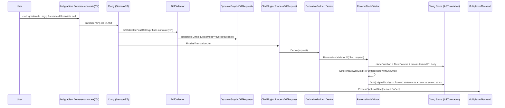

# CLAD Reverse-Mode Differentiation Workflow (Detailed)

This document explains the complete internal workflow for derivative requests when the differentiation call resolves to **reverse mode** and related reverse-pass modes:

- `DiffMode::reverse`
- `DiffMode::pullback`
- `DiffMode::reverse_mode_forward_pass` (special reverse-mode split)

It focuses on the **end-to-end internal pipeline** from reverse-mode request creation to reverse-mode AST transformation, with detailed coverage of:

- `ReverseModeVisitor::Derive()` and `DifferentiateWithClad()` vs `DifferentiateWithEnzyme()`
- reverse-mode traversal model (dfdx stack, `DifferentiateSingleStmt/Expr`)
- tape / push / pullback mechanisms
- the forward-pass vs reverse-pass statement construction pattern
- external RMV sources (error estimation) callback responsibilities

## 1. Reverse-Mode Entry and Dispatch Overview

### User API (compile-time trigger)

Users request reverse-mode differentiation by calling one of the reverse/gradient-family APIs in:

- `include/clad/Differentiator/Differentiator.h`

The relevant overload is annotated with:

- `__attribute__((annotate("G")))` for gradients (reverse mode)
- other reverse-family annotations such as `annotate("D")`, `annotate("H")`, `annotate("J")`, and error estimation `annotate("E")`

In `DiffPlanner`, the plugin interprets the `AnnotateAttr` value and sets:

- `DiffRequest.Mode = DiffMode::reverse` for `"G"`
- `DiffRequest.Mode = DiffMode::pullback` for `"G"/"H"/etc` depending on context
- `DiffRequest.EnableErrorEstimation` for `"E"`

### Clang frontend plugin: detection -> planning -> request graph

At compile time, `clad::plugin::CladPlugin` orchestrates everything:

1. `CladPlugin::HandleTranslationUnit` traverses collected `DeclGroupRef`s and runs `DiffCollector` to build a static request graph (`DynamicGraph<DiffRequest>`).
2. `CladPlugin::FinalizeTranslationUnit` drains the graph and calls `ProcessDiffRequest(request)` in dependency order.

### Derivative builder: selecting reverse-mode visitor

Inside `DerivativeBuilder::Derive(const DiffRequest&)`, reverse mode dispatches as:

- `request.Mode == DiffMode::reverse` or `DiffMode::pullback`
  - `ErrorEstimationHandler handler;`
  - `ReverseModeVisitor V(*this, request);`
  - optionally: `V.AddExternalSource(handler)` when `request.EnableErrorEstimation`
  - then: `result = V.Derive()`

## 2. High-level Architecture (Reverse Mode)

```mermaid
flowchart LR
  U[User calls clad::gradient / differentiate (reverse modes)] --> C[Clang Sema + AST]
  C --> P[CladPlugin (tools/ClangPlugin.cpp)]
  P --> D[DiffCollector / DiffRequestGraph (DiffPlanner.cpp)]
  D --> R[CladPlugin::ProcessDiffRequest]
  R --> B[DerivativeBuilder::Derive]
  B --> RMV[ReverseModeVisitor::Derive]
  RMV --> Path{request.use_enzyme ?}
  Path -->|yes| ENZ[ReverseModeVisitor::DifferentiateWithEnzyme]
  Path -->|no| CLAD[ReverseModeVisitor::DifferentiateWithClad]
  CLAD --> Tape[Tape/push/pop + forward pass + reverse sweep]
  ENZ --> EnzymeCall[__enzyme_autodiff_* call + gradient extraction]
  Tape --> MX[Clang multiplexer emission]
  EnZ --> MX
```

## 3. Forward-to-Reverse Perspective: request graph to derivative generation

Sequence diagram (reverse mode generation):



## 4. Core Reverse-Mode Engine

### 4.1 `ReverseModeVisitor::Derive()` (entry point for reverse-mode transformation)
File: `lib/Differentiator/ReverseModeVisitor.cpp`

`ReverseModeVisitor::Derive()` performs the reverse-mode derivative function construction:

1. Precondition and diagnostics:
   - `assert(m_DiffReq.Function && "Must not be null.")`
   - sets up `PrettyStackTraceDerivative`
2. External source hooks:
   - if `m_ExternalSource`: `m_ExternalSource->ActOnStartOfDerive()`
3. Gradient-specific overload logic:
   - for `DiffMode::reverse`:
     - if return type is real: push literal `1` into `m_Pullback`
     - else if return is non-void but non-real: emit warning suggesting `clad::jacobian`
   - sets `shouldCreateOverload = !m_ExternalSource`
   - suppress overload if `m_DiffReq.DeclarationOnly` is false and `DerivedFDPrototypes` indicates the overload already exists
4. Clone signature:
   - compute derived function name via `m_DiffReq.ComputeDerivativeName()`
   - call:
     - `m_Builder.cloneFunction(m_DiffReq.Function, *this, DC, loc, DNI, dFnType)`
5. Build derived parameter list:
   - `BuildParams(params)`
   - optional callback: `m_ExternalSource->ActAfterCreatingDerivedFnParams(params)`
   - `m_Derivative->setParams(params)`
6. If definition is required:
   - `m_Sema.ActOnStartOfFunctionDef(...)`
   - begin function body scopes/blocks
   - external callbacks:
     - `ActOnStartOfDerivedFnBody(m_DiffReq)`
   - select backend:
     - if `m_DiffReq.use_enzyme`: `DifferentiateWithEnzyme()`
     - else: `DifferentiateWithClad()`
   - `m_Derivative->setBody(fnBody)`
7. Derivative overload creation:
   - if `shouldCreateOverload`: return `{derivative, CreateDerivativeOverload()}`
   - else: return `{derivative, nullptr}`

Key reverse-mode semantic difference vs forward mode:

- reverse mode constructs *two* logical program regions:
  - forward accumulation (primal + recorded intermediates)
  - reverse sweep (adjoint propagation via tape/push/pop)

### 4.2 `ReverseModeVisitor::DifferentiateWithClad()`
File: `lib/Differentiator/ReverseModeVisitor.cpp`

This path implements CLAD-native reverse-mode AD by building:

- derived adjoint variables for parameters not treated as independent
- forward-pass statements
- reverse sweep statements inserted/serialized into separate blocks

Core steps:

1. Initialize adjoints for “non-independent” parameters (when `mode == reverse` and no external source):
   - iterate `m_NonIndepParams`
   - disallow dependent non-const pointer/array parameters (size unknown) with a diagnostic
   - create derived global adjoint variables:
     - `BuildGlobalVarDecl(VDDerivedType, "_d_" + param->getName(), initExpr, ...)`
   - store mapping:
     - `m_Variables[param] = BuildDeclRef(VDDerived)`
   - insert adjoint declarations into `m_Globals`
2. Constructor differentiation special case:
   - if original is `CXXConstructorDecl`:
     - build `_this` expression (unless linear constructor):
       - `thisObj = BuildThisExpr(thisTy)`
     - differentiate constructor initializers:
       - for each `CXXCtorInitializer`:
         - `CI_diff = DifferentiateCtorInit(CI, thisObj.getExpr())`
         - append `CI_diff.getStmt()` into forward-direction current block
         - append unwrapped reverse sweep statements into `initsDiff` in reverse order
3. Main AST traversal:
   - `StmtDiff BodyDiff = Visit(m_DiffReq->getBody());`
   - `Forward = BodyDiff.getStmt()`
   - `Reverse = BodyDiff.getStmt_dx()`
4. Assemble the derived function body:
   - emit `m_Globals` first
   - forward pass:
     - if `Forward` is compound: emit each child in forward direction
     - else emit `Forward`
   - reverse pass:
     - if `Reverse` is compound: emit each reverse-sweep statement
     - else emit `Reverse`
   - append differentiated constructor initializer reverse statements:
     - `for (S in initsDiff.rbegin()...): addToCurrentBlock(*S, direction::forward);`
5. Memory deallocation (if any):
   - append any delete/free statements recorded in `m_DeallocExprs` into the current block
6. External source end callback:
   - if `m_ExternalSource`: `ActOnEndOfDerivedFnBody()`

### 4.3 `ReverseModeVisitor::DifferentiateWithEnzyme()`
File: `lib/Differentiator/ReverseModeVisitor.cpp`

This path is selected when `m_DiffReq.use_enzyme` is true.

Main responsibilities:

1. Build enzyme autodiff call signature:
   - prepare `enzymeArgs` and `enzymeParams`
   - first add:
     - the original function itself as an enzyme parameter/argument
   - then add original parameters and derived parameter pointers for array/pointer types
2. Choose gradient container type:
   - if differentiable real-floating parameters exist:
     - instantiate `clad::EnzymeGradient<NumRealParams>`
   - else:
     - gradient return type is `void`
3. Create the `__enzyme_autodiff_*` call:
   - build `enzymeCallFD` (a new `FunctionDecl`)
   - `enzymeCall = BuildCallExprToFunction(enzymeCallFD, enzymeArgs)`
4. Extract gradients for non-array/pointer parameters:
   - declare `grad` variable from enzyme output
   - for each real parameter:
     - assign extracted gradient into `*paramDerived` by indexing `grad.d_arr[i]`
5. For void gradient case:
   - just call enzyme and rely on side-effect-free / side-effect insertion strategy

## 5. Reverse-mode traversal model (dfdx stack + two-pass block strategy)

### 5.1 `ReverseModeVisitor::Visit(stmt, dfdS)`
File: `include/clad/Differentiator/ReverseModeVisitor.h`

Reverse-mode expressions are visited with an additional semantic input:

- `dfdS` meaning “incoming derivative seed for this statement/expression”

Implementation mechanics:

1. Set `m_CurVisitedStmt = stmt`
2. Push `dfdS` onto `m_Stack` only if not already present as a top duplicate
3. Call Clang traversal:
   - `clang::ConstStmtVisitor<ReverseModeVisitor, StmtDiff>::Visit(stmt)`
4. Pop `dfdS` if it was pushed

Return value:

- `StmtDiff` containing:
  - `StmtDiff.getStmt()` = forward/primal cloned statement or expr
  - `StmtDiff.getStmt_dx()` = reverse-sweep adjoint update statements or expr

### 5.2 `DifferentiateSingleStmt` and `DifferentiateSingleExpr` (explicit transformation boundary)
File: `lib/Differentiator/ReverseModeVisitor.cpp`

#### `DifferentiateSingleStmt(const Stmt* S, Expr* dfdS)`
Purpose:

- Wraps a statement visit in reverse-mode block management.

Core algorithm:

1. Optional external callback: `ActOnStartOfDifferentiateSingleStmt()`
2. Begin a reverse-direction block: `beginBlock(direction::reverse)`
3. Visit the statement:
   - `StmtDiff SDiff = Visit(S, dfdS)`
4. Optional external callback:
   - `ActBeforeFinalizingDifferentiateSingleStmt(direction::reverse)`
5. Extract reverse statement:
   - `stmtDx = SDiff.getStmt_dx()`
6. If `stmtDx` exists:
   - special-case if `S` is `CallExpr` and `stmtDx` is also a call:
     - add derivative call in the same “forward” block as primal (`addToCurrentBlock(stmtDx, direction::forward)`)
   - else:
     - add it to reverse block (`addToCurrentBlock(stmtDx, direction::reverse)`)
7. End the reverse-direction block:
   - `RCS = endBlock(direction::reverse)`
   - reverse body order (`std::reverse(...)`)
8. Unwrap reverse compound if needed:
   - `ReverseResult = unwrapIfSingleStmt(RCS)`
9. Return:
   - `StmtDiff(SDiff.getStmt(), ReverseResult)`

#### `DifferentiateSingleExpr(const Expr* E, Expr* dfdE)`
Purpose:

- Provides a consistent two-pass decomposition for an expression:
  - forward result expression
  - reverse sweep result expression

Core algorithm:

1. `beginBlock(direction::forward)` and `beginBlock(direction::reverse)`
2. `StmtDiff EDiff = Visit(E, dfdE)`
3. End reverse block:
   - reverse body order
   - unwrap if single stmt
4. End forward block:
   - unwrap forward
5. Return:
   - `{StmtDiff(ForwardResult, ReverseResult), EDiff}`

## 6. Explicit `Visit*` Method Structure (Reverse Mode)

In reverse mode, the visitor produces `StmtDiff` where:

- forward statements are inserted into a forward block
- reverse-sweep statements are inserted into a reverse block and serialized in reverse order

### 6.1 `VisitCompoundStmt`
File: `lib/Differentiator/ReverseModeVisitor.cpp`

Purpose:

- Generate both forward and reverse blocks for the entire compound statement.

Key steps:

1. Determine scope flags:
   - if this is the outermost compound statement of the derivative function scope, propagate `Scope::FnScope`
2. `beginScope(scopeFlags)`
3. begin both blocks:
   - `beginBlock(direction::forward)`
   - `beginBlock(direction::reverse)`
4. For each statement `S` in the compound:
   - external hook (if present):
     - `ActBeforeDifferentiatingStmtInVisitCompoundStmt()`
   - call transformation boundary:
     - `StmtDiff SDiff = DifferentiateSingleStmt(S)`
   - insert:
     - primal into forward: `addToCurrentBlock(SDiff.getStmt(), direction::forward)`
     - reverse into reverse: `addToCurrentBlock(SDiff.getStmt_dx(), direction::reverse)`
   - external hook after processing
5. end blocks:
   - `Forward = endBlock(direction::forward)`
   - `Reverse = endBlock(direction::reverse)`
6. return `StmtDiff(Forward, Reverse)`

### 6.2 `VisitIfStmt`
File: `lib/Differentiator/ReverseModeVisitor.cpp`

Purpose:

- Produce forward evaluation of condition/init/branches plus reverse adjoint propagation for each path.

Key patterns (from code excerpt):

1. Begin scope:
   - `beginScope(Scope::DeclScope | Scope::ControlScope)`
2. Create both blocks for if:
   - `beginBlock(direction::forward)`
   - `beginBlock(direction::reverse)`
3. Handle optional `init`:
   - differentiate init via `Visit(If->getInit())`
   - insert init primal + init dx into forward+reverse blocks
4. Differentiate condition variable or condition expression:
   - if condition-variable exists:
     - `condDiff = Visit(condDeclStmt)` (condition variable declarations)
   - else:
     - `condDiff = Visit(If->getCond())`
5. Continue with branch differentiation and serialization into forward+reverse blocks (full logic is extensive but follows the same two-block pattern).

### 6.3 `VisitDeclStmt` (reverse mode recording and tape insertion)
File: `lib/Differentiator/ReverseModeVisitor.cpp`

Purpose:

- Clone declarations and create derivative “adjoint storage” for the reverse sweep.
- Optionally push values into a tape so reverse sweep can recompute or retrieve them.

Core responsibilities:

1. Decide whether declarations should be promoted:
   - `promoteToFnScope` when not in function scope and mode != `reverse_mode_forward_pass`
2. For each declaration `D`:
   - if `VarDecl`:
     - call `DifferentiateVarDecl(VD)` to create:
       - primal clone decl
       - derivative adjoint decl (if needed)
     - insert logic to make variables visible to reverse sweep:
       - promote decl to function scope (as needed)
     - update initializers:
       - replace original init with zero init and keep assignment statements as needed
3. Tape push/pop behavior in loops:
   - when inside a loop, and:
     - `m_DiffReq.shouldBeRecorded(DS)`:
     - call `StoreAndRestore(declRef, prefix="_t", moveToTape=true)`
     - insert push/pop reverse statements:
       - `addToCurrentBlock(pushPop.getExpr_dx(), direction::reverse)`
     - sequence ordering:
       - push into tape before assignment, via comma-expression insertion
4. For declarations requiring reverse-zero init:
   - `declsToZeroInit` handled by additional zero-init statements
5. OpenMP parallel regions:
   - if `isInsideOMPBlock`, mark promoted adjoint decls as `threadprivate`
6. If external source exists:
   - call `ActBeforeFinalizingVisitDeclStmt(decls, declsDiff)` before returning

Return:

- `StmtDiff(DSClone)` for declarations with no direct expression dx in this representation; reverse sweep pieces are inserted during block assembly.

## 7. Tape / push / pullback in reverse mode

### 7.1 Tape container creation: `MakeCladTapeFor`
File: `lib/Differentiator/ReverseModeVisitor.cpp`

Purpose:

- Create a CLAD tape (a global variable and push/pop calls) for an expression `E` so reverse sweep can traverse derivatives over saved values.

Core algorithm:

1. Determine tape element type:
   - `TapeType = GetCladTapeOfType(type)`
2. Resolve push/pop lookup results:
   - `LookupResult& Push = GetCladTapePush()`
   - `LookupResult& Pop = GetCladTapePop()`
3. Decide storage class:
   - threadprivate tapes must be `static` when inside an OpenMP block
4. Create tape storage decl in derivative function scope:
   - `TapeRef = GlobalStoreImpl(TapeType, prefix, zero_init, StorageClass)`
   - force location:
     - `VD->setLocation(m_DiffReq->getLocation())`
5. Build push/pop expressions:
   - `PopExpr = ActOnCallExpr(Pop, TapeRef)`
   - `PushExpr = ActOnCallExpr(Push, TapeRef, E)`
6. Return:
   - `CladTapeResult{PushExpr, PopExpr, TapeRef}`

### 7.2 Tape back traversal: `CladTapeResult::Last()`
File: `lib/Differentiator/ReverseModeVisitor.cpp`

Purpose:

- Get an expression representing access to the last saved element in the tape for an eventual reverse sweep.

Implementation:

- builds declaration-name expr for tape-back method
- then calls it with `(Ref)` as arguments

## 8. Reverse mode backend integration (CLAD vs Enzyme)

### CLAD backend

- uses `DifferentiateWithClad`
- constructs tape + reverse sweep via AST visitor transformation and recorded variables
- manages tape push/pop and reverse statements with:
  - `m_Globals`, `m_Blocks`, `m_Reverse`
  - `m_Stack` for derivative propagation

### Enzyme backend

- uses `DifferentiateWithEnzyme`
- generates an `__enzyme_autodiff_*` call
- extracts gradients from an Enzyme-provided `EnzymeGradient` structure (for real-floating parameters)
- assigns gradients into `_d_*` derived parameters

## 9. Error handling and diagnostics (reverse mode)

Primary sources:

1. `ReverseModeVisitor::Derive()`:
   - in gradient mode (`DiffMode::reverse`), if return type is not real:
     - warn and ignore return stmt differentiation
     - suggest `clad::jacobian`
2. `BaseForwardModeVisitor` contains forward-mode checks, but reverse-mode has its own:
   - disallow dependent non-const pointer/array parameters without known size
3. Custom derivative overload failures:
   - in nested derivative scheduling, forward-mode visitor requests derivatives
   - reverse-mode relies on derivative existence or numerical fallbacks through builder/planner paths

Numerical differentiation fallback:

- occurs via builder/custom derivative lookup logic
- reverse-mode uses nested derivative requests for certain helper derivations (e.g., central differences for unsupported functions)

## 10. Memory and object lifecycle (reverse mode)

Key lifecycle components:

1. Reverse visitor external sources
   - `ReverseModeVisitor::~ReverseModeVisitor()` deletes `m_ExternalSource`
2. Tape storage and deallocation:
   - tape variables are introduced as global declarations (`m_Globals`) to ensure availability in reverse sweep
   - `m_DeallocExprs` collects delete/free expressions and is appended into the final derived function body
3. Derived function signature cloning:
   - `DerivativeBuilder::cloneFunction` creates `FunctionDecl` skeletons; the visitor populates bodies

## 11. External RMV sources (error estimation) integration

Reverse-mode supports callback-driven extensions via:

- `clad::ExternalRMVSource` interface (`include/clad/Differentiator/ExternalRMVSource.h`)

`DerivativeBuilder::Derive` attaches:

- `ErrorEstimationHandler handler;`
- `V.AddExternalSource(handler)` when `request.EnableErrorEstimation`

Callback responsibility model:

1. `ErrorEstimationHandler` implements many hooks like:
   - `InitialiseRMV(ReverseModeVisitor&)`
   - `ActOnStartOfDerive()`
   - `ActAfterCreatingDerivedFnParams(...)`
   - `ActOnStartOfDerivedFnBody(...)`
   - `ActBeforeDifferentiatingStmtInVisitCompoundStmt()`
   - `ActBeforeFinalizingVisitReturnStmt(StmtDiff&)`
   - `ActBeforeFinalizingVisitCallExpr(...)`
2. The reverse visitor calls these hooks at well-defined transformation boundaries:
   - `DifferentiateSingleStmt`
   - `DifferentiateSingleExpr`
   - `VisitCompoundStmt`
   - `VisitDeclStmt`
   - and others

## 12. Forward mode vs reverse mode differentiation paths (what differs in practice)

At a high level, reverse mode differs from forward mode in these internal mechanics:

1. Seed representation:
   - forward mode uses local derivative variables and scalar/vector derivative propagation during evaluation
   - reverse mode uses an incoming derivative seed (`dfdS`) and a stack (`m_Stack`) for derivative propagation
2. Code shape:
   - forward mode often builds `Stmt_dx()` in a single forward evaluation order
   - reverse mode builds two blocks:
     - forward pass
     - reverse sweep pass
3. Tape recording:
   - reverse mode records values needed for reverse sweep in tape (push/pop/last)
   - forward mode typically does not require tape; it computes derivatives directly
4. Control flow handling:
   - reverse visitor splits forward vs reverse effects into the separate blocks and serializes the reverse block in reverse order

## 13. Important configuration points and extension hooks (reverse mode)

### Differentiation options and runtime toggles

Request option bitmask in `clad::CladConfig.h` includes:

- `clad::opts::use_enzyme`
- `clad::opts::enable_tbr` / `disable_tbr`
- `clad::opts::enable_va` / `disable_va`
- `clad::opts::enable_ua` / `disable_ua`

`DiffPlanner` maps template pack options to `DiffRequest` flags and also enforces sanity checks, e.g.:

- tbr analysis is not meant for forward mode
- reverse vector mode not supported yet (so reverse-mode path is scalar-return based)

### Extension hooks

1. Custom derivatives:
   - reverse mode still relies on existence/derivation of called functions during nested requests
   - derivative overload resolution happens in builder/planner logic
2. Error estimation:
   - attach `ErrorEstimationHandler` external RMV source
   - hooks drive extra error statements insertion into the reverse-mode derivative body
3. Enzyme backend:
   - `use_enzyme` switches to `DifferentiateWithEnzyme()`

## 14. Threading / concurrency behavior (reverse mode)

Reverse-mode visitor explicitly supports OpenMP constructs through:

- inheritance from `clang::ConstOMPClauseVisitor<ReverseModeVisitor, std::array<clang::OMPClause*, 3>>`
- internal flags:
  - `isInsideOMPBlock`
  - `m_OMPBlocks` and `m_OMPReverseBlocks` to queue tape push/pop inside OpenMP forward and reverse phases

Concurrency semantics:

- CLAD does not spawn new threads for derivative generation.
- Instead, concurrency behavior is dictated by:
  - the original OpenMP constructs in the differentiated function
  - how tape variables are marked threadprivate and how push/pop operations are emitted around OMP forward/reverse blocks

