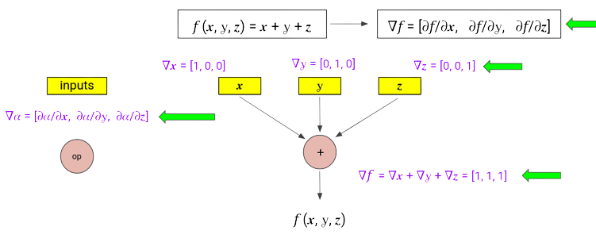

Core Concepts
***************

How Clad Works
=================

Clad is an open source clang plugin that enables automatic differentiation of
mathematical functions in C++. Clad which is based on the LLVM compiler
infrastructure does this by parsing and transforming the abstract syntax tree
(AST); it detects mathematical function and consequently inserts the derived
function in the AST.

Forward and Reverse Mode Automatic Differentiation
====================================================

Forward Mode Automatic Differentiation
----------------------------------------

In forward mode AD, one first fixes the independent variable with respect to
which differentiation is performed and computes the derivative of each
sub-expression recursively. Compared to reverse mode AD, forward
mode is natural and easy to implement as the flow of derivative information
coincides with the order of evaluation of the mathematical function.

Consider the following equation :

.. math::

   z = x * y + sin(x)

Consider,

.. math::

   a = x * y
   b = sin(x)
   z = a + b

Differentiating this eqn w.r.t to any arbitrary variable t we get :

.. math::

   \pdv{a}{t} = y * \pdv{x}{t} + x * \pdv{y}{t}\\
   \pdv{b}{t} = cos(x) * \pdv{x}{t}\\
   \pdv{z}{t} = \pdv{a}{t} + \pdv{b}{t}

The above equations were obtained using the chain rule for differentiation which
is as follows :

 .. math::

  \pdv{w}{t} = \pdv{w}{u1} * \pdv{u1}{t} + \pdv{w}{u2} * \pdv{u2}{t} ....

Here `w` denotes the output variable and `u1` and `u2` denote the input variables.

Replacing :math:`\pdv{a}{t}` with :math:`da` and so on we get.

.. math::

   da = y * dx + x * dy\\
   db = cos(x) * dx\\
   dz = da + db

If we substitute :math:`t = x` i.e. we need to substitute :math:`dx = 1` and
:math:`dy = 0`. Thus :math:`dz` will be :math:`\pdv{z}{x}`. Similarly we need
to substitute :math:`dy = 1` as the seed value while differentiating w.r.t
:math:`y`. The disadvantage of the forward mode AD is clearly visible here; we need to
calculate derivative w.r.t to both independent variables separately.

Reverse Mode Automatic Differentiation
----------------------------------------

In reverse mode AD, the dependent variable to be differentiated is fixed and the
derivative is computed with respect to each sub-expression recursively.
Reverse accumulation traverses the chain rule from outside to inside, or in the
case of the directed acyclic graph of the function(often used to show flow of
information), from top to bottom. The reverse mode AD requires only one sweep of
the computation graph; this is faster than forward mode AD; however it
should also be noted that the intermidiate variables need to be stored during
computation which may result in significant amount of memory if the computation
graph is large.

Thus the simplicity of the foward mode comes with a big disadvantage we need
to seed `dx = 0` and `dy = 1`, run the program and then seed `dx = 1` and `dy = 0`
and run another iteration  of the program. The cost of forward mode AD thus scales
to `o(n)` where n is the number of input variables. Thus the cost would be very
high; if we want to calculate the gradient of a very complicated function with large
number of input variables.

Rewriting the chain rule upside down taking advantage of its symmetry we get :

.. math::

  \pdv{s}{u} = \pdv{w1}{u} * \pdv{s}{w1} + \pdv{w2}{u} * \pdv{s}{w2}

Here we have reversed the roles of the input and output variables. Here `u` is
some input variable and `wi` is an output variable dependent on `u`. `s` is an
intermidiate variable to show change in the position of the derivative.

Here we apply the chain rule for every input variable `u` as opposed to the forward
mode where we applied chain rule for every output variable `w`.

Applying this modified version of the chain rule on our given equations we
get :

.. math::

   \pdv{s}{b} = \pdv{s}{z}\\
   \pdv{s}{a} = \pdv{s}{z}\\
   \pdv{s}{y} = x * \pdv{s}{a}\\
   \pdv{s}{x} = y * \pdv{s}{a} + cos(x) * \pdv{s}{b}

Replacing :math:`\pdv{s}{b}` by `sb` and so on.

.. math::

  sb = sz \\
  sa = sz \\
  sy = x * sa \\
  sx = y * sa + cos(x) * gb

Substituting `s = z` we will get `sz` = 1

Thus we don't need to run the program twice for each input. However, as mentioned
above the only drawback is we need to re-run the program for a different output.

Vectorized Forward Mode Automatic Differentiation
===================================================

Vectorized Forward Mode Automatic Differentiation is a computational technique
that combines two powerful concepts: vectorization and forward mode automatic
differentiation. This approach is used to efficiently compute derivatives of
functions with respect to multiple input variables by taking advantage of both
parallel processing capabilities and the structure of the computation graph.

Working
--------

For computing gradient of a function with an n-dimensional input - forward mode
requires n forward passes.

We can do this in a single forward pass, instead of accumulating a single
scalar value of derivative with respect to a particular node, we maintain a
gradient vector at each node. Although, the strategy is pretty similar, it requires
three passes for computing partial derivatives w.r.t. the three scalar inputs of
the function.

At each node, we maintain a vector, storing the complete gradient of that node's
output w.r.t.. all the input parameters. All operations are now vector operations,
for example, applying the sum rule will result in the addition of vectors.
Initialization for input nodes are done using one-hot vectors.

  Vectorized Forward Mode Automatic Differentiation to compute the gradient.

Benefits
----------

We know that each node requires computing a vector, which requires more memory
and more time, which adds to these memory allocation calls. This must be offset
by some improvement in computing efficiency.

This can prevent the recomputation of some expensive functions, which would have
executed in a non-vectorized version due to multiple forward passes. This approach
can take advantage of the hardware's vectorization and parallelization capabilities
using SIMD techniques.

Derived Function Types and Derivative Types
=============================================

.. todo:: todo

Custom Derivatives
====================

.. todo:: todo

Pushforward and Pullback functions
===================================

Pushforward functions
-------------------------

Pushforward function of a function computes the output variables sensitivities
from the input values and the input variables sensitivities.
Intuitively, pushforward functions propagates the derivatives forward. Pushforward
functions are constructed by applying the core principles of the forward mode
automatic differentiation.

As a user, you need to understand how pushforward function mechanism works so that you
can define custom derivative pushforward functions as require and can thus, unlock full
potential of Clad.

Mathematically, if a function `fn` is represented as\:

.. math::

   fn(u) = sin(u)

then the corresponding pushforward will be defined as follows\:

.. math::

    fn\_pushforward(x, \dot{u}) = cos(u)*\dot{u}

Here, :math:`\dot{u} = \pdv{u}{x}` and :math:`x` is the independent variable.

As a concrete example, pushforward of `std::sin(double)` function will be generated by Clad as follows::

  namespace std {
    double sin_pushforward(double x, double d_x) {
      return ::std::cos(x) * d_x;
    }
  }

In the forward mode automatic differentiation, we need to compute derivative
of each expression in the original source program. Pushforward functions allow to
effectively compute and process derivatives of function call expressions. For example::

  y = fn(u, v);

In the derived function, this statement will be transformed to::

  _d_y = fn_pushforward(u, v, _d_u, _d_v);
  y = fn(u, v);

Here, note that\:

.. math::

   \_d\_u = \dot{u} = \pdv{u}{x} \\
   \_d\_v = \dot{v} = \pdv{v}{x} \\
   \_d\_y = \dot{y} = \pdv{y}{x}

Here, :math:`x` is the independent variable.

From here onwards, in the context of a pushforward function or a usual forward
mode derived function, `_d_someVar` will represent :math:`\pdv{someVar}{x}`
where :math:`x` is the associated independent variable.

Pushforward functions are generated on demand. That is, if Clad needs to
differentiate a function call expression,
then only it will generate the pushforward of the corresponding function declaration.

For a function::

  double fn1(float i, double& j, long double k) { }

the prototype of the corresponding pushforward function will be as follows::

  double fn1(float i, double& j, long double k, float _d_i, double& _d_j, long double _d_k);

Please note the following specification of the pushforward functions:

- Return type of the pushforward function is same as that of the return type of the source function.
- Parameter list of the pushforward function is the parameter list of the original function followed by
  the parameter list that contains derivative of each differentiable parameter of the source function
  in the original sequence.

All of these specifications must be exactly satisfied when creating a custom
derivative pushforward function.

Pullback functions
--------------------

.. todo:: todo

Differentiable Class Types
==============================

.. todo:: todo

Numerical Differentiation
============================

Clad currently provides two interfaces packaged in a single template header file
that allows users to easily use numerical differentiation standalone. The two
interfaces and their usages are mentioned as follows:

* `forward_central_difference`

The numerical differentiation function that differentiates a multi-argument
function with respect to a single argument only. The position of the argument
is specified by the user or Clad. This interface is mainly used in Clad's
forward mode for call expressions with single arguments. However, it can also
easily be extended for jacobian-vector products. The signature of this
method is as follows::

  template < typename F, typename T, typename... Args>
    precision forward_central_difference(F f, T arg, std::size_t n, bool printErrors, Args&&... args){
        // Clad has enough type generality that it can accept
  	// functions with a variety of input types.
  	// Here:
  	// f(args...) - is the target function.
  	// n - is the position of the parameter with respect to which the derivative is calculated.
  	// printErrors - a flag to enable printing of error estimates.
  }

* `central_difference`

The numerical differentiation function that differentiates a multi-argument
function with respect to all the input arguments. This function returns the
partial derivative of the function with respect to every input, and as such
is used in Clad's reverse mode. The signature of the method is as follows::

  template <typename F, std::size_t... Ints,
              typename RetType = typename clad::function_traits<F>::return_type,
              typename... Args>
    void central_difference(F f, clad::tape_impl<clad::array_ref<RetType>>& _grad, bool printErrors, Args&&... args) {
  	// Similar to the above method, here:
  	// f(args...) - is the target function.
  	// grad - is a 2D data structure to store all our derivatives as grad[paramPosition][indexPosition]
  	// printErrors - a flag to enable printing of error estimates.
  }

The above uses functions from the standard math library and so is required
to link against the same. To avoid this (and disable numerical differentiation)
use `-DCLAD_NO_NUM_DIFF` at the target program's compile time.

Implementation Details
-------------------------

Clad uses the five-point stencil method to calculate numerical derivatives. Here,
the target function is executed at least 4 times for each input parameter. Since the
number of parameters can be different across multiple candidate functions, we use an
add-on function to correctly select the parameter whose derivative is to be calculated.
The function is described as follows::

  // This function enables 'selecting' the correct parameter to update.
  // Without this function, Clad will not be able to figure out which x should be updated to x ± h.
  template <typename T>
  T updateIndexParamValue(T arg, std::size_t idx, std::size_t currIdx, int multiplier, precision& h_val,...) {
      if (idx == currIdx) {
  	    // selects the correct ith term.
  	    // assigns it an h_val (h)
  	    // and returns arg + multiplier * h_val.
      }
      return arg;
    }

Here, Idx is the current parameter and currIdx is the parameter to differentiate with
respect to in that pass. If the indices do not match, the argument is returned unchanged.

This function is then applied to all the arguments and is forwarded to the target function `f`::

  fxh = f(updateIndexParamValue(args, indexSeq/*integer index sequence for the parameter pack,
  				Args allows giving an index to each parameter in the pack.*/,
  				i /*index to be differentiated wrt*/,
  				/*±1*/,
  				h/*this is returned*/,
  				/*other params omitted for brevity*/)...);

The above line results in the calculation of `f(..., xi ± h, ...)`. Finally the whole algorithm
for calculating the gradient of a function (numerically) is as follows::

  for each i in args, do:

    fx1 := f(updateIndexParamValue(args, idexSeq, i, 1, h, /*other params*/)...)

    fx2 := f(updateIndexParamValue(args, idexSeq, i, -1, h, /*other params*/)...)

    grad[i][0] := (fx1 - fx2)/(2 * h)

  end for

Currently Supported Use Cases
--------------------------------

* Differentiating multi-arg function calls.
* Differentiating calls with pointer/array input.
* Differentiating user-defined types.
* Printing of error estimates.

Error Estimation Core Concepts
================================

.. todo:: todo
