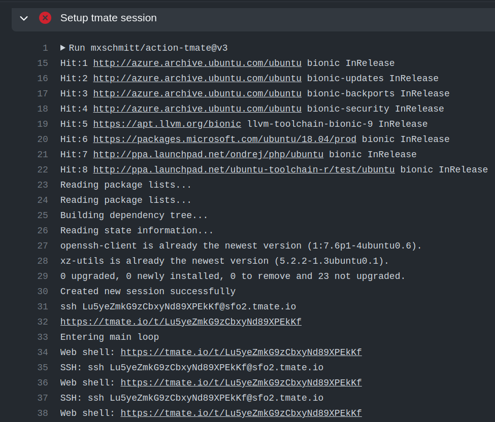

Developers Documentation
***************************

Building from source
=======================

Linux (Ubuntu)
-----------------

.. code-block:: bash

   sudo apt install clang-11 libclang-11-dev llvm-11-tools llvm-11-dev
   sudo -H pip install lit
   git clone https://github.com/vgvassilev/clad.git clad
   mkdir build_dir inst; cd build_dir
   cmake ../clad -DClang_DIR=/usr/lib/llvm-11 -DLLVM_DIR=/usr/lib/llvm-11 -DCMAKE_INSTALL_PREFIX=../inst -DCMAKE_BUILD_TYPE=Debug -DLLVM_EXTERNAL_LIT="``which lit``"
   make && make install

Instructions to build documentation
-------------------------------------

Make sure you have installed `sphinx` before building clad with documentation.

Please use the project's `requirements.txt` file to install Python dependencies.
This will also install the correct version of `sphinx` : 

.. code-block:: bash

   pip install -r requirements.txt

Make sure `doxygen` is installed if you want to build the internal documentation : 

Doxygen Installation `Instructions`_.

.. _Instructions : https://www.doxygen.nl/download.html

To build clad and its documentation, use the following CMake command:

.. code-block:: bash

   cmake ../clad -DClang_DIR=/usr/lib/llvm-11 -DLLVM_DIR=/usr/lib/llvm-11 -DCLAD_INCLUDE_DOCS=ON -DCLAD_ENABLE_DOXYGEN=ON -DCLAD_ENABLE_SPHINX=ON -DCMAKE_INSTALL_PREFIX=../inst -DCMAKE_BUILD_TYPE=Debug -DLLVM_EXTERNAL_LIT="``which lit``"
   make sphinx-clad doxygen-clad

The built user documentation can be found in `build/docs/userDocs/build`; 
while the built internal documentation can be found in `build/docs/internalDocs/build`.

Developers Environment (Linux) - debug build of LLVM, Clang and Clad from source
----------------------------------------------------------------------------------

Clad is a plugin for LLVM Clang compiler infrastructure. Clad uses
Clang and LLVM APIs. Therefore, to properly debug Clad, you will also
need a debug build of LLVM.

Please visit `LLVM CMake documentation <https://llvm.org/docs/CMake.html>`_
to learn how to build LLVM from source. Make sure to pass ``-DCMAKE_BUILD_TYPE=Debug``
and ``-DLLVM_ENABLE_PROJECTS="clang"`` options to LLVM CMake configure command. 

In brief, debug build of LLVM with Clang enabled can be built using the following 
instructions:

.. code-block:: bash

   python -m pip install lit
   git clone https://github.com/llvm/llvm-project.git
   cd llvm-project
   git checkout llvmorg-16.0.0

Build Clang:

.. code-block:: bash

   mkdir build && cd build
   cmake -DLLVM_ENABLE_PROJECTS="clang" -DCMAKE_BUILD_TYPE="DEBUG" -DLLVM_TARGETS_TO_BUILD=host -DLLVM_INSTALL_UTILS=ON ../llvm
   cmake --build . --target clang --parallel $(nproc --all)
   make -j8 check-clang # this installs llvm-config required by lit
   cd ../..

Clone and build Clad:

.. code-block:: bash

   git clone https://github.com/vgvassilev/clad.git
   cd clad
   mkdir build && cd build
   cmake -DLLVM_DIR=PATH/TO/llvm-project/build -DCMAKE_BUILD_TYPE=DEBUG -DLLVM_EXTERNAL_LIT="$(which lit)" ../
   make -j8 clad

Please note that it is recommended to have at least 16 GB of total memory (RAM + swap) to build LLVM in debug mode.

To build Clad with Debug build of LLVM, adjust the ``-DClang_DIR`` and 
``-DLLVM_DIR`` options to point to installation home of debug build of LLVM.

If you are low on computational resources, the following tweaks may help to 
reduce build times, and use less storage and memory consumption while building LLVM.

1. Use Ninja build system instead of make. For large codebases, ninja performs 
   significantly better than GNU make.
2. Use 'gold' linker instead of the default BFD 'ld' linker. The gold linker 
   was written to make the link process considerably faster. It also consumes 
   less memory. 
3. Build LLVM as a shared library. By default, each component is built as a 
   static library. Linking against a static library usually takes more time. 
   And also if multiple executables link against the same set of static libraries 
   then the total size of these executables will be significantly larger.
4. Split the debug info. This option reduces link-time memory usage by 
   reducing the amount of debug information that the linker needs to resolve.
5. Build an optimised version of llvm-tblgen.

After incorporating all of these tweaks, the CMake command should look like this: 

.. code-block:: bash

   cmake -G Ninja /path/to/llvm-project/llvm -DLLVM_USE_LINKER=gold -DCMAKE_BUILD_TYPE=Debug -DLLVM_TARGETS_TO_BUILD=host -DBUILD_SHARED_LIBS=On -DLLVM_USE_SPLIT_DWARF=On -DLLVM_OPTIMIZED_TABLEGEN=On -DLLVM_ENABLE_PROJECTS=clang -DCMAKE_INSTALL_PREFIX=../inst

Clad Internal Documentation
=================================

Clad maintains an internal Doxygen documentation of its components. Internal
documentation aims to capture intrinsic details and overall usage of code 
components. The goal of internal documentation is to make the codebase easier 
to understand for the new developers. 

Internal documentation can be visited 
`here </en/latest/internalDocs/html/index.html>`_
 

Debugging Clang
==================

Why debug the Clang compiler?
--------------------------------

Given a function ``fn`` and argument information, Clad generates the source code 
of a function that computes derivatives of ``fn`` with respect to specified 
input arguments. It is not always easy to find the right way to build a required 
C++ code without having a deeper understanding of how Clang would build that code.
Thus, a typical workflow in Clad involves understanding how Clang builds
a particular C++ code and exactly which Clang APIs are involved in building it. 
Debugging the Clang compiler allows us to see in-action and give insights into how Clang 
builds a given C++ code. 

Debugging Clang during compilation
--------------------------------------

To study how Clang processes a C++ code, we can debug the Clang compiler while it is
compiling a source code.

Before proceeding, make sure you have compiled clang in debug mode so that 
proper debug symbols are available.

We need to debug the Clang compiler when it's compiling a source code. One 
important thing to note here is, that we need to debug *clang compiler* rather than *clang driver*.

When we run command such as::

  clang++ -g hello-world.cpp

This command executes the Clang driver. Clang driver invokes preprocessor, compiler, assembler, 
and linker as needed along with all the necessary flags. Clang driver *drives* the compilation process.
We cannot directly debug ``clang++`` executable since it's the driver and not the compiler itself.

Generally, the compiler driver creates a fork for the compiler.
GDB has ``set follow-fork-mode child`` option that can be used to debug the compiler.
Alternatively, you can find and debug the compiler invocation that is used by the driver
as part of the compilation pipeline of a program. The Clang driver invokes the clang
compiler with all the necessary arguments. Compiler invocation command can be obtained
by adding the ``-v`` option to the Clang driver command. 

For example, 

.. code-block:: bash

   clang++ -g hello-world.cpp -fsyntax-only -v

This command will give output similar to

.. code-block:: bash

   Ubuntu clang version 11.1.0-6
   Target: x86_64-pc-linux-gnu
   Thread model: posix
   InstalledDir: /home/parth/Programs/bin
   Found candidate GCC installation: /usr/lib/gcc/x86_64-linux-gnu/11
   Selected GCC installation: /usr/lib/gcc/x86_64-linux-gnu/11
   Candidate multilib: .;@m64
   Selected multilib: .;@m64
    (in-process)
    "/usr/lib/llvm-11/bin/clang" -cc1 -triple x86_64-pc-linux-gnu 
    -fsyntax-only -disable-free -disable-llvm-verifier -discard-value-names
    -main-file-name hello-world.cpp -mrelocation-model static 
    -mframe-pointer=all -fmath-errno -fno-rounding-math -mconstructor-aliases 
    -munwind-tables -target-cpu x86-64 -fno-split-dwarf-inlining 
    -debug-info-kind=limited -dwarf-version=4 -debugger-tuning=gdb 
    -v -resource-dir /usr/lib/llvm-11/lib/clang/11.1.0 
    -internal-isystem /usr/lib/gcc/x86_64-linux-gnu/11/../../../../include/c++/11 
    -internal-isystem /usr/lib/gcc/x86_64-linux-gnu/11/../../../../include/x86_64-linux-gnu/c++/11 
    -internal-isystem /usr/lib/gcc/x86_64-linux-gnu/11/../../../../include/x86_64-linux-gnu/c++/11 
    -internal-isystem /usr/lib/gcc/x86_64-linux-gnu/11/../../../../include/c++/11/backward 
    -internal-isystem /usr/local/include -internal-isystem /usr/lib/llvm-11/lib/clang/11.1.0/include 
    -internal-externc-isystem /usr/include/x86_64-linux-gnu -internal-externc-isystem /include 
    -internal-externc-isystem /usr/include -fdeprecated-macro -fdebug-compilation-dir /home/parth 
    -ferror-limit 19 -fgnuc-version=4.2.1 -fcxx-exceptions -fexceptions -faddrsig -x c++ hello-world.cpp
   
   clang -cc1 version 11.1.0 based upon LLVM 11.1.0 default target x86_64-pc-linux-gnu
   ignoring nonexistent directory "/include"
   ignoring duplicate directory "/usr/lib/gcc/x86_64-linux-gnu/11/../../../../include/x86_64-linux-gnu/c++/11"
   #include "..." search starts here:
   #include <...> search starts here:
    /usr/lib/gcc/x86_64-linux-gnu/11/../../../../include/c++/11
    /usr/lib/gcc/x86_64-linux-gnu/11/../../../../include/x86_64-linux-gnu/c++/11
    /usr/lib/gcc/x86_64-linux-gnu/11/../../../../include/c++/11/backward
    /usr/local/include
    /usr/lib/llvm-11/lib/clang/11.1.0/include
    /usr/include/x86_64-linux-gnu
    /usr/include
   End of search list.

With the compiler invocation command in hand, we are ready to debug the compiler. 

A typical example that demonstrates debugging of a program using ``lldb``

.. code-block:: bash

   lldb clang
   # set breakpoints
   breakpoint set -n "clang::Sema::BuildDeclRefExpr"
   process launch -- {compiler-invocation-arguments}

Replace ``{compiler-invocation-arguments}`` with the compiler invocation arguments
obtained by executing the Clang driver command with ``-v`` option.

Debugging Github runners
==========================

GitHub runners build and test Clad on a combination of different build compilers, 
Clang runtimes and Operating systems (Mac and Ubuntu).
It gets difficult to debug Clad if one or a few of the GitHub runners are failing, 
but everything seems to work fine on the local system.
To debug failing tests, it will be necessary to replicate the 
GitHub runner environment on which tests are failing just to reproduce the bug, 
and sometimes it may not be even feasible to replicate the GitHub runner environment. 

For cases like these, we can directly ssh into the Github runner and debug the codebase 
there itself, thus saving a lot of time in replicating the Github runner environment.

To ssh into the GitHub runner on which tests are failing, click on re-run actions
and select the debug logging checkbox. If necessary increase the value of
``timeout-minutes`` key in ``.github/workflows/ci.yml`` to a suitable value for 
debugging --  30 - 60 minutes should generally be enough.

After increasing the timeout minutes value, committing and pushing the change.
GitHub runners that have failing tests will stay active for the time specified for 
the ``timeout-minutes``. To ssh into a 
GitHub runner, go to the latest GitHub action corresponding to the push event, 
select any Github runner with failed checks, and click on the 
``setup tmate session`` drop-down to display ssh connection details of the selected 
Github runner. 

Now, to ssh into the GitHub runner do, simply do::

  ssh SSH_KEY

No username or password is required.

Debugging x86 builds locally
============================

It is possible to use a local namespace container using ``systemd-nspawn``.
In order to replicate the CI environment as closely as possible it is recommended to use
an Alpine mini root filesystem, which can be downloaded from `Alpine Downloads <https://alpinelinux.org/downloads/>`_.
After downloading, the container can be set up in the ``~/alpine32/`` directory with the
following commands:

.. code-block:: sh

   mkdir ~/alpine32/
   tar -C ~/alpine32/ -xpf alpine-minirootfs-*.tar.gz

A shell inside the container can be created with:

.. code-block:: sh

   sudo systemd-nspawn --personality=x86 -D ~/alpine32/

When in the container the neccessary tools can be installed with:

.. code-block:: sh

   apk add llvm llvm-dev llvm-gtest llvm-static clang clang-dev clang-static make cmake git

Then clad can be built:

.. code-block:: sh

   git clone https://github.com/vgvassilev/clad.git
   cd clad/
   mkdir build/ && cd build/
   cmake -DLLVM_EXTERNAL_LIT="$(which lit)" ../
   make -j$(nproc --all) clad

If debugging it could be useful to add ``-DCMAKE_BUILD_TYPE=Debug`` to the ``cmake`` command
and specifying the ``check-clad`` target when running ``make`` in order to also run the tests.

*Note:* LLDB can't run any processes on x86 [#lldb-x86-bug]_, but GDB can be used instead.

.. [#lldb-x86-bug] https://bugs.llvm.org/show_bug.cgi?id=45852
