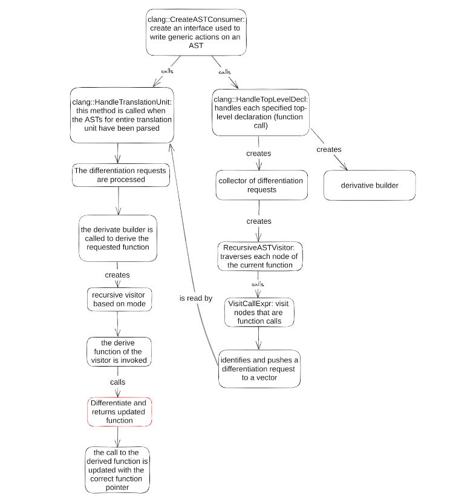

Introduction to Clang for Clad contributors
**********************************************

Since there’s a lack of official documentation for the LLVM Clang, while the
existing docs are not meant to explain how to modify the Clang AST, we are 
writing this text to help the newcomers get into the technical aspects of Clang
useful for contributing to Clad and manipulating the Clang AST in general.

The big picture
=================
So, as you probably know, Clang is a compiler. More precisely, it is a compiler
front end that operates with the LLVM compiler backend. This means that the 
code you're trying to compile will first be processed by Clang, which parses 
the source code and performs initial processing before passing it to the LLVM 
backend for optimisation and code generation. In this picture, Clad is an 
extension for Clang to generate derivatives of C++ functions along the way. 
That is, **Clad synthesises the code for the derivatives** while Clang is 
processing the actual code you have written.

The AST
=========
.. _clang::Expr: https://clang.llvm.org/doxygen/classclang_1_1ValueStmt__inherit__graph.png
.. |clang::Expr| replace:: ``clang::Expr`` 
.. _clang::Decl: https://clang.llvm.org/doxygen/classclang_1_1Decl.html
.. |clang::Decl| replace:: ``clang::Decl`` 
.. _clang::Stmt: https://clang.llvm.org/doxygen/classclang_1_1Stmt.html
.. |clang::Stmt| replace:: ``clang::Stmt``
.. _clang::ValueStmt: https://clang.llvm.org/doxygen/classclang_1_1ValueStmt.html
.. |clang::ValueStmt| replace:: ``clang::ValueStmt`` 
.. _clang::CompoundStmt: https://clang.llvm.org/doxygen/classclang_1_1CompoundStmt.html
.. |clang::CompoundStmt| replace:: ``clang::CompoundStmt``

Clang, parses the input code into an **Abstract Syntax Tree (AST)**. It is at 
this stage that Clad operates as well. The nodes in the Clang AST represent 
various constructs of the source code, including: **declarations, statements, 
expressions**, etc. As one can guess from the name, **declarations (** 
|clang::Decl|_ **)** represent places in the source code where something is 
declared (a variable (clang::VarDecl), a function, etc.); **expressions (** 
|clang::Expr|_ **)** are basically something that can be evaluated to a 
meaningful value, for instance binary operations (``clang::BinaryOperator``) 
like addition or comparison; **statements (** |clang::Stmt|_ **)** could be a 
lot of different things, like loops (``clang::WhileStmt``), conditions 
(``clang::IfStmt``), breaks, etc – pretty much anything you have in your code. 
An important note is that declarations (``clang::Decl``) and statements 
(``clang::Stmt``) are completely different classes (so, **a declaration is not 
a statement**), but there’s a separate declaration statement class, 
|clang::Decl|_, which describes a declaration statement to intertwine the 
statements and declarations. An expression (``clang::Expr``), on the other 
hand, is always a statement, since ``clang::Expr`` inherits from 
|clang::ValueStmt|_ which, in turn, inherits from ``clang::Stmt`` and is a 
statement.
Statements can be grouped into one with a compound statement 
(|clang::CompoundStmt|_).

Flow graph of Clad’s compilation
==================================
The graph below indicates the order of execution during compilation of the 
source code. Clang offers some API functions that work as entry points to the 
AST’s processing. These functions can be modified by the user and are invoked 
by clang. In our case, Clad has altered these functions accordingly, in order 
to compute and include the function’s gradient to the original source code. 
`This source <https://clang.llvm.org/docs/RAVFrontendAction.html>`__ helps to 
distinguish the clang functions, their purpose and how they are connected. The
most useful ones are explained in better detail in later sections.

Identifying functions to derive
=================================
During parsing of the source code through ``HandleTopLevelDecl()``, a 
``RecursiveASTVisitor`` is created. This visitor traverses the nodes by using 
the equivalent ``Visit()`` functions. For instance, a call expression, which 
corresponds to a function call node, is processed through ``VisitCallExpr()`` 
etc. Clad distinguishes the functions related to a differentiation request by 
annotating a compiler attribute that matches the first letter of the 
differentiation method to be used (e.g. “G” for gradient function). This way, 
when ``VisitCallExpr()`` is called upon those nodes, the differentiation 
request is identified, initialised and added to a list. 
Similarly, any statement supported by Clad has a corresponding ``Visit()`` 
method. An if statement would be visited by ``VisitIfStmt()``, a return 
statement by ``VisitReturnStmt()``, etc. The general rule is that the ``Visit``
method is called ``Visit+the name of the statement in Clang``.

Code generation and insertion
===============================
After the parsing is completed and all differentiation requests have been 
identified, the system can begin processing to compute the derived functions 
through ``HandleTranslationUnit()``. A ``DerivativeBuilder`` is created and, 
depending on the Clad function used and its corresponding mode (forward, 
reverse, etc.), the appropriate ``Visitor`` is defined. The ``Visitor``’s 
``Derive()`` method is invoked, which contains a nested call to 
``DifferentiateWithClad()``. This triggers a secondary processing of the nodes 
in the original function. 
During this traversal, for each node encountered, the corresponding node in the
derived function is created and returned to the parent node. The parent node 
then emplaces this newly created node into the current code block of the 
derived function. This process repeats until the traversal reaches the top 
level of the original function, resulting in the complete computation of the 
derived function.
Once the derived function is fully computed, its declaration is created, 
including the appropriate body and parameters. A reference to this derived 
function is then added in ``updateCall()``, where the function to be returned 
by ``clad::differentiate()`` / ``clad::gradient()`` is replaced with its 
derivative.

Statement differentiation
===========================
Visit methods that we have just talked about earlier typically return a 
``clad::StmtDiff`` object. This is a Clad’s structure, so you can find its 
definition in the code and explore its methods. It is basically a type that 
contains 4 values, each one being a pointer to a ``clang::Stmt``. Of these, the
following two values are crucial to understand:

- ``clad::StmtDiff::getStmt()`` - this method gives you the statement contained
  in this StmtDiff object.

- ``clad::StmtDiff::getStmt_dx()`` - this method gives you the derivative of 
  the statement contained by this object.

Let’s see how ``clang::NullStmt`` is handled in the reverse mode (reverse mode
differentiation is called by calling ``clad::gradient``) as an example. Since 
the null statement (which you can have by writing ``;;`` at the end of a line 
in the source code) represents an empty statement in Clang, it doesn’t really 
affect the derivative in any way. So if this happens to be in the source code, 
we just want to ignore it. In the reverse mode, Clad generates derivative 
functions that consist of two parts: a forward pass and a reverse pass. Clad 
produces a ``clad::StmtDiff`` object for each statement of the original 
function where the object’s first part is what will be put in the forward pass
part of the produced derivative function and should basically do the same thing
as the original statement, whereas the object’s second part is basically the 
derivative, which is put into the reverse pass. So, in the case of the null 
statement, both of these should be nothing! Which is expressed by returning an 
empty ``clad::StmtDiff`` from the visitor.

.. code-block:: c++

    StmtDiff VisitNullStmt(const clang::NullStmt* NS) { 
        return StmtDiff{}; 
    };

Less relevant notes
=====================
This section is not that important, but it’s just a bunch of facts that might 
confuse a newcomer.

- Clang AST might not seem like a tree (:D)! In a mathematical sense, a tree is
  a graph without cycles. While the AST itself is intended to be a tree and 
  thus acyclic, practical considerations and additional structures can 
  introduce references that might resemble cycles. So, some recursive 
  constructs or templates  in the source code might confuse you.

- Clang can compile many C-like languages, specifically: C, C++, Objective-C, 
  and Objective-C++. So, if you look at the documentation, not only are you 
  going to see some general Clang classes and classes designed specifically for
  C++ compilation (those mostly start with a CXX- prefix), but also things that
  have an ObjC- prefix like ``clang::ObjCAtTryStmt`` that represent statements 
  of the Objective-C programming language that you likely don’t need.

Further Reading
===============

- `“Changing Everything With Clang Plugins” — 2020 LLVM Developers’ Meeting: H. Finkel <https://www.youtube.com/watch?v=A9COzFs-gEg>`__