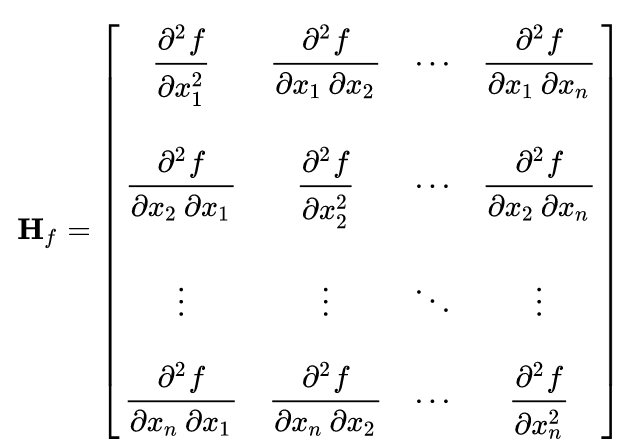

Using Clad
***********

This section briefly describes all the key functionalities offered by Clad.
If you are just getting started with Clad, then this is the best place to start.
You may want to skim some sections on the first read. 

In case you haven't installed Clad already, then please do before proceeding 
with this guide. Visit :doc:`Clad installation and usage <InstallationAndUsage>` 
to know more about installing clad.

Let's get started.

Automatic Differentiation
===========================

Clad differentiation functions takes a function as an input and returns a 
``clad::CladFunction`` object that contains information about the generated 
derived function. Generated derived function can be called by calling the 
`.execute` method on the corresponding `clad::CladFunction` object.

Clad consists of 4 primary automatic differentiation functions:

- ``clad::differentiate`` -- Primary forward mode automatic differentiation
- ``clad::gradient`` -- Primary reverse mode automatic differentiation
- ``clad::hessian``  
- ``clad::jacobian``

Each of these functions will be explored in this guide.

.. todo::

   Perhaps add example use before proceeding with different differentiation modes.


Forward Mode Automatic Differentiation
----------------------------------------

Forward mode AD computes derivatives of all the output parameters of a program with 
respect to an input parameter. The input parameter with respect to which differentiation
takes place is termed as independent parameter. 
Mathematically, the forward mode AD allows the efficient computation of columns of 
the jacobian matrix.

``clad::differentiate`` provides the forward mode differentiation functionality. 
It takes as input, a source function and independent parameter information,
parameter with respect to which differentiation should take place, and returns a ``clad::CladFunction`` object. 
A call to ``clad::differentiate`` tells Clad to generate a function that computes the 
derivatives of the source function with respect to the independent parameter. We will
call the function generated by Clad that computes derivatives as derived function. 
``clad::CladFunction`` is a simple wrapper over the derived function and provides convenient access to it.
Generated derived function is executed by calling the ``.execute`` member 
function on the associated ``clad::CladFunction`` object.

An example that demonstrates the usage of 
``clad::differentiate``::

   #include "clad/Differentiator/Differentiator.h"
   #include <iostream>

   double fn(double x, double y) {
     return x*x + y*y;
   }

   int main() {
     // differentiate 'fn' w.r.t 'x'.
     auto d_fn_1 = clad::differentiate(fn, "x");

     // computes derivative of 'fn' w.r.t 'x' when (x, y) = (3, 4).
     std::cout<<d_fn_1.execute(3, 4)<<"\n"; // prints 6
   }

The independent parameter can be specified either using the parameter name or
the parameter index. Parameter indexing starts from 0. Therefore for 
the example shown above, the two differentiation calls shown below are
equivalent::

  clad::differentiate(fn, "x");

and::

  clad::differentiate(fn, 0);

The derived function is executed by calling the ``.execute`` method on the associated ``clad::CladFunction`` object. 
Clad forward mode differentiated functions returns the computed derivatives,
this behaviour is unique among other types of derived functions generated by Clad.

Clad can also differentiate with respect to an array element. The following
example demonstrates this::

  double fn_arr(double* arr, int n) {
    double res = 0;
    for (int i=0; i<n-1; ++i)
      res += arr[i] * arr[i+1];
    return res;
  }

  int main() {
    // Differentiate 'fn_arr' w.r.t element '1' of the 'arr' parameter
    auto d_fn_arr = clad::differentiate(fn_arr, "arr[1]");
    double arr[5] = {1, 2, 3, 4, 5};
    std::cout<<d_fn_arr.execute(arr, 5)<<"\n";  // prints 4
  }

Arbitrary higher-order derivatives can also be computed using forward mode 
differentiation. The following examples demonstrate computation of higher-order derivatives::

  double fn(double i) { return i * i * i * i; }

  int main() {
    // Differentiate 3rd order higher derivative of 'fn_arr' w.r.t parameter 'i'
    auto d_fn_3 = clad::differentiate<3>(fn, "i");
    std::cout << d_fn_3.execute(3) << "\n"; // prints 72.00
  }

Clad also supports higher order differentiation of custom derivatives like `std::sin`. A usage example can be something like::
  
  double mysin(double x) { return std::sin(x); }
  int main() {
    auto d_sin_3 = clad::differentiate<3>(mysin);
    std::cout << d_sin_3.execute(3) << "\n"; // prints 0.989992
  }
  
.. note::

   For derivative orders upto 3, clad has specially defined enums that can be used
   instead of the integer template parameter. For example, the following code is
   equivalent to the code shown above::

      auto d_fn_3 = clad::differentiate<clad::order::third>(fn, "i");

.. note::

   Forward mode AD can only be used to differentiate with respect to a single 
   value. For differentiating with respect to multiple values (parameters), 
   reverse-mode AD must be used..
  
Visit API reference of :ref:`clad::differentiate<api_reference_clad_differentiate>`
for more details.

Reverse Mode Automatic Differentiation
----------------------------------------

Hessian Computation
----------------------

Clad can directly compute the 
`hessian matrix <https://en.wikipedia.org/wiki/Hessian_matrix>`_ of a
function using the ``clad::hessian`` function.


  
  Hessian matrix when specified parameters are 
  (x\ :sub:`1`\ , x\ :sub:`2`\ , ..., x\ :sub:`n`\ ).

``clad::hessian`` provides the hessian computation functionality. 
The ``clad::hessian`` function takes a source function as input, and optionally, 
information about independent parameters -- with respect to which hessian should be computed.

Internally, ``clad::hessian`` uses both the forward mode AD and the 
reverse mode AD to efficiently compute hessian matrix.  

An example that demonstrates the usage of ``clad::hessian``::

  #include "clad/Differentiator/Differentiator.h"

  double kinetic_energy(double mass, double velocity) {
    return 0.5 * mass * velocity * velocity;
  }

  int main() {
    // Tells clad to generate a function that computes hessian matrix of the function 
    // 'kinetic_energy' with respect to all the input paramters.
    auto hessian_one = clad::hessian(kinetic_energy);

    // Can manually specify independent arguments
    auto hessian_two = clad::hessian(kinetic_energy, "mass, velocity");

    // Creates an empty matrix to store the Hessian in
    // Must have enough space, 2 independent variables requires 4 elements (2^2=4)
    double matrix[4];

    // Prints the generated Hessian function
    hessian_one.dump();
    hessian_two.dump();

    // Substitutes these values into the Hessian function and pipes the result
    // into the matrix variable.
    hessian_one.execute(10, 2, matrix);
    hessian_two.execute(5, 1, matrix);
  }

Few important things to note about ``clad::hessian``:

- If no independent variable information is provided, then hessian matrix is 
  computed by taking all differentiable function parameters as independent
  variables.

- Independent argument information is provided as a string literal with comma
  separated names of function parameters. For example::

    double product(double i, double j, double k) {
      return i*j*k;
    }
    // Tells Clad to generate a function that computes hessian matrix of the
    // 'product' function with respect to the input parameters 'i' and 'j'.
    auto d_fn = clad::hessian(product, "i, j");

- ``clad::hessian`` also supports differentiating w.r.t multiple paramters.

::
  
  auto d_fn = clad::hessian(fn);
  double hessian_matrix[4] = {};
  d_fn.execute(3, 5, hessian_matrix);

- hessian matrix array should be passed as the last argument to the call 
  to the ``CladFunction::execute`` as shown in the above code sample. It will store the hessian matrix computed 
  by the derived function. The hessian matrix array size should at least be as big as the size 
  required to store the hessian matrix. Passing an array less than the required size will result in undefined behaviour.

Consider the case of the input being an array we need to specify the array index 
that needs to be differentiated even when we want to differentiate w.r.t entire array.

.. code-block:: cpp
  
 #include "clad/Differentiator/Differentiator.h"

 double fn(double x, double arr[2]) { return x * arr[0] * arr[1]; }

 int main() {

   auto fn_hessian = clad::hessian(fn, "x, arr[0:1]");

   // We have 3 independent variables thus we require space of 9.
   double mat_fn[9] = {0};
   double num[2] = {1, 2};
   fn_hessian.execute(3, num, mat_fn);
 }

Jacobian Computation
----------------------

The Jacobian matrix is the generalization of the gradient for vector-valued functions of several variables.

Clad can compute the 
 `jacobian matrix <https://en.wikipedia.org/wiki/Jacobian_matrix_and_determinant>`_ of a
 function through the ``clad::jacobian`` interface.

 .. figure:: ../_static/jacobian-matrix.png
   :width: 400
   :align: center
   :alt: Jacobian matrix image taken from Wikipedia

   Jacobian matrix of a function with x\ :sub:`n`\ parameters:  
   (x\ :sub:`1`\ , x\ :sub:`2`\ , ..., x\ :sub:`n`\ ).


 A self-explanatory example that demonstrates the usage of ``clad::jacobian``::

   #include "clad/Differentiator/Differentiator.h"

   void fn_jacobian(double i, double j, double *res) {
      res[0] = i*i;
      res[1] = j*j;
      res[2] = i*j;
   }

   int main() {
     // Generates all first-order partial derivatives columns of a Jacobian matrix
     // and stores CallExprs to them inside a single function 
     auto jacobian = clad::jacobian(fn_jacobian);

     // Creates an empty matrix to store the Jacobian in
     // Must have enough space, 2 columns (independent variables) times 3 rows (2*3=6)
     double matrix[6];

     // Prints the generated Hessian function
     jacobian.dump();

     // Substitutes these values into the Jacobian function and pipes the result
     // into the matrix variable.
     double res[3] = {0, 0, 0};
     jacobian.execute(3, 5, res, matrix);
   }

 Few important things to note through this example:

 - ``clad::jacobian`` supports differentiating w.r.t multiple paramters.

 - The array that will store the computed jacobian matrix needs to be passed as the 
   last argument to ``CladFunction::execute`` call. The array size 
   needs to be greater or equal to the size required to store the jacobian matrix. 
   Passing an array of a smaller size will result in undefined behaviour.

Array Support 
----------------
Clad currently supports differentiating arrays for forward, reverse, hessian and error estimation modes. The interface
for these vary a bit.

Forward mode: The interface requires the user to provide the exact index of the array for which the function is to
be differentiated. The interface of the diff function remains the same as before. An example is given below::

    #include "clad/Differentiator/Differentiator.h"

    double f (double arr[4]) { return arr[0] * arr[1] * arr[2] * arr[3]; }

    int main() {
        // Differentiating the function f w.r.t arr[1] :
        auto f_diff = clad::differentiate(f, "arr[1]");

        double arr[4] = {1, 2, 3, 4};
        // Pass the input to f to the execute function
        // The output is stored in a variable with the same type as the return type of f
        double f_dx = f_diff.execute(arr);

        printf("df/darr[2] = %g\n", f_dx);
    }

Reverse mode: The interface doesn't require any specific index to be mentioned. The interface of the diff function
requires you to pass `T*` for the independent variables after you pass the inputs to the original
function. The `T` here is type of the original variable. The example below will explain it better::

    #include "clad/Differentiator/Differentiator.h"

    double g(double x, double arr[2]) { return x * arr[0] + x * arr[1]; }

    int main() {
        // Differentiating g w.r.t all the input variables (x, arr)
        auto g_grad = clad::gradient(g);

        double x = 2, arr[2] = { 1, 2 };
        // Create memory for the output of differentiation
        double dx = 0, darr[2] = { 0 };

        // The inputs to the original function g (i.e x and arr) are passed
        // followed by the variables to store the output (i.e dx and darr)
        g_grad.execute(x, arr, &dx, darr);

        printf("dg/dx = %g \ndg/darr = { %g, %g } \n", dx, darr[0], darr[1]);
    }

Hessian Mode: The interface requires the indexes of the array being differentiated to be mentioned explicitly even if
you are trying to differentiate w.r.t the whole array. The interface of the diff function requires you to pass an
an array `T*` after passing the inputs to the original function. The `T` is the return type of the original
function and the size of the array should be at least the square of the number of independent variables
(each index of an array is counted as one independent variable). Example::

    #include "clad/Differentiator/Differentiator.h"

    double h(double x, double arr[3]) { return x * arr[0] * arr[1] * arr[2]; }

    int main() {
        // Differentiating h w.r.t all the input variables (x, arr)
        // Note that the array and the indexes are explicitly mentioned even though all the indexes (0, 1 and 2)
        // are being differentiated
        auto h_hess = clad::hessian(h, "x, arr[0:2]");

        double x = 2, arr[3] = { 1, 2, 3 };

        // Create memory for the hessian matrix
        // The minimum required size of the matrix is the square of the
        // number of independent variables
        // Since there are 3 indexes of the array and a scalar variable
        // the total number of independent variables are 4
        double mat[16];

        // The inputs to the original function h (i.e x and arr) are passed
        // followed by the output matrix
        h_hess.execute(x, arr, mat);

        printf("hessian matrix: \n"
               "{ %g, %g, %g, %g\n"
               "  %g, %g, %g, %g\n"
               "  %g, %g, %g, %g\n"
               "  %g, %g, %g, %g }\n",
                mat[0], mat[1], mat[2], mat[3],
                mat[4], mat[5], mat[6], mat[7],
                mat[8], mat[9], mat[10], mat[11],
                mat[12], mat[13], mat[14], mat[15]);
    }

Error estimation: This interface is the same as with reverse mode.

Differentiating Functors and Lambdas
-------------------------------------

Despite significant differences, differentiating functors and lambda
expressions is remarkably similar to differentiating ordinary functions.
Similarly, computing the hessian matrix and jacobian matrix of functors and
lambda expressions is also similar to computing hessian matrix and 
jacobian matrix of ordinary functions.

Differentiating functors and lambdas means differentiating the call operator 
(operator()) member function defined by the functor and lambda type and 
executing the differentiated function using a reference to the functor object.

An example that demonstrates the differentiation of functors::

  #include "clad/Differentiator/Differentiator.h"
  
  // A class type with user-defined call operator
  class Equation {
    double m_x, m_y;
  
    public:
    Equation(double x = 0, double y = 0) : m_x(x), m_y(y) {}
    double operator()(double i, double j) {
      return m_x*i*j + m_y*i*j;
    }
    void setX(double x) {
      m_x = x;
    }
  };
  
  int main() {
    Equation E(3, 5);
  
    // Functor is an object of any type which have user defined call operator.
    //
    // Clad differentiation functions can directly differentiate functors.
    // Functors can be passed to clad differentiation functions in two distinct
    // ways:
  
    // 1) Pass by reference
    // differentiates 'E' wrt parameter 'i'
    // object 'E' is saved in the 'CladFunction' object 'd_E'
    auto d_E = clad::differentiate(E, "i");
  
    // 2) Pass as pointers
    // differentiates 'E' wrt parameter 'i'
    // object 'E' is saved in the 'CladFunction' object 'd_E_pointer'
    auto d_E_pointer = clad::differentiate(&E, "i");
  
    // calculate differentiation of 'E' when (i, j) = (7, 9)
    double res1 = d_E.execute(7, 9);  // prints 66
    double res2 = d_E_pointer.execute(7, 9);  // prints 66
  }

Functors and lambda expressions can be passed both by reference and by pointers.
Therefore, the two differentiation calls shown below are equivalent::

  Experiment E;  // a functor
  // passing function by reference
  auto d_E = clad::differentiate(E, "i");

and::

  Experiment E;  // a functor
  // passing function by pointer
  auto d_E = clad::differentiate(&E, "i");

An example that demonstrates differentiation of lambda expressions::

  int main() {
    auto lambda = [](double i, double j) {
      return i*j;
    };
    // Pass by reference
    auto lambda_grad = clad::gradient(lambda);
    // Can be passed by pointer as well!!
    auto lambda_grad_pointer = clad::gradient(&lambda);

    double d_i_1, d_j_1, d_i_2, d_j_2;
    d_i_1 = d_j_1 = d_i_2 = d_j_2 = 0;

    lambda_grad.execute(3, 5, &d_i_1, &d_j_1);
    lambda_grad_pointer.execute(3, 5, &d_i_2, &d_j_2);

    std::cout<<d_i_1<<" "<<d_j_1<<"\n"; // prints 5 3
    std::cout<<d_i_2<<" "<<d_j_2<<"\n"; // prints 5 3
  }

.. note::

   Functor class should not contain multiple overloaded call operators. 
   This restriction will be removed in the future.  

Differentiable Class Types
----------------------------

.. note:: 

   This feature is currently experimental. Expect some adventures while
   using it. If you do decide to go on this adventure, please consider giving 
   your review as well on how we can improve this functionality.

One of the main goals of Clad is to be able to differentiate existing codebases
with minimal boilerplate code. Most existing codebases invariably use several
data structures for representing different information at various stages of computations.
Thus, we are adding support for differentiating class type objects for convenient and effective
differentiation of existing codebases. 

Before going any further, let's first understand how data structures and functions 
relate to their mathematical counterparts, and what does it mean for a data structure or a function
to be differentiable.
As per the principles of calculus and from purely mathematical perspective, only mathematical functions, are 
differentiable. Intuitively, data structures represent a mathematical space, and are thus, not 
differentiable from mathematical point of view. On the other hand, functions represent mathematical functions and can thus,
be differentiable. Please note that not all functions represent a mathematical space. We will call a function, a differentiable function, if it represents a mathematical function 
and can be differentiated.
We will call a type, a differentiable type, if Clad can perform calculus on the 
values of this type. A differentiable function should only use differentiable types
in its definition. 

.. math::

   F : X \longrightarrow Y

where

.. math::

   X = (x_0, x_1, x_2, ...) \\
   Y = (y_0, y_1, y_2, ...)


For a class type to be differentiable, it should satisfy the following rules:

- Represent a real vector space.
- Have a default constructor that zero initialises the object of
  the class.
  Class objects initialised by the default constructor should represent
  0 tangent vector -- that is, all real data members should be equal to 0.
- Copy initialisation should perform deep copy initialisation. For example, 
  after performing the initialisation ``a(b)``:, 1) there should be no shared 
  resource between ``a`` and ``b``, and 2) values of all the associated data
  members of ``a`` and ``b`` should be equal.
- Assignment operator should performs deep copy. 
  For example, after performing the assignment ``a = b;``: there should be no 
  shared resource between ``a`` and ``b``; and values of all the associated data
  members of ``a`` and ``b`` should be equal.
  

In general, type of derivative of a variable of type 'YType' with respect to
a variable of type 'XType' is a function of both 'YType' and 'XType'. Therefore,
:math:`DerivativeType = f(YType, XType)`. Intuitively, derivative type should be
able to represent all the derivatives that are obtained on differentiating a variable
``y`` with respect to a variable ``x``. We will obtain more than one derivative if either
or both of ``x`` and ``y`` are aggregate types.

In case when both ``y`` and ``x`` are built-in scalar numerical type, as your 
intuition probably suggests, the derivative type is also a built-in scalar 
numerical type. Things get more complicated when one or both the types
are aggregate types. When used in a computation, aggregate types -- or more generally, 
class types -- represent a mathematical space. In the specific case when either of ``y`` 
or ``x`` is a built-in numerical scalar type, the derivative type can be considered
to be the other type. For example, consider the following aggregate type::

  struct Vector {
    double data[5];
  };

If we are differentiating a variable ``v`` of type ``Vector`` with respect to a variable ``x`` of type ``double``.
Then, the derivative is of the ``Vector`` type. Mathematically, let ``Vector`` represents
a vector space :math:`V`, then the following relations holds true:

.. math::
  x \in \mathbb{R} \\
  v \in V \\
  \pdv{v}{x} \in V

If :math:`\pdv{v}{x}` is stored in a variable `d_v`. Then we can access the individual 
derivatives as follows::

  d_v.data[0];  // derivative of v.data[0] w.r.t x
  d_v.data[1];  // derivative of v.data[1] w.r.t x
  .. and so on ..

Similarly, in the case of differentiating a variable ``y`` of type ``double`` with respect to a variable ``v`` of type ``Vector``,
the derivative, ``d_v``, is again of the ``Vector`` type. But the derivatives represented by the elements of ``d_v.data``` have changed.
In this case, the elements of ``d_v.data`` represent derivative of ``y`` with respect to each of the elements of ``v.data``.

If :math:`\pdv{x}{v}` is stored in a variable ``d_v``. Then we can access the individual derivatives as follows::

  d_v.data[0];  // derivative of x w.r.t v.data[0]
  d_v.data[1];  // derivative of x w.r.t v.data[1]
  .. and so on ..

Currently, class type support have the following limitations:

- Calls to member functions are not supported
- Calls to overloaded operators are not supported
- Initialising class type variables using non-default constructors that take 
  non-literal arguments (non-zero derivatives) are not supported.
- Class cannot have pointer or reference data members.

Class type support is under active development and thus, most of these 
limitations will be removed soon.

Specifying Custom Derivatives
-------------------------------

At times Clad may be unable to differentiate your function (e.g. if its definition is 
in a library and the source code is not available) or an efficient/more numerically 
stable expression for derivatives may be known that couldn't be computed just by applying 
the rules of automatic differentiation. In such cases, it is useful 
to be able to specify custom derivatives for the function.

Clad supports this functionality by allowing the user to specify their own custom derivatives
pushforward and pullback functions in the namespace ``clad::custom_derivatives::``. 
For a function ``FNAME`` one can specify:

- a custom derivative pushforward function by defining a function
  ``FNAME_pushforward`` inside the namespace ``clad::custom_derivatives::``.
- a custom derivative pullback function by defining a function
  ``FNAME_pullback`` inside the namespace ``clad::custom_derivatives::``.

When Clad will encounter a function ``FNAME``, it will first search for a 
suitable custom derivative function definition within the custom_derivatives namespace. 
Provided no definition was found, Clad will proceed to automatically derive the function.

Please read `Pushforward and Pullback Functions` section to get better understanding 
of them.

.. note::

   Currently, there is no way of specifying custom derivative function for 
   member functions. This limitation will be removed soon.

Example:

- Suppose that you have a function ``my_pow(x, y)`` which computes ``x`` to 
  the power of ``y``. In this example, Clad is not able to differentiate ``my_pow``'s 
  body 
  (e.g. it calls an external library or uses some non-differentiable approximation)::

    double my_pow(double x, double exponent) { // something non-differentiable here... }

However, the analytical formulas of its derivatives are known, thus one can easily 
specify custom derivatives::

  namespace clad {
    namespace custom_derivatives {
      double my_pow_pullback(double x, double exponent, double d_x,
                             double d_exponent) {
        return exponent * my_pow(x, exponent - 1) * d_x +
               (my_pow(x, exponent) * ::std::log(x)) * d_exponent;
      }
    } 
  } 

Moreover, a custom gradient can be specified::

  namespace clad {
    namespace custom_derivatives {
      void my_pow_pullback(double x, double exponent, double d_y,
                           double *d_x, double *exponent) {
        double t = my_pow(x, exponent-1);
        *d_x += t * d_y;
        *d_exponent += t * x * ::std::log(x) * d_y;
      }
    }
  }

Whenever Clad will encounter ``my_pow`` inside a differentiated function, it 
will first try to find and use the provided custom derivative funtion before
attempting to automatically differentiate it.

.. note::
   Clad provides custom derivatives for some mathematical functions from ``<cmath>`` by default.


Numerical Differentiation Fallback
====================================

In the cases that Clad is unable to differentiate a function by itself or cannot see the function's definition, it will 
numerically differentiate the function. Clad uses the `Five-Point Stencil Method <https://en.wikipedia.org/wiki/Five-point_stencil>`_ 
with support for differentiating most scalar or array (pointer) types. For a comprehensive demo on numerically 
differentiating custom/user-defined types, you can checkout the following `demo <https://github.com/vgvassilev/clad/blob/master/demos/CustomTypeNumDiff.cpp>`__.

This default behavior can be disabled by passing the `-DCLAD_NO_NUM_DIFF` flag during the compilation of 
your programs. This will cause Clad to fail and error out if it encounters something non-differentiable. 
Another interesting bit of information that can be solicited from numerical differentiation calls is error information. 
Since numerical differentiation is only a way to estimate the derivative, it is essential to keep track of any associated 
errors. Error estimates from numerical differentiation calls can be printed to stdout using the `-fprint-num-diff-errors` 
compilation flag. This flag is overridden by the `-DCLAD_NO_NUM_DIFF` flag.

Error Estimation
======================

Clad is capable of annotating a given function with floating point error estimation code using reverse mode AD. 
An interface similar to `clad::gradient(f)` is provided as follows:

`clad::estimate_error(f)`, where `f` is a pointer to the function or method to be annotated with floating point 
error estimation code.

The function signature of the generated code is the same as from `clad::gradient(f)` with an extra argument at 
the end of type `double&`, which returns the total floating point error in the function by reference. For a user 
function `double f(double, double)` example usage is described below::

  double f(double x, double y) {
    double z;
    z = x + y;
    return z
  }
  
  int main() {
    // Generate the floating point error estimation code for 'f'.
    auto df = clad::estimate_error(f);
    // Print the generated code to standard output.
    df.dump();
    // Declare the necessary variables.
    double x, y, d_x, d_y, final_error = 0;
    // Finally call execute on the generated code.
    df.execute(x, y, &d_x, &d_y, final_error);
    // After this, 'final_error' contains the floating-point error in function 'f'.
  }

The above example generates the floating point error estimation code using an in-built taylor approximation model. 
However, Clad is capable of using any user defined custom model, for information on how to use you own custom model, 
please visit this `demo <https://github.com/vgvassilev/clad/tree/master/demos/ErrorEstimation/CustomModel>`__.
This `tutorial <https://compiler-research.org/tutorials/fp_error_estimation_clad_tutorial/>`_
provides a comprehensive guide on building your own custom models and understanding the working behind the error 
estimation framework.

Debug functionalities
======================


