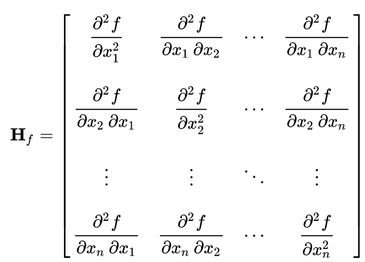
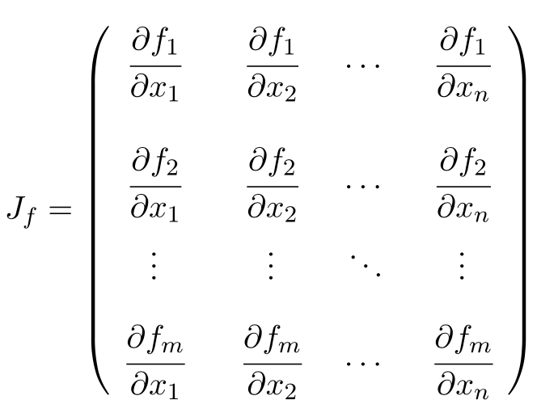

Using Clad
***********

This section briefly describes all the key functionalities offered by Clad.
If you are just getting started with Clad, then this is the best place to start.
You may want to skim some sections on the first read. 

In case you haven't installed Clad already, then please do before proceeding 
with this guide. Visit :doc:`Clad installation and usage <InstallationAndUsage>` 
to know more about installing clad.

Let's get started.

Automatic Differentiation
===========================

Clad differentiation functions takes a function as an input and returns a 
``clad::CladFunction`` object that contains information about the generated 
derived function. Generated derived function can be called by calling the 
`.execute` method on the corresponding `clad::CladFunction` object.

Clad consists of 4 primary automatic differentiation functions:

- ``clad::differentiate`` -- Primary forward mode automatic differentiation
- ``clad::gradient`` -- Primary reverse mode automatic differentiation
- ``clad::hessian``  
- ``clad::jacobian``

Each of these functions will be explored in this guide.

.. todo::

   Perhaps add example use before proceeding with different differentiation modes.


Forward Mode Automatic Differentiation
----------------------------------------

Forward mode AD computes derivatives of all the output parameters of a program with 
respect to an input parameter. The input parameter with respect to which differentiation
takes place is termed as independent parameter. 
Mathematically, the forward mode AD allows the efficient computation of columns of 
the jacobian matrix.

``clad::differentiate`` provides the forward mode differentiation functionality. 
It takes as input, a source function and independent parameter information,
parameter with respect to which differentiation should take place, and returns a ``clad::CladFunction`` object. 
A call to ``clad::differentiate`` tells Clad to generate a function that computes the 
derivatives of the source function with respect to the independent parameter. We will
call the function generated by Clad that computes derivatives as derived function. 
``clad::CladFunction`` is a simple wrapper over the derived function and provides convenient access to it.
Generated derived function is executed by calling the ``.execute`` member 
function on the associated ``clad::CladFunction`` object.

An example that demonstrates the usage of 
``clad::differentiate``:

.. literalinclude:: ../../../../test/Documentation/UsingClad/ForwardMode.cpp
   :language: cpp
   :start-after: docs-begin-forward-mode
   :end-before: docs-end-forward-mode

The independent parameter can be specified either using the parameter name or
the parameter index. Parameter indexing starts from 0. Therefore for 
the example shown above, the two differentiation calls shown below are
equivalent::

  clad::differentiate(fn, "x");

and::

  clad::differentiate(fn, 0);

The derived function is executed by calling the ``.execute`` method on the associated ``clad::CladFunction`` object. 
Clad forward mode differentiated functions returns the computed derivatives,
this behaviour is unique among other types of derived functions generated by Clad.

Clad can also differentiate with respect to an array element. The following
example demonstrates this:

.. literalinclude:: ../../../../test/Documentation/UsingClad/ForwardModeArray.cpp
   :language: cpp
   :start-after: docs-begin-forward-mode-array
   :end-before: docs-end-forward-mode-array

Arbitrary higher-order derivatives can also be computed using forward mode 
differentiation. The following example demonstrates computation of
higher-order derivatives:

.. literalinclude:: ../../../../test/Documentation/UsingClad/HigherOrder.cpp
   :language: cpp
   :start-after: docs-begin-higher-order
   :end-before: docs-end-higher-order

Clad also differentiates a call to a function it has a custom derivative for,
such as `std::sin`, more than once. A usage example can be something like:

.. literalinclude:: ../../../../test/Documentation/UsingClad/HigherOrderCustom.cpp
   :language: cpp
   :start-after: docs-begin-higher-order-custom
   :end-before: docs-end-higher-order-custom

.. note::

   This chaining currently stops at the second derivative. Asking for a third
   derivative through a built-in pushforward compiles and then fails to link,
   because clad declares the pushforward of the pushforward of the pushforward
   without defining it. See `issue #2081
   <https://github.com/vgvassilev/clad/issues/2081>`__.
  
.. note::

   For derivative orders upto 3, clad has specially defined enums that can be used
   instead of the integer template parameter. For example, the following code is
   equivalent to the code shown above::

      auto d_fn_3 = clad::differentiate<clad::order::third>(fn, "i");

.. note::

   Forward mode AD can only be used to differentiate with respect to a single 
   value. For differentiating with respect to multiple values (parameters), 
   reverse-mode AD must be used..
  
Visit API reference of :ref:`clad::differentiate<api_reference_clad_differentiate>`
for more details.

Reverse Mode Automatic Differentiation
----------------------------------------

Hessian Computation
----------------------

Clad can directly compute the 
`hessian matrix <https://en.wikipedia.org/wiki/Hessian_matrix>`_ of a
function using the ``clad::hessian`` function.


  
  Hessian matrix when specified parameters are 
  (x\ :sub:`1`\ , x\ :sub:`2`\ , ..., x\ :sub:`n`\ ).

``clad::hessian`` provides the hessian computation functionality. 
The ``clad::hessian`` function takes a source function as input, and optionally, 
information about independent parameters -- with respect to which hessian should be computed.

Internally, ``clad::hessian`` uses both the forward mode AD and the 
reverse mode AD to efficiently compute hessian matrix.  

An example that demonstrates the usage of ``clad::hessian``:

.. literalinclude:: ../../../../test/Documentation/UsingClad/Hessian.cpp
   :language: cpp
   :start-after: docs-begin-hessian
   :end-before: docs-end-hessian

Few important things to note about ``clad::hessian``:

- If no independent variable information is provided, then hessian matrix is 
  computed by taking all differentiable function parameters as independent
  variables.

- Independent argument information is provided as a string literal with comma
  separated names of function parameters. For example::

    double product(double i, double j, double k) {
      return i*j*k;
    }
    // Tells Clad to generate a function that computes hessian matrix of the
    // 'product' function with respect to the input parameters 'i' and 'j'.
    auto d_fn = clad::hessian(product, "i, j");

- ``clad::hessian`` also supports differentiating w.r.t multiple parameters.

::
  
  auto d_fn = clad::hessian(fn);
  double hessian_matrix[4] = {};
  d_fn.execute(3, 5, hessian_matrix);

- hessian matrix array should be passed as the last argument to the call
  to the ``CladFunction::execute`` as shown in the above code sample. The
  derived function adds into that array rather than overwriting it, so it
  should start zeroed. The array size should at least be as big as the size
  required to store the hessian matrix. Passing an array less than the required size will result in undefined behaviour.

Consider the case of the input being an array we need to specify the array index 
that needs to be differentiated even when we want to differentiate w.r.t entire array.

.. literalinclude:: ../../../../test/Documentation/UsingClad/HessianArray.cpp
   :language: cpp
   :start-after: docs-begin-hessian-array
   :end-before: docs-end-hessian-array

Jacobian Computation
----------------------

The Jacobian matrix is the generalization of the gradient for vector-valued functions of several variables.

Clad can compute the
`jacobian matrix <https://en.wikipedia.org/wiki/Jacobian_matrix_and_determinant>`_ of a
function through the ``clad::jacobian`` interface.



  Jacobian matrix of a function with x\ :sub:`n`\ parameters:
  (x\ :sub:`1`\ , x\ :sub:`2`\ , ..., x\ :sub:`n`\ ).


A self-explanatory example that demonstrates the usage of ``clad::jacobian``:

.. literalinclude:: ../../../../test/Documentation/UsingClad/Jacobian.cpp
   :language: cpp
   :start-after: docs-begin-jacobian
   :end-before: docs-end-jacobian

Few important things to note through this example:

- ``clad::jacobian`` supports differentiating w.r.t multiple parameters.

- The clad::matrix args are generated for all array/pointer parameters. They need to be passed
  after the original parameters to ``CladFunction::execute`` call. The size of every matrix
  needs to be exactly the size required to store the derivative of the corresponding parameter
  w.r.t. all input parameters. Passing a matrix of a different size will result in undefined behaviour.

Array Support 
----------------
Clad currently supports differentiating arrays for forward, reverse, hessian and error estimation modes. The interface
for these vary a bit.

Forward mode: The interface requires the user to provide the exact index of the array for which the function is to
be differentiated. The interface of the diff function remains the same as before. An example is given below:

.. literalinclude:: ../../../../test/Documentation/UsingClad/ArrayForward.cpp
   :language: cpp
   :start-after: docs-begin-array-forward
   :end-before: docs-end-array-forward

Reverse mode: The interface doesn't require any specific index to be mentioned. The interface of the diff function
requires you to pass `T*` for the independent variables after you pass the inputs to the original
function. The `T` here is type of the original variable. The example below will explain it better:

.. literalinclude:: ../../../../test/Documentation/UsingClad/ArrayReverse.cpp
   :language: cpp
   :start-after: docs-begin-array-reverse
   :end-before: docs-end-array-reverse

Hessian Mode: The interface requires the indexes of the array being differentiated to be mentioned explicitly even if
you are trying to differentiate w.r.t the whole array. The interface of the diff function requires you to pass an
an array `T*` after passing the inputs to the original function. The `T` is the return type of the original
function and the size of the array should be at least the square of the number of independent variables
(each index of an array is counted as one independent variable). Example:

.. literalinclude:: ../../../../test/Documentation/UsingClad/ArrayHessian.cpp
   :language: cpp
   :start-after: docs-begin-array-hessian
   :end-before: docs-end-array-hessian

Error estimation: This interface is the same as with reverse mode.

Differentiating Functors and Lambdas
-------------------------------------

Despite significant differences, differentiating functors and lambda
expressions is remarkably similar to differentiating ordinary functions.
Similarly, computing the hessian matrix and jacobian matrix of functors and
lambda expressions is also similar to computing hessian matrix and 
jacobian matrix of ordinary functions.

Differentiating functors and lambdas means differentiating the call operator 
(operator()) member function defined by the functor and lambda type and 
executing the differentiated function using a reference to the functor object.

An example that demonstrates the differentiation of functors:

.. literalinclude:: ../../../../test/Documentation/UsingClad/Functor.cpp
   :language: cpp
   :start-after: docs-begin-functor
   :end-before: docs-end-functor

Functors and lambda expressions can be passed both by reference and by pointers.
Therefore, the two differentiation calls shown below are equivalent::

  Experiment E;  // a functor
  // passing function by reference
  auto d_E = clad::differentiate(E, "i");

and::

  Experiment E;  // a functor
  // passing function by pointer
  auto d_E = clad::differentiate(&E, "i");

An example that demonstrates differentiation of lambda expressions:

.. literalinclude:: ../../../../test/Documentation/UsingClad/Lambda.cpp
   :language: cpp
   :start-after: docs-begin-lambda
   :end-before: docs-end-lambda

.. note::

   Functor class should not contain multiple overloaded call operators. 
   This restriction will be removed in the future.  

.. _differentiating-templates-and-overloads:

Differentiating Templates and Overloaded Functions
----------------------------------------------------

Clad differentiates a function, not a name. When a name stands for more than one
function -- a function template, or a set of overloads -- the call has to say
which one is meant, exactly as taking its address would.

For a function template, name the instantiation:

.. literalinclude:: ../../../../test/Documentation/UsingClad/Template.cpp
   :language: cpp
   :start-after: docs-begin-template
   :end-before: docs-end-template

Clad differentiates that instantiation, with the template arguments already
substituted, so it sees ordinary code in which ``T`` is ``double``. Each
instantiation is a different function and gets its own derivative:
``clad::gradient(poly<float>)`` derives a second one. The same holds for member
functions of class templates and for explicit specializations.

For an overload set, cast to the signature you want:

.. literalinclude:: ../../../../test/Documentation/UsingClad/Overloads.cpp
   :language: cpp
   :start-after: docs-begin-overloads
   :end-before: docs-end-overloads

Overloaded member functions take a pointer-to-member cast:

.. literalinclude:: ../../../../test/Documentation/UsingClad/MemberOverloads.cpp
   :language: cpp
   :start-after: docs-begin-member-overloads
   :end-before: docs-end-member-overloads

The cast picks the overload by ordinary C++ rules, before Clad is involved. In
particular, a name declared in a derived class hides the base class overloads of
that name. A cast to a signature only the base declares therefore has to use the
base in the type, as in ``static_cast<double (A::*)(double)>(&B::f1)``, and that
is true whether or not a ``using`` declaration makes the overload visible in the
derived class.

If the call does not narrow the name down to a single function, the error comes
from C++ overload resolution rather than from Clad, and does not mention
differentiation at all:

.. code-block:: text

  error: no matching function for call to 'gradient'
  note: candidate template ignored: couldn't infer template argument 'F'

That message means the argument named a set of functions instead of one
function: add the template argument or the cast.

Differentiable Class Types
----------------------------

.. note:: 

   This feature is currently experimental. Expect some adventures while
   using it. If you do decide to go on this adventure, please consider giving 
   your review as well on how we can improve this functionality.

One of the main goals of Clad is to be able to differentiate existing codebases
with minimal boilerplate code. Most existing codebases invariably use several
data structures for representing different information at various stages of computations.
Thus, we are adding support for differentiating class type objects for convenient and effective
differentiation of existing codebases. 

Before going any further, let's first understand how data structures and functions 
relate to their mathematical counterparts, and what does it mean for a data structure or a function
to be differentiable.
As per the principles of calculus and from purely mathematical perspective, only mathematical functions, are 
differentiable. Intuitively, data structures represent a mathematical space, and are thus, not 
differentiable from mathematical point of view. On the other hand, functions represent mathematical functions and can thus,
be differentiable. Please note that not all functions represent a mathematical space. We will call a function, a differentiable function, if it represents a mathematical function 
and can be differentiated.
We will call a type, a differentiable type, if Clad can perform calculus on the 
values of this type. A differentiable function should only use differentiable types
in its definition. 

.. math::

   F : X \longrightarrow Y

where

.. math::

   X = (x_0, x_1, x_2, ...) \\
   Y = (y_0, y_1, y_2, ...)


For a class type to be differentiable, it should satisfy the following rules:

- Represent a real vector space.
- Have a default constructor that zero initialises the object of
  the class.
  Class objects initialised by the default constructor should represent
  0 tangent vector -- that is, all real data members should be equal to 0.
- Copy initialisation should perform deep copy initialisation. For example, 
  after performing the initialisation ``a(b)``:, 1) there should be no shared 
  resource between ``a`` and ``b``, and 2) values of all the associated data
  members of ``a`` and ``b`` should be equal.
- Assignment operator should performs deep copy. 
  For example, after performing the assignment ``a = b;``: there should be no 
  shared resource between ``a`` and ``b``; and values of all the associated data
  members of ``a`` and ``b`` should be equal.
  

In general, type of derivative of a variable of type 'YType' with respect to
a variable of type 'XType' is a function of both 'YType' and 'XType'. Therefore,
:math:`DerivativeType = f(YType, XType)`. Intuitively, derivative type should be
able to represent all the derivatives that are obtained on differentiating a variable
``y`` with respect to a variable ``x``. We will obtain more than one derivative if either
or both of ``x`` and ``y`` are aggregate types.

In case when both ``y`` and ``x`` are built-in scalar numerical type, as your 
intuition probably suggests, the derivative type is also a built-in scalar 
numerical type. Things get more complicated when one or both the types
are aggregate types. When used in a computation, aggregate types -- or more generally, 
class types -- represent a mathematical space. In the specific case when either of ``y`` 
or ``x`` is a built-in numerical scalar type, the derivative type can be considered
to be the other type. For example, consider the following aggregate type::

  struct Vector {
    double data[5];
  };

If we are differentiating a variable ``v`` of type ``Vector`` with respect to a variable ``x`` of type ``double``.
Then, the derivative is of the ``Vector`` type. Mathematically, let ``Vector`` represents
a vector space :math:`V`, then the following relations holds true:

.. math::
  x \in \mathbb{R} \\
  v \in V \\
  \pdv{v}{x} \in V

If :math:`\pdv{v}{x}` is stored in a variable `d_v`. Then we can access the individual 
derivatives as follows::

  d_v.data[0];  // derivative of v.data[0] w.r.t x
  d_v.data[1];  // derivative of v.data[1] w.r.t x
  .. and so on ..

Similarly, in the case of differentiating a variable ``y`` of type ``double`` with respect to a variable ``v`` of type ``Vector``,
the derivative, ``d_v``, is again of the ``Vector`` type. But the derivatives represented by the elements of ``d_v.data``` have changed.
In this case, the elements of ``d_v.data`` represent derivative of ``y`` with respect to each of the elements of ``v.data``.

If :math:`\pdv{x}{v}` is stored in a variable ``d_v``. Then we can access the individual derivatives as follows::

  d_v.data[0];  // derivative of x w.r.t v.data[0]
  d_v.data[1];  // derivative of x w.r.t v.data[1]
  .. and so on ..

Currently, class type support have the following limitations:

- Calls to member functions are not supported
- Calls to overloaded operators are not supported
- Initialising class type variables using non-default constructors that take 
  non-literal arguments (non-zero derivatives) are not supported.
- Class cannot have pointer or reference data members.

Class type support is under active development and thus, most of these 
limitations will be removed soon.


The ``non_differentiable`` Attribute
------------------------------------

Occasionally, you may want to skip differentiating a specific variable or function call. For example, some variables might be used purely for logging, as constants, or as standalone metrics. Clad provides the ``non_differentiable`` annotation attribute to safely omit generating derivatives for these components.

Clad ships the ``CLAD_NONDIFFERENTIABLE`` macro (defined in
``clad/Differentiator/BuiltinDerivatives.h``, pulled in by ``Differentiator.h``)
for this; it expands to ``__attribute__((annotate("non_differentiable")))``.

If ``CLAD_NONDIFFERENTIABLE`` is applied to a variable, Clad skips generating a
derivative counterpart for it:

.. literalinclude:: ../../../../test/Documentation/UsingClad/NonDifferentiableVariable.cpp
   :language: cpp
   :start-after: docs-begin-non-differentiable-variable
   :end-before: docs-end-non-differentiable-variable

If the attribute is applied to a function declaration, Clad refrains from producing any derivative expressions for that specific function. Instead, calls to the primal function are injected directly, behaving as if the result has a zero derivative:

.. literalinclude:: ../../../../test/Documentation/UsingClad/NonDifferentiableFunction.cpp
   :language: cpp
   :start-after: docs-begin-non-differentiable-function
   :end-before: docs-end-non-differentiable-function

Marking a type you do not own
~~~~~~~~~~~~~~~~~~~~~~~~~~~~~~~

The attribute must sit on the declaration you want to mark, so it cannot be
attached to a library type declared in a header you do not control (a stream, an
allocator, a third-party handle). For those, mark the type from the outside with
``CLAD_NONDIFFERENTIABLE_TYPE`` at global scope; Clad then treats every
construction of and call on that type as opaque:

.. code-block:: c++

   CLAD_NONDIFFERENTIABLE_TYPE(ThirdParty::Handle);
   // template arguments (and commas) are fine:
   CLAD_NONDIFFERENTIABLE_TYPE(std::map<int, double>);

It expands to a ``clad::Tag`` specialization carrying
``CLAD_NONDIFFERENTIABLE``. A concrete type is marked as written; a *template
family* (e.g. every ``Boxed<T>``) needs a partial specialization the macro
cannot express -- write it directly:

.. code-block:: c++

   namespace clad {
   template <class T> class CLAD_NONDIFFERENTIABLE Tag<Boxed<T>> {};
   }

The standard-library primitives Clad already knows are non-differentiable
(``std::string``, ``std::allocator``, the stream family) are marked this way in
``STLBuiltins.h``.

Specifying Custom Derivatives
-------------------------------

At times Clad may be unable to differentiate your function (e.g. if its definition is 
in a library and the source code is not available) or an efficient/more numerically 
stable expression for derivatives may be known that couldn't be computed just by applying 
the rules of automatic differentiation. In such cases, it is useful 
to be able to specify custom derivatives for the function.

Clad supports this functionality by allowing the user to specify their own custom derivatives
pushforward and pullback functions in the namespace ``clad::custom_derivatives::``. 
For a function ``FNAME`` one can specify:

- a custom derivative pushforward function by defining a function
  ``FNAME_pushforward`` inside the namespace ``clad::custom_derivatives::``.
- a custom derivative pullback function by defining a function
  ``FNAME_pullback`` inside the namespace ``clad::custom_derivatives::``.

When Clad will encounter a function ``FNAME``, it will first search for a 
suitable custom derivative function definition within the custom_derivatives namespace. 
Provided no definition was found, Clad will proceed to automatically derive the function.

Please read `Pushforward and Pullback Functions` section to get better understanding 
of them.

.. note::

   Currently, there is no way of specifying custom derivative function for 
   member functions. This limitation will be removed soon.

Example:

- Suppose that you have a function ``my_pow(x, y)`` which computes ``x`` to 
  the power of ``y``. In this example, Clad is not able to differentiate ``my_pow``'s 
  body 
  (e.g. it calls an external library or uses some non-differentiable approximation)::

    double my_pow(double x, double exponent) { // something non-differentiable here... }

However, the analytical formulas of its derivatives are known, thus one can
easily specify custom derivatives. Forward mode uses the pushforward, which
returns the value of the function alongside the derivative:

.. literalinclude:: ../../../../test/Documentation/UsingClad/CustomDerivatives.cpp
   :language: cpp
   :start-after: docs-begin-custom-pushforward
   :end-before: docs-end-custom-pushforward

Moreover, a custom gradient can be specified:

.. literalinclude:: ../../../../test/Documentation/UsingClad/CustomDerivatives.cpp
   :language: cpp
   :start-after: docs-begin-custom-pullback
   :end-before: docs-end-custom-pullback

Whenever Clad will encounter ``my_pow`` inside a differentiated function, it
will first try to find and use the provided custom derivative function before
attempting to automatically differentiate it:

.. literalinclude:: ../../../../test/Documentation/UsingClad/CustomDerivatives.cpp
   :language: cpp
   :start-after: docs-begin-custom-use
   :end-before: docs-end-custom-use

.. note::
   Clad provides custom derivatives for some mathematical functions from ``<cmath>`` by default.


Numerical Differentiation Fallback
====================================

In the cases that Clad is unable to differentiate a function by itself or cannot see the function's definition, it will 
numerically differentiate the function. Clad uses the `Five-Point Stencil Method <https://en.wikipedia.org/wiki/Five-point_stencil>`_ 
with support for differentiating most scalar or array (pointer) types. For a comprehensive demo on numerically 
differentiating custom/user-defined types, you can checkout the following `demo <https://github.com/vgvassilev/clad/blob/master/demos/CustomTypeNumDiff.cpp>`__.

This default behavior can be disabled by passing the `-DCLAD_NO_NUM_DIFF` flag during the compilation of 
your programs. This will cause Clad to fail and error out if it encounters something non-differentiable. 
Another interesting bit of information that can be solicited from numerical differentiation calls is error information. 
Since numerical differentiation is only a way to estimate the derivative, it is essential to keep track of any associated 
errors. Error estimates from numerical differentiation calls can be printed to stdout using the `-fprint-num-diff-errors` 
compilation flag. This flag is overridden by the `-DCLAD_NO_NUM_DIFF` flag.

Error Estimation
======================

Clad is capable of annotating a given function with floating point error estimation code using reverse mode AD. 
An interface similar to `clad::gradient(f)` is provided as follows:

`clad::estimate_error(f)`, where `f` is a pointer to the function or method to be annotated with floating point 
error estimation code.

The function signature of the generated code is the same as from `clad::gradient(f)` with an extra argument at 
the end of type `double&`, which returns the total floating point error in the function by reference. For a user 
function `double f(double, double)` example usage is described below:

.. literalinclude:: ../../../../test/Documentation/UsingClad/ErrorEstimation.cpp
   :language: cpp
   :start-after: docs-begin-error-estimation
   :end-before: docs-end-error-estimation

The above example generates the floating point error estimation code using an in-built taylor approximation model. 
However, Clad is capable of using any user defined custom model, for information on how to use your own custom model, 
please visit this `demo <https://github.com/vgvassilev/clad/tree/master/demos/ErrorEstimation/CustomModel>`__.
This `tutorial <https://compiler-research.org/tutorials/fp_error_estimation_clad_tutorial/>`_
provides a comprehensive guide on building your own custom models and understanding the working behind the error 
estimation framework.

Debug functionalities
======================


