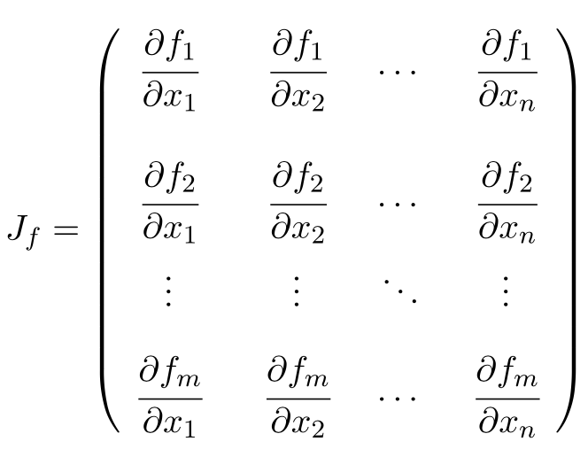

Getting started with Clad
===========================

This is a short guide on getting started with Clad. If you haven't used Clad
before, then this is the best place to start.

In case you haven't installed Clad already, then please do before proceeding with
this guide. Visit :doc:`Clad installation <installation>` to know more about
installing Clad.

Let's get started. 

How to use Clad
-----------------

Clad differentiation functions take a function as an input, and internally
generates a new function that can compute the derivative of the requested function
with respect to the specified parameters. 
We call these internally generated function a "derived function" because they compute
derivative of other functions. Clad generates a derived function for each
function that is to be differentiated.

Clad differentiation functions returns an interface object that allows to conveniently
access, call and debug the associated derived function.

For the rest of the article we will refer automatic differentiation as AD.

A simple example
-------------------

::

   #include "clad/Differentiator/Differentiator.h"
   #include <iostream>

   double fn(double x, double y) { return x * y; }

   int main() {
      auto fn_dx = clad::differentiate(fn, "x");
      std::cout << fn_dx.execute(3, 4) << std::endl; // prints: 4
   }

What do this example do?
^^^^^^^^^^^^^^^^^^^^^^^^^
This example differentiates the function ``fn`` with respect to the parameter ``x``.
Then prints the derivative of ``fn`` w.r.t ``x`` when (x, y) = (3, 4).

Simple, isn't it?

Few important things to note through this example:
^^^^^^^^^^^^^^^^^^^^^^^^^^^^^^^^^^^^^^^^^^^^^^^^^^^^^

- All Clad differentiation functions differentiate a function with respect to 
  one or more specified parameters, ``clad::differentiate`` is one of these 
  functions. Generally in Clad, by differentiating a function, we mean
  that the Clad generates a function that can compute derivative of the
  requested function with respect to the specified parameters.

- All Clad differentiation functions return an object of the ``CladFunction`` type. 
  ``CladFunction`` object provides a convenient way to access, call and debug
  the differentiated function.

- This example computes the derivative of ``fn`` using the ``CladFunction::execute`` 
  member function. ``CladFunction::execute`` perfectly forwards all the arguments
  to a call to the differentiated function.
  

To know more details, please continue reading.

How to run Clad
-------------------

Since Clad is a Clang plugin, it must be properly attached when Clang compiler
is invoked. First, the plugin must be built to get ``libclad.so`` (or ``.dylib``).
One way to compile ``SourceFile.cpp`` with Clad enabled is by directly calling
the compiler using the ``-cc1`` flag::

  clang -cc1 -x c++ -std=c++11 -load /full/path/to/lib/clad.so -plugin clad SourceFile.cpp

This method have the downside that default header search paths have to be 
configured manually.

One other way to enable Clad is to compile ``SourceFile``  and manually enabling the
Clad plugin by passing flags to the clang compiler using the ``-Xclang`` flag::

  clang++ -Xclang -add-plugin -Xclang clad -Xclang -load -Xclang /full/path/to/lib/clad.so -I/full/path/to/clad/include -x c++ -std=c++11 SourceFile.cpp

In this method, the arguments required to enable Clad plugin are passed one
by one directly to the clang compiler. This method also preserve all the 
options and flags that are usually set by the compiler driver such as 
default header search paths. 

.. todo::

   Should we explain about or give an external link to read more about difference
   between the clang compiler driver and the clang compiler?

What can Clad differentiate
----------------------------

Clad can differentiate functions, functors and lambda expressions whose
definitions are visible to the compiler at compile time.

Clad automatic differentiation currently only supports a subset of C++ syntax.
We are currently working towards supporting all of the C++ syntax.
Though not to worry, in cases where automatic differentiation fails,
Clad automatically shifts to numerical differentiation and gives correct results.

To know more about limitations of Clad, please visit 
:ref:`Clad limitations<clad_limitations>`.

Clad AD API at a glance
------------------------------------------------

- **clad::differentiate:** Generates a function that computes derivative of the
  requested function using the :ref:`forward mode AD<forward_mode>`.
- **clad::gradient:** Generates a function that computes derivative of the
  requested function using the :ref:`reverse mode AD<reverse_mode>`.
- **clad::hessian:** Generates a function that computes hessian matrix of the
  requested function.
- **clad::jacobian:** Generates a function that computes jacobian matrix of the
  requested function.

All the functions return an object containing the generated derivative
which can be called via ``.execute`` method, which forwards provided arguments
to the generated derivative function.

clad::CladFunction
--------------------

Before seeing how to compute derivatives, hessian matrix and other cool stuff,
we want to first talk about ``clad::CladFunction``. 

``clad::CladFunction`` objects allow to conveniently access, call and debug the
differentiated functions. All Clad differentiation functions returns an
associated ``clad::CladFunction`` object.

To compute derivative at a specific state, we call the derived function
by calling ``clad::CladFunction::execute`` member function. This function
forwards all the arguments to the call to the derived function.

We can also print the generated derived function, for studying or 
debugging purposes, through a ``clad::CladFunction`` object by calling 
``clad::CladFunction::dump`` member function.

.. todo:: 

   Should we add more information about CladFunction here?

Differentiating a function
----------------------------

Two most important functions for computing partial derivatives of a function 
with respect to its parameters are ``clad::differentiate`` and ``clad::gradient``.

``clad::differentiate`` differentiates the function using the forward mode AD. 
It can only be used when you want to differentiate with respect to a
single parameter. For differentiating with respect to multiple parameters, please use
``clad::gradient``.

``clad::gradient`` differentiates the function using the reverse mode AD.
Generally, the reverse mode AD is more efficient when the number of
input parameters are more than the number of output parameters. 
``clad::gradient`` supports differentiating with respect to multiple function 
parameters as well. Differentiating w.r.t multiple parameters means that the partial
derivatives of the function are computed w.r.t each specified parameter, thus if 4 
parameters are specified then there will be 4 computed partial derivatives.

clad::differentiate
^^^^^^^^^^^^^^^^^^^^^^

A self-explanatory example that demonstrates the usage of ``clad::differentiate``::

   #include <iostream>
   #include "clad/Differentiator/Differentiator.h"

   double fn(double x, double y) {
     return x*x + y*y;
   }

   int main() {
     // differentiate 'fn' w.r.t 'x'.
     auto d_fn_1 = clad::differentiate(fn, "x");
  
     // computes derivative of 'fn' w.r.t 'x' when (x, y) = (3, 4).
     std::cout<<d_fn_1.execute(3, 4)<<"\n";
   }

Few important things to note through this example:

- Independent parameter can be specified either using the parameter name or
  the parameter index. Indexing starts from 0. Therefore for the 
  ``clad::differentiate`` example, 2 differentiation calls shown below are
  equivalent. ::
  
    clad::differentiate(fn, "x");

  and:: 

    clad::differentiate(fn, 0);

- ``d_fn_1.execute`` returns the computed derivative. For now just remember
  that in Clad forward mode differentiated functions returns the computed derivative.
  
Visit API reference of :ref:`clad::differentiate<api_reference_clad_differentiate>` for more details.

clad::gradient
^^^^^^^^^^^^^^^^^

A self-explanatory example that demonstrates the usage of ``clad::gradient``::

   #include <iostream>
   #include "clad/Differentiator/Differentiator.h"

   double fn(double x, double y) {
     return x*x + y*y;
   }

   int main() {
     // differentiate 'fn' w.r.t 'y'.
     auto d_fn_2 = clad::gradient(fn, "x, y");
     double d_x, d_y;
     // computes derivative of 'fn' w.r.t 'x' and 'y'.
     // Derivatives are saved in 'd_x' and 'd_y' respectively.
     d_fn_2.execute(3, 4, &d_x, &d_y);
     std::cout<<d_x<<" "<<d_y<<"\n";
   }

Few important things to note through this example:

- Parameters with respect to which differentiation should be performed can be
  specified by c-style strings containing comma-separated parameter names such as 
  *"x, y"*\ . If no parameter is specified, then the function is differentiated
  w.r.t all the parameters. Multiple parameters can only be specified in clad 
  reverse mode AD functions, ``clad::gradient`` is one of them.

- There's a difference in how the derivatives are obtained from ``clad::differentiate``
  and ``clad::gradient``. Or more generally, there's a difference in how the
  derivatives are obtained from Clad forward mode differentiation functions and
  Clad reverse mode differentiation functions.

  Since ``clad::differentiate`` always differentiates with respect to a single 
  parameter, it always *returns* the computed derivative whereas since 
  Clad reverse mode differentiation functions such as ``clad::gradient``
  can compute derivatives with respect to multiple parameters, it
  stores derivative result with respect to each specified parameter in a
  separate variable that is provided in the call to ``CladFunction::execute``.

Visit API reference of :ref:`clad::gradient<api_reference_clad_gradient>` for more details.

Computing hessian matrix
--------------------------

We can directly compute the `hessian matrix <https://en.wikipedia.org/wiki/Hessian_matrix>`_ of a
function in Clad using the ``clad::hessian`` function.

.. figure:: ../_static/hessian-matrix.png
  :width: 400
  :align: center
  :alt: Hessian matrix image taken from wikipedia
  
  Hessian matrix when specified parameters are (x\ :sub:`1`\ , x\ :sub:`2`\ , ..., x\ :sub:`n`\ ).

Internally, ``clad::hessian`` uses both the forward mode AD and the 
reverse mode AD to efficiently compute hessian matrix.

A self-explanatory example that demonstrates the usage of ``clad::hessian``::

  #include "clad/Differentiator/Differentiator.h"

  double kinetic_energy(double mass, double velocity) {
    return mass * velocity * velocity * 0.5;
  }

  int main() {
    // Generates all the second partial derivative columns of a Hessian matrix
    // and stores CallExprs to them inside a single function 
    auto hessian_one = clad::hessian(kinetic_energy);

    // Can manually specify independent arguments
    auto hessian_two = clad::hessian(kinetic_energy, "mass, velocity");

    // Creates an empty matrix to store the Hessian in
    // Must have enough space, 2 independent variables requires 4 elements (2^2=4)
    double matrix[4];

    // Prints the generated Hessian function
    hessian_one.dump();
    hessian_two.dump();

    // Substitutes these values into the Hessian function and pipes the result
    // into the matrix variable.
    hessian_one.execute(10, 2, matrix);
    hessian_two.execute(5, 1, matrix);
  }

Few important things to note through this example:

- ``clad::hessian`` also supports differentiating w.r.t multiple paramters.

- Array which will store the computed hessian matrix should be passed as the 
  last argument to the call to the ``CladFunction::execute``. Array size 
  should atleast be as much as the size required to store the hessian matrix. 
  Passing array size less than the required size will result in undefined behaviour.

Computing jacobian matrix
----------------------------

We can directly compute `jacobian matrix <https://en.wikipedia.org/wiki/Jacobian_matrix_and_determinant>`_
of a function in clad using the ``clad::jacobian`` function.

Unlike other clad AD functions, function that is passed to ``clad::jacobian``
should modify a passed argument to store a vector (array) result instead of
returning a single value. Differentiating these functions using ``clad::jacobian``
w.r.t possibly multiple parameters will compute derivative of each value of the
vector w.r.t all the specified parameters.

  Jacobian matrix when function output are (f\ :sub:`1`\ , f\ :sub:`2`\ , ... , f\ :sub:`m`\ ) and specified independent parameters are (x\ :sub:`1`\ , x\ :sub:`2`\ , ... , x\ :sub:`n`\ )

A self-explanatory example that demonstrates the usage of ``clad::jacobian``::
  
  #include <iostream>
  #include "clad/Differentiator/Differentiator.h"

  void fn(double i, double j, double *res) {
    res[0] = i*i;
    res[1] = j*j;
    res[2] = i*j;
  }

  int main() {
    auto d_fn = clad::jacobian(fn);
    double res[3] = {0, 0, 0};
    double derivatives[6] = {0, 0, 0, 0, 0, 0};
    d_fn.execute(3, 5, res, derivatives);
    std::cout<<"Jacobian matrix:\n";
    for (int i=0; i<3; ++i) {
      for (int j=0; j<2; ++j) {
        std::cout<<derivatives[i*2 + j]<<" ";
      }
      std::cout<<"\n";
    }
  }

This example computes and prints the jacobian matrix of ``fn`` when (i, j) = (3, 5).

Few important things to note through this example:

- ``clad::jacobian`` also supports differentiating w.r.t multiple parameters.

- Array which will store the computed jacobian matrix should be passed as the
  last argument to the call to the ``CladFunction::execute``. Array size should 
  atleast be as much as the size required to store the jacobian matrix. 
  Passing array size less than the required size will result in undefined behaviour.

Differentiating functors and lambda expressions
-----------------------------------------------------

Despite significant differences, differentiating functors and lambda
expressions is remarkably similar to differentiating ordinary functions.

Similarly, computing hessian matrix and jacobian matrix of functors and
lambda expressions is remarkably similar to computing hessian matrix and 
jacobian matrix of ordinary functions.

A self-explanatory example that demonstrates the differentiation of functors::

  #include "clad/Differentiator/Differentiator.h"
  
  // A class type with user-defined call operator
  class Equation {
    double m_x, m_y;
  
    public:
    Equation(double x, double y) : m_x(x), m_y(y) {}
    double operator()(double i, double j) {
      return m_x*i*j + m_y*i*j;
    }
    void setX(double x) {
      m_x = x;
    }
  };
  
  int main() {
    Equation E(3, 5);
  
    // Functor is an object of any type which have user defined call operator.
    //
    // Clad differentiation functions can directly differentiate functors.
    // Functors can be passed to clad differentiation functions in two distinct
    // ways:
  
    // 1) Pass by reference
    // differentiates `E` wrt parameter `i`
    // object `E` is saved in the `CladFunction` object `d_E`
    auto d_E = clad::differentiate(E, "i");
  
    // 2) Pass as pointers
    // differentiates `E` wrt parameter `i`
    // object `E` is saved in the `CladFunction` object `d_E_pointer`
    auto d_E_pointer = clad::differentiate(&E, "i");
  
    // calculate differentiation of `E` when (i, j) = (7, 9)
    double res1 = d_E.execute(7, 9);
    double res2 = d_E_pointer.execute(7, 9);
  }

Few important things to note through this example:

- Functors and lambda expressions can be passed both by reference and by pointers.
  Therefore, the two differentiation calls shown below are equivalent::

    Experiment E;  // a functor
    // passing function by reference
    auto d_E = clad::differentiate(E, "i");
  
  and::

    Experiment E;  // a functor
    // passing function by pointer
    auto d_E = clad::differentiate(&E, "i");

Array differentiation
--------------------------------

.. todo:: 

   Add array differentiation quickstart documentation.

Automatically shifting to Numerical differentiation
-----------------------------------------------------

.. todo::

   Add numerical differentiation quickstart documentation.

Error estimation framework
-------------------------------

.. todo::
   
   Add error estimation framework quickstart documentation.